# Matching、New Input 与 Rerun 工作流——Codex 的理解

> 日期：2026-08-29  
> 状态：设计理解稿；待确认语义已于 2026-08-31 决定并实现。  
> 说明：当前操作契约以 Matching/Orchestrator README 与生成的 Orchestrator storage reference 为准。

## 1. 总体目标

系统新增两种顶层操作：

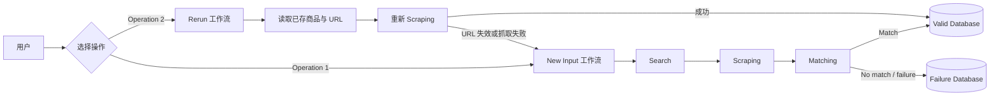

- **New Input**：接收一批新的商品输入，完成搜索、抓取和商品身份验证。
- **Matching**：比较用户输入商品与抓取商品是否为同一具体商品/变体。
- **Rerun**：复用已验证 URL 重新抓取价格、库存等最新数据；旧 URL 不可用时回退到完整 New Input 流程。

## 2. New Input 输入与标准化

### 2.1 外部格式与内部格式

用户可以提交 `xlsx`、`csv` 或 `json`。入口层先完成格式解析和字段标准化，后续模块只接收统一的内部对象。

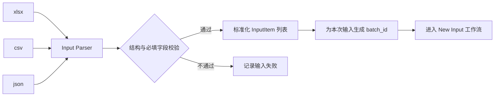

### 2.2 单条输入的字段理解

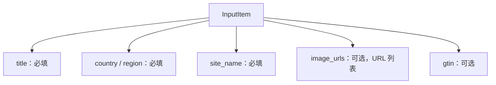

其中：

- `title`、`country/region`、`site_name` 是触发 Search 所需的基本字段。
- `image_urls` 和 `gtin` 不影响是否可以发起 Search，但可以给 Matching 提供更强证据。
- 每批输入需要一个 `batch_id`；批内还需要稳定的逐行标识，例如 `item_id` 或 `row_index`，因为 `title` 不一定唯一。

## 3. New Input 的逐商品工作流

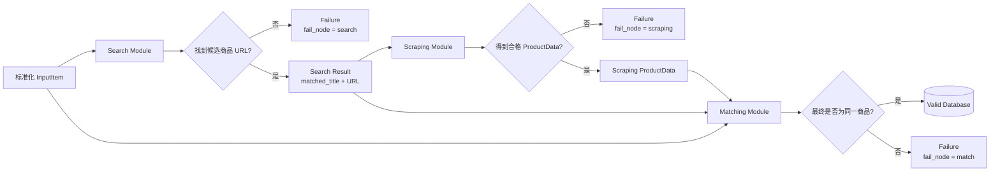

Search 负责找到最可能的商品页面，Scraping 负责提取页面上的结构化商品数据，Matching 才负责最终确认“用户输入商品”和“抓取商品”是不是同一个具体商品/变体。因此，Search 的 URL-level match 不等同于最终业务 match。

### 3.1 三段数据的关系

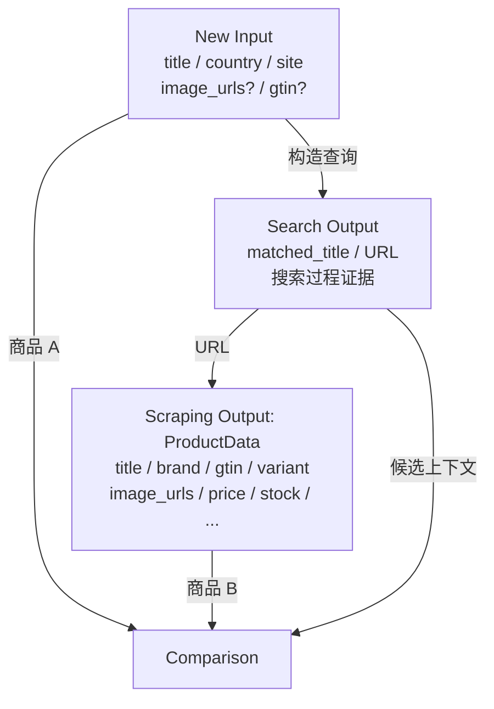

## 4. Matching 机制

### 4.1 总体原则

Matching 采用分层证据：

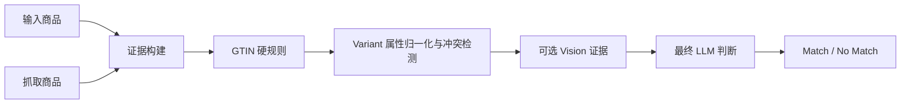

基本原则是：

1. 确定性强、成本低的证据先执行。
2. 明确冲突不能被模糊的 LLM 推理覆盖。
3. 缺失字段表示 `unknown`，不等同于冲突。
4. Vision 提供图片中可见的事实和冲突，最终 verdict 仍由 Matching 模块产生。

### 4.2 详细决策流程

下面是我对设计图中 Matching 路由的具体理解；GTIN 冲突是否无条件失败仍属于待确认项。

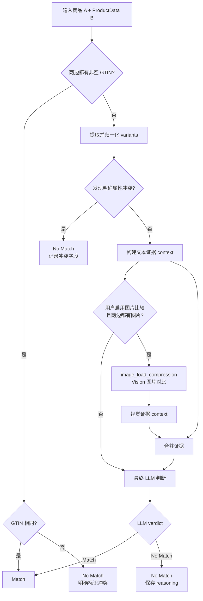

### 4.3 Variant 比较不是字典相等

`variant same?` 应理解为“归一化后是否存在业务属性冲突”，而不是直接执行两个 dict 的相等判断。

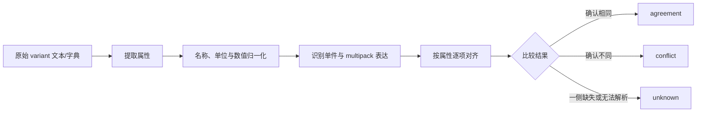

重点属性包括：

- brand
- model / variant name
- size、capacity、weight
- pack count / quantity
- colorway
- included accessories

示例：

- `15 ml` 对 `30 ml`：相同单位、不同值，属于冲突。
- `15 ml × 20` 对 `15 ml each, 20 pack, 300 ml total`：需要做 multipack 分解，不能因为出现 `15` 和 `300` 就误判。
- A 有颜色、B 没有颜色：属于 `unknown`，不是直接冲突。

### 4.4 Vision 分支与 `image_load_compression`

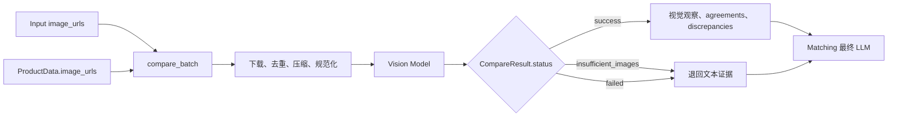

现有 `image_load_compression` 的比较接口正适合这一位置：它接收两组图片 URL，返回视觉证据文本和执行状态。它当前有意不输出 same/different verdict，因此 Matching 应负责把以下内容一起交给最终 LLM：

- 输入 title、gtin 和归一化 variants；
- 抓取 title、brand、gtin 和归一化 variants；
- 规则层得到的 agreements / conflicts / unknowns；
- Vision 返回的可见事实与图片冲突。

当用户没有启用图片比较、任一侧没有可用图片，或 Vision 调用失败时，流程应降级为文本证据判断，而不是让整个 Matching 因图片失败而失败。

## 5. 成功与失败结果

### 5.1 结果路由

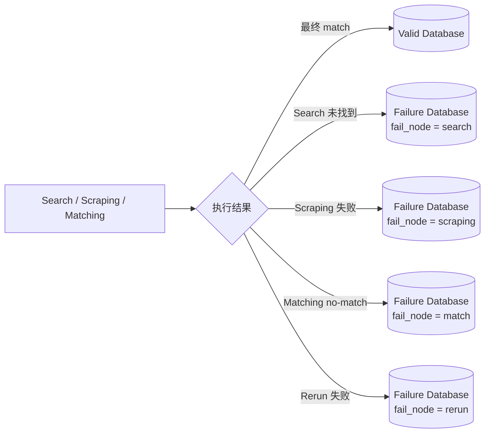

### 5.2 Valid 记录

按设计图，我理解至少需要保存：

- `batch_id`
- 批内商品标识，如 `item_id` / `row_index`
- `input_title`
- `search_title`：Search 找到的候选 title；如需最终商品名称，应以 Scraping 的 `ProductData.title` 为准
- `timestamp`
- `result`：完整 Scraping `ProductData`
- 已验证并可供 Rerun 复用的 URL

### 5.3 Failure 记录

至少需要保存：

- `batch_id`
- 批内商品标识
- `input_title`
- `search_title`：仅在 Search 已找到候选时存在
- `timestamp`
- `fail_node`：`search | scraping | match | rerun`
- `reasoning`：优先保存结构化原因；如果经过 LLM，则同时保存 LLM reasoning

失败原因的来源关系为：

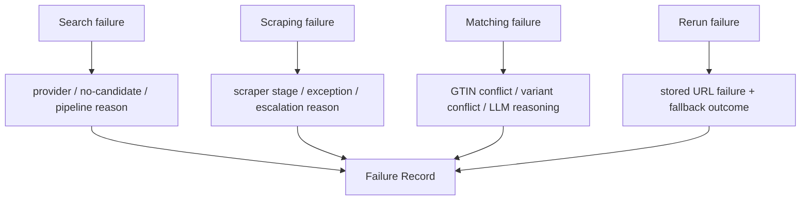

## 6. Rerun 工作流

### 6.1 输入选择

Rerun 的输入包括：

- 必填：`batch_id`
- 可选：`search_title` 列表

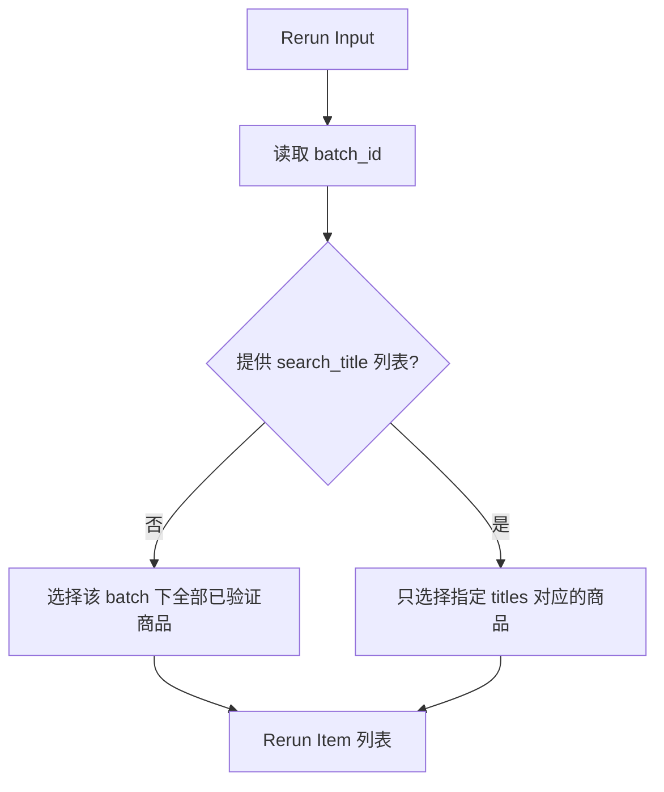

实现时不宜把 `search_title` 当成唯一主键，因为 title 可能重复或随页面更新。更稳定的选择键应是 `item_id`，title 可以继续作为方便用户操作的筛选条件。

### 6.2 执行流程

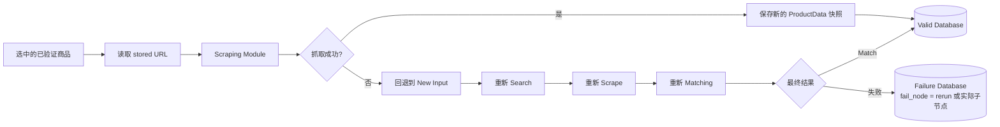

Rerun 的正常路径跳过 Search 和 Matching，因为 stored URL 已经通过上一轮验证。本次主要目标是刷新会变化的数据，例如：

- price / list price / membership price
- in-stock 状态
- availability
- 页面当前的其他 ProductData 字段

每次成功 Rerun 应追加新快照，而不是覆盖旧结果，从而保留价格和库存历史。

### 6.3 Rerun 身份关系

设计图要求能够看出某次结果来自重新运行。我的理解是需要同时表达“来源批次”和“本次执行”，而不是只覆盖原 `batch_id`：

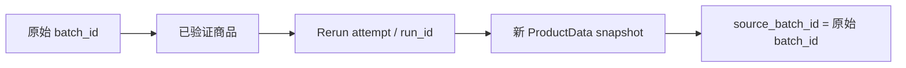

具体采用“新 batch_id”还是“保留 batch_id 并新增 rerun_id/run_id”仍需确认。为了可追溯性，我目前更倾向后者：保留来源 `batch_id`，另建本次执行 ID 和 attempt 序号。

## 7. 与当前仓库实现的对应关系

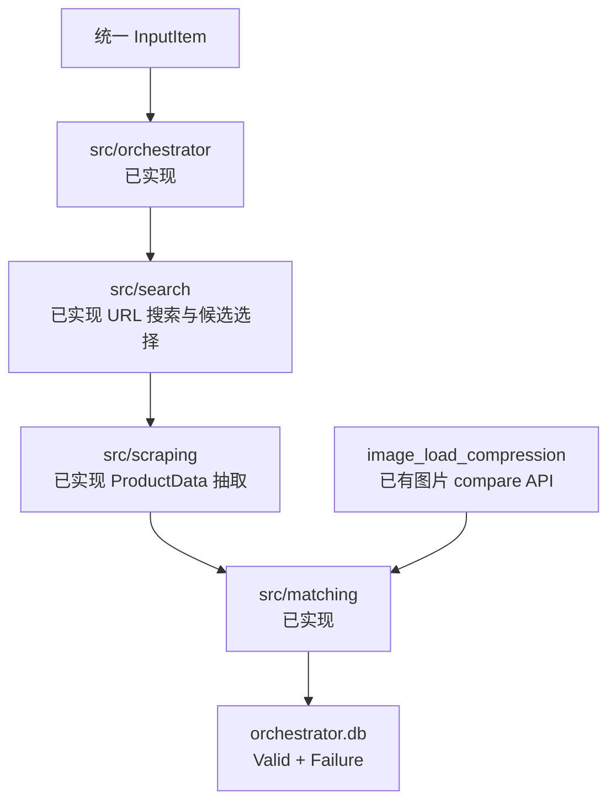

当前可直接复用或需要补齐的部分：

- `src.search` 当前最终结果可以提供 matched candidate 的 `title + URL`，但还没有图中独立的共享 Search Output 模型。
- `src.scraping.models.ProductData` 已包含 `title`、`brand`、`gtin`、`image_urls`、`variant`、价格和库存字段。
- Scraping DB 已把完整 `ProductData` 写入 `results.product_data`，但目前没有 New Input 的 `batch_id/item_id` 关联。
- `src/models`、`src/matching`、`src/orchestrator` 已形成端到端契约；旧 `src/storage` 空壳已删除。
- `image_load_compression.compare_batch()` 可以作为 Matching 的异步 Vision 证据层使用；其 `CompareResult` 不应直接冒充最终 MatchResult。

## 8. 已决定事项

1. 双边 GTIN 不同进入最终 context，不直接失败；缺失/无效为 Unknown。
2. 明确 variant 冲突直接 No Match；缺失/模糊进入最终 LLM。
3. 每次 Rerun 创建 `<root>-rN`，保存显式 parent/root 血缘。
4. Rerun 默认复用 URL；身份字段变化才复核，失败后只 fallback 一次。
5. `operation=rerun` 与实际 `fail_node` 分开存储。
6. Vision 为 batch 级、默认关闭；Rerun 继承且允许覆盖。
7. 单图和 JSON 数组输入都在入口统一为 `list[str]`。

## 9. 一句话总结

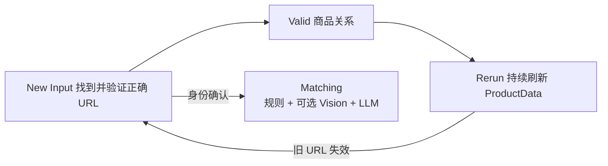

New Input 建立“输入商品 → 正确竞品 URL”的已验证关系，Matching 负责建立这份信任，Rerun 在信任仍有效时复用 URL 刷新数据，并在 URL 失效时回到完整验证流程。
