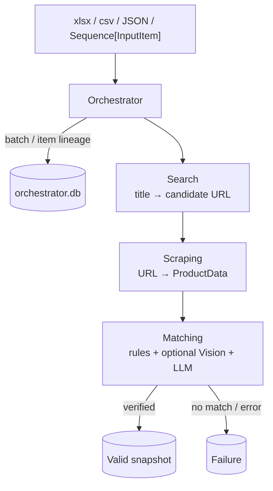
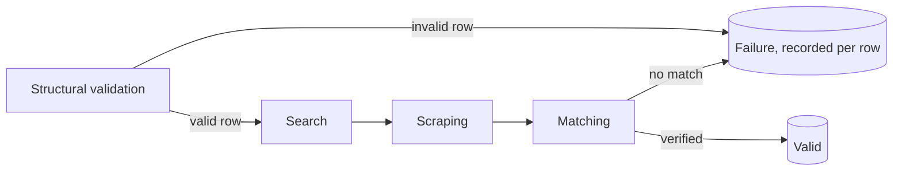
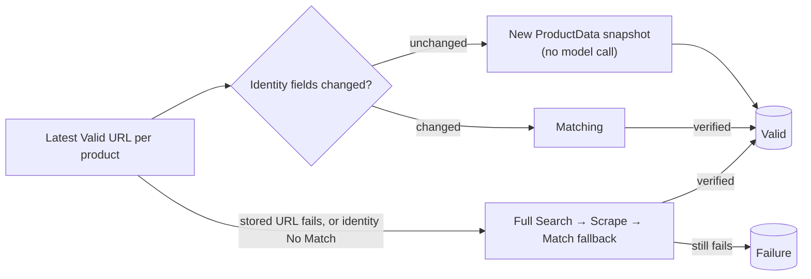

# PriceScope Architecture

## Current end-to-end flow

Search and Scraping retain their standalone public APIs and their own trace databases. Orchestrator uses the typed in-memory Search batch API, calls Scraping per URL, and verifies a newly discovered URL through Matching before writing an append-only Valid snapshot. Each Matching invocation is also appended to `matching_decisions` with its ordered GTIN → variant rule → Vision → LLM trace; identity reuse and technical failures are represented explicitly.

## New Input

New Input validates the file structure before paid calls, records invalid rows individually, then runs Search → Scraping → Matching in batches. Search title and Scraping `ProductData.title` remain separate evidence. Only a successful identity verdict writes Valid.

## Rerun

Every Rerun creates `<root>-rN` and selects the latest Valid URL for each logical product in the requested batch's scope. Unchanged identity fields write a fresh ProductData snapshot without another model call. Changed identity triggers Matching; a stored-URL failure or identity No Match gets one full Search → Scrape → Match fallback in the same rerun batch.

## Module ownership

| Module | Responsibility | Persistent store |
|---|---|---|
| `src/search` | Marketplace candidate discovery and URL selection | `search.db` trace |
| `src/scraping` | ProductData extraction, validation, parser repair | `scraping.db` |
| `src/matching` | Exact identity verification and ordered decision traces | Persisted once in orchestrator `matching_decisions` |
| `src/orchestrator` | Input parsing, workflow state, rerun lineage, terminal outcomes, Matching decision history | `orchestrator.db` |
| `src/models` | Shared InputItem and ProductMatchResult contracts | None |
| `src/common` | Shared Search/Matching/Scraping LLM provider routing | None |
| `src/api` | Future REST interface | Not implemented |

The former project-level `src/storage` skeleton was removed. In-progress state, Valid results, failures, and Matching decision history now have one clear owner in `orchestrator.db`; no temporary or trash database is required.

## Configuration

- Search tuning: `src/search/maintain/search_config.yaml`
- Shared Search/Matching/Scraping LLM vendors: `src/common/llm_router_config.yaml` (scraping additionally holds optional per-vendor call capabilities in `src/scraping/providers.py`)
- Matching text and Vision models, plus per-side Vision image caps: `src/matching/matching_config.yaml`
- Scraping runtime: `src/scraping/config.py`, `hosts.yaml`, and `sites.yaml`

Generated database references live in `docs/search/storage.md`, `docs/scraping/storage.md`, and `docs/orchestrator/storage.md` (the last also covers matching's persisted decision trace, since matching has no database of its own). Per-module design rationale lives alongside each in `docs/<module>/design.md`.
