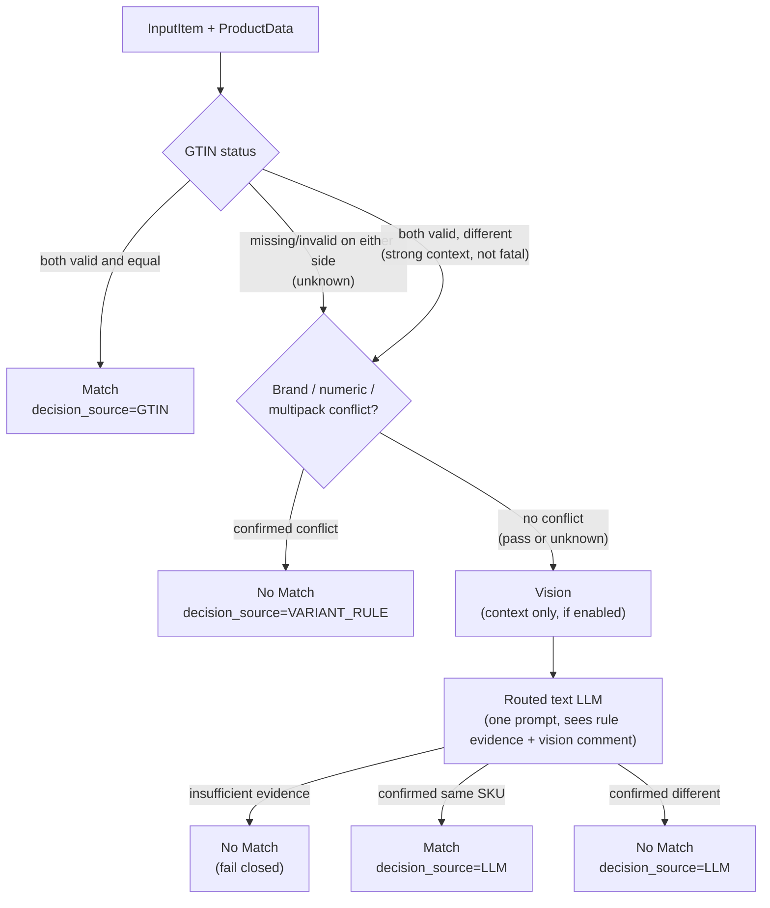

# Matching Module — Design Reference

The decision-order business logic behind Matching: why GTIN outranks everything else, what
counts as a conflict, why Vision never renders a verdict, and why ambiguity fails closed.

## 0. How to read this document

Three documents cover Matching. They do different jobs — pick the right one:

| Document | Job | Read it when |
|---|---|---|
| [`src/matching/README.md`](../../src/matching/README.md) | Operator manual — call the API, `matching_config.yaml` keys, setup | You are *using* the module |
| [`src/matching/CLAUDE.md`](../../src/matching/CLAUDE.md) (= `AGENTS.md`) | Architecture map and file list, for an agent working in the code | You need to know *where things live* |
| **This document** | Decision-order business logic and rationale | You need to know *why a verdict came out the way it did* |

This document does not repeat operator instructions (how to call `verify_product` /
`verify_products`, what each config key defaults to) or the file map — see the README and
CLAUDE.md for those. Matching has no database of its own; its persisted decision trace
(`matching_decisions`) lives in `orchestrator.db` and is documented at
[`docs/orchestrator/storage.md#matching_decisions`](../orchestrator/storage.md#matching_decisions).

---

## 1. What Matching decides

Matching verifies whether a canonical `InputItem` (what the caller intended to buy) and one
qualified scraping `ProductData` (what was actually found on a marketplace) describe the same
exact SKU. The output, `ProductMatchResult`, is a binary verdict (`match` / `no_match`) with
evidence and one sentence of reasoning — there is no numeric score, and no "maybe".

## 2. Decision order

Three stages run in a fixed order, each capable of short-circuiting the ones after it:

### 2.1 GTIN — the only short-circuit that ends in Match

`attributes.normalize_gtin()` validates the check digit for 8/12/13/14-digit codes on both
sides (`service._gtin_status`). Three outcomes:

- **Equal, both valid → `PASS`.** This is the one path that short-circuits straight to
  `Match` without ever building a prompt or calling the LLM. A retailer-assigned GTIN match is
  treated as definitive identity — stronger evidence than anything a text/vision model could
  infer from titles and images.
- **Either side missing or invalid → `UNKNOWN`.** Absence is not evidence of anything;
  processing continues to the variant-rule stage exactly as if GTIN were never checked.
- **Both valid but different → `CONFLICT`.** This does *not* short-circuit to `No Match`. A
  different valid GTIN is strong negative context (e.g. a multipack GTIN vs a single-item
  GTIN for what is otherwise the same product), but the module still runs it through the
  variant rules and the final LLM prompt rather than rejecting on GTIN alone. This is the one
  deliberate asymmetry: GTIN can *confirm* a match by itself; it cannot *deny* one by itself.

### 2.2 Brand / numeric / multipack — the only short-circuit that ends in No Match

`attributes.compare_variants()` runs three independent comparisons and folds them with
OR-logic:

- **Brand** (`src.search.layers.brand.compare_brands`) — reused from Search: literal
  substring hits first, fuzzy match (RapidFuzz) as fallback, three-state (`pass` / `fail` /
  `unknown`). Only a confirmed differing brand fails.
- **Numeric** (`src.search.layers.numeric.compare_numerics`) — reused from Search:
  quantulum3 plus a regex pre-pass. **Discrete** attributes (storage_gb, ram_gb, count,
  screen_inch, voltage_v, abv_percent, power_w) must match exactly. **Continuous** attributes
  (weight, volume, …) tolerate ±10% after unit normalization — the same tolerance Search uses,
  so a listing quoting "1kg" against an input of "1000g" is not a false conflict.
- **Multipack** (`attributes.extract_multipack` / `compare_multipacks`) — parses
  count/per-item/total quantity language (`4 x 330ml`, `pack of 4`, `330ml each`, `1320ml
  total`) into three independent *roles*: `per_item`, `count`, `total`. Roles are **never**
  compared across each other — an input's `per_item` is only ever checked against a product's
  `per_item`, never against the product's `total`. A signature that is internally
  inconsistent (declared `per_item * count != total` beyond tolerance) is recorded as evidence
  but never turned into a hard verdict by itself; it just means that dimension contributes no
  pass/fail signal.

Any confirmed conflict among the three (`FAIL` brand, `FAIL` numeric, or `CONFLICT`
multipack) short-circuits straight to `No Match` with `decision_source=VARIANT_RULE`, skipping
Vision and the LLM entirely. If none conflict — whether because evidence passed or because it
was simply absent (`unknown`) — the item proceeds to Vision/LLM. Passing here is not itself a
short-circuit to `Match`: absence of a conflict is not proof of identity, only proof that cheap
rules found no reason to reject.

### 2.3 Vision — context, never a verdict source

When `vision_enabled=True` and both sides have at least one image,
`image_load_compression.compare_batch()` produces a free-text visual comment (plus per-side
image counts, dropped URLs, and model/token metadata) that is folded into the same JSON payload
the final LLM prompt receives. Vision has no independent pass/fail channel and can never
short-circuit anything on its own:

- Missing images on either side, or Vision itself failing, degrades to `VisionStatus.
  NOT_AVAILABLE` / `FAILED` — the text-only prompt still runs.
- Vision runs as one batch-wide barrier *before* any text decision starts in a
  `verify_products()` call, because the text prompt needs the finished visual comment; within
  that barrier, calls run concurrently under `compare_batch`'s own bound.
- Each side's image list is deduplicated in order, then truncated to that side's configured
  cap (`vision.max_considered_num_input_image` / `max_considered_num_scraping_image`) *before*
  being handed to `compare_batch`, and `image_load_compression`'s own shared
  `compare.max_images_per_set` is raised to the max of the two caps so it cannot silently
  re-truncate a side matching's own config already allowed.

The system prompt states this explicitly: *"Visual evidence provides observations, not a
verdict."* A confident-looking visual mismatch is one more fact for the LLM to weigh, not an
automatic rejection — because Vision models are the least reliable evidence source in the
pipeline and the module does not want a hallucinated visual observation to out-rank a matching
GTIN or a clean brand/numeric read.

### 2.4 The one routed text-LLM decision

Every item that survives GTIN and the variant rules gets exactly one LLM call
(`service._SYSTEM_PROMPT` + `_build_prompt`), never more than one per item, with retries on
technical failure only (`llm.max_retries`, default 2). The prompt receives the full `InputItem`
and `ProductData` (JSON, `raw` excluded), the rule evidence (`gtin_status`, `variant_status`,
brand/numeric/multipack detail), and the Vision status + comment. It is instructed to:

- Treat missing information as unknown, not conflicting.
- Judge which attributes are variant-defining *for that product category* — materiality, not
  superficial wording/packaging/marketing differences.
- Treat a GTIN conflict as strong negative evidence, not an automatic rejection (consistent
  with §2.1 — the rule layer already decided not to short-circuit on it, so the LLM is the
  place that finally weighs it against everything else).
- Return strict JSON: `{"verdict": "match"|"no_match", "reasoning": "..."}`.

### 2.5 Fail-closed on ambiguity

The system prompt's controlling instruction: *"If the evidence is insufficient to confirm the
exact SKU, return no_match."* Matching never has a third "unsure" verdict at the top level —
ambiguity always resolves to `No Match`, never to `Match`. This is a deliberate asymmetry with
real cost: a false `No Match` sends a good product back for review or re-search, which is
cheap; a false `Match` writes a wrong product into whatever downstream pricing/comparison logic
trusts the verdict, which is expensive and hard to detect later. Two different failure modes
must not be confused:

- **Business `No Match`** — the model considered the evidence and could not confirm identity.
  This is a normal, expected outcome and is not an error.
- **Technical `MatchingError`** — the model call failed outright (timeout, malformed JSON,
  invalid verdict token) after exhausting retries. This is raised as an exception, never
  silently turned into a `No Match` verdict, so a caller cannot mistake "the model broke" for
  "the model looked and said no."

## 3. Tracing every decision

Every `ProductMatchResult` and every terminal `MatchingError` carries an ordered
`trace: list[DecisionNodeRecord]` (`DecisionNode`: `GTIN`, `VARIANT_RULE`, `VISION`, `LLM`). A
missing node means that stage never ran — most commonly because an earlier stage already
short-circuited the decision (a GTIN `PASS` never produces a `VARIANT_RULE` or `LLM` node; a
`VARIANT_RULE` conflict never produces a `VISION` or `LLM` node). This trace is what gets
persisted per attempt; see the next section for where and how.

## 4. Where the trace is persisted

Matching itself has no database. Its trace is written by the orchestrator into the
`matching_decisions` table inside `orchestrator.db`, one append-only row per invocation
(including rule short-circuits and skipped decisions). For the table's exact columns,
constraints, relationships, and the queries used to replay an item's Matching history, see
[`docs/orchestrator/storage.md#matching_decisions`](../orchestrator/storage.md#matching_decisions).

## Related documents

- [`src/matching/README.md`](../../src/matching/README.md) — operator manual: API call shape, config table, environment setup
- [`src/matching/CLAUDE.md`](../../src/matching/CLAUDE.md) — architecture map and file list
- [`docs/orchestrator/storage.md`](../orchestrator/storage.md) — `matching_decisions` schema and query reference
- [`docs/architecture.md`](../architecture.md) — project-level module map
