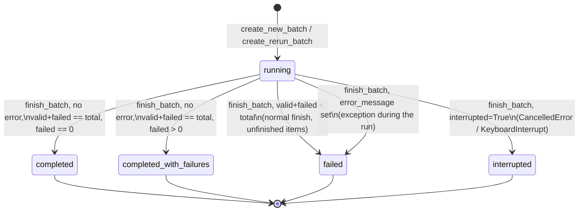
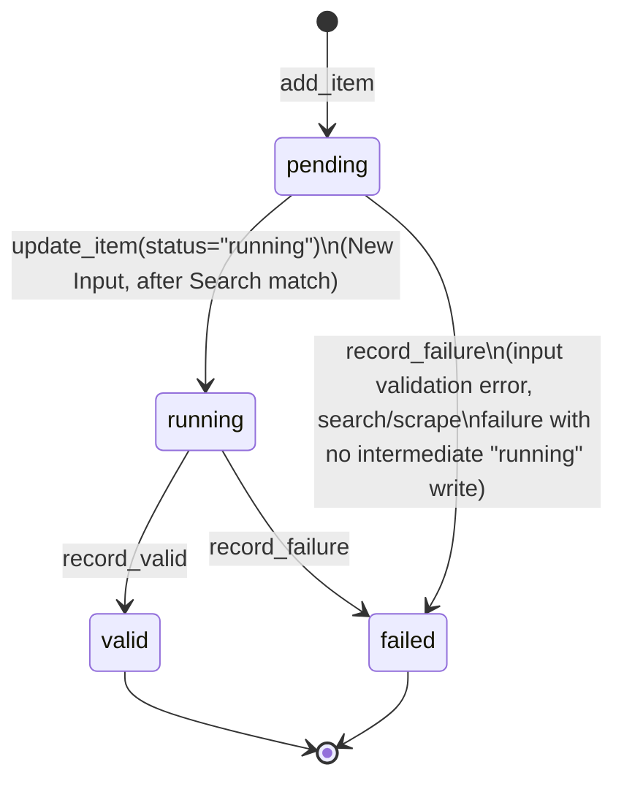

# Orchestrator Design

How New Input and Rerun actually work internally: lineage fields, status/exit-code
semantics, the v1→v2→v3 migration, and Rerun's fallback and vision-inheritance mechanics.

## 0. How to read this document

| Document | Job | Read it when |
|---|---|---|
| [`src/orchestrator/README.md`](../../src/orchestrator/README.md) | Operator manual — CLI flags, env vars, input format, exit codes, progress bars | You are *running* the orchestrator |
| [`src/orchestrator/CLAUDE.md`](../../src/orchestrator/CLAUDE.md) (= `AGENTS.md`) | Architecture map and key files, for an agent working in the code | You need to know *where things live* |
| [`docs/architecture.md`](../architecture.md) | Project-level, module-to-module Mermaid diagrams for New Input and Rerun | You want the high-level shape before drilling in |
| **This document** | Field-level lineage, status/exit-code semantics, migration mechanics | You are *analyzing or evolving* the workflow logic |
| [`docs/orchestrator/storage.md`](storage.md) | Generated SQLite schema: tables, columns, constraints, ER diagram, migration facts | You need the exact persisted schema |

This document does not repeat `docs/architecture.md`'s module-to-module flow diagrams —
read those first. It goes one level deeper: the fields that carry lineage across reruns,
exactly when a batch or item flips state, and the mechanics (not just the existence) of the
v1→v2→v3 migration. It does not repeat `docs/orchestrator/storage.md`'s column-by-column
DDL reference either — link there for the schema itself.

---

## 1. New Input: validation, then one full pipeline pass

`run_new_input()` ([`workflow.py`](../../src/orchestrator/workflow.py)) parses the input file
or `Sequence[InputItem]` (`input.py:load_input`) row by row before any paid call. A row that
fails structural/type validation gets `item=None`; it is still inserted via `add_item()` (so
its `row_index` is preserved) and immediately closed out with
`record_failure(fail_node="input", failure_kind="validation_error")`. Only rows that parsed
cleanly become `WorkItem`s and enter `_run_full_pipeline()`.

`_run_full_pipeline()` runs Search → Scraping → Matching as three batch stages, not
per-item lockstep — every item finishes Search before any item starts Scraping. Each stage
appends one entry to that item's `stage_trace` JSON array via `update_item(trace_event=...)`,
in addition to any `record_failure`/`record_valid` terminal write:

- **Search**: `{"stage": "search", "status": "error"|"success"|"no_match", "run_id": ..., "row_index": ...}`.
  `run_id` + `row_index` together locate the task row in `search.db` — Search's own trace DB,
  not orchestrator's. A `success` status requires both `FinalVerdict.MATCH` *and* a non-null
  `matched_candidate`; anything else is `no_match` (or `error` if Search itself raised) and the
  item terminates here with `fail_node="search"`.
- **Scraping**: `{"stage": "scraping", "status": "success"|"invalid_target"|"error", "run_ids": [...]}`.
  `run_ids` is captured via `capture_run_ids()` and can hold more than one id — every
  `scrape_runs` row written during that call, including a failed primary scraper attempt
  before a fallback scraper inside `scrape()` succeeded. An empty list means Scraping wrote no
  execution record at all (a fast failure before any scraper attempt).
- **Matching**: no separate trace-only event — the terminal write (`record_matching_result` /
  `record_matching_result` and Valid, or `record_failure`) doubles as the record. A technical
  Matching error additionally calls `record_matching_decision(decision_source="technical_error")`
  so `matching_decisions` still has exactly one row per invocation attempt.

Search-selected `title` (written to `batch_items.search_title`) and the scraped
`ProductData.title` are kept as two separate fields on purpose — Search's candidate title can
legitimately differ from the page's own title (translations, marketplace listing titles vs.
brand titles), and downstream consumers need to tell "what Search matched" from "what the page
says" without guessing which one a single shared field held.

---

## 2. Rerun: three lineage fields, and how selection uses them

Every Rerun is `create_rerun_batch(parent_batch_id, ...)`, producing `<root>-r<N>` where `N`
is `MAX(rerun_no) WHERE root_batch_id = root) + 1` — monotonic per root lineage, not per
parent, so `b-xxx-r1`, `b-xxx-r2`, `b-xxx-r3` are all siblings of the same root even if `r3`
was requested against `r1`.

Three fields carry identity and provenance across that lineage:

| Field | Set by | Meaning |
|---|---|---|
| `batches.root_batch_id` | Self-referential on the first New Input batch; copied from parent on every rerun | Groups every batch in one lineage for numbering and "latest across lineage" lookups |
| `batches.parent_batch_id` | The batch id passed to `rerun()` | The *specific* batch a rerun was requested against — may not be the root |
| `batch_items.logical_item_id` | Random uuid4 on first creation; copied verbatim on every rerun | Identifies "the same product row" across the whole lineage regardless of `row_index` renumbering |
| `batch_items.source_valid_result_id` | Set on rerun-created items only | Points at the exact `valid_results.result_id` this rerun item started from |

`rerun_sources()` ([`database.py`](../../src/orchestrator/database.py)) is where selection
actually happens, and it deliberately does **not** read from the requested batch's own Valid
rows:

1. Take the *distinct* `logical_item_id`s present in the **requested** batch (`batch_id`
   argument) — this defines the item *scope* of the rerun (which logical products are
   included), preserving each one's `row_index` from that batch.
2. For each `logical_item_id`, find the newest `valid_results` row anywhere in the **root**
   lineage (`JOIN batches ON root_batch_id = parent's root`, `ORDER BY result_id DESC LIMIT 1`)
   — not necessarily from the requested batch itself.

The effect: rerunning an old batch `b-xxx-r1` re-selects using `b-xxx-r1`'s item scope, but if
a later `b-xxx-r2` already refreshed one of those products, this new rerun starts from
`r2`'s snapshot, not `r1`'s stale one. A `logical_item_id` with no Valid row anywhere in the
lineage (every attempt ever failed) is silently dropped from the new batch — there is nothing
to re-scrape.

Optional `--search-title` filtering (`search_titles` param) matches against
`RerunSource.search_title` — trimmed, case-insensitive, exact string match
(`_title_key()`). Every requested title must match at least one selected source or the whole
operation raises before `create_rerun_batch()` is called (no child batch, no rows — the
`except` branch's `"child_id" in locals()` check exists specifically for this preflight
failure path). A title matching multiple sources is not an error — all of them proceed.

### Identity comparison decides Matching vs. skip

For each selected source, its stored URL is rescraped once (`stored_url` execution path).
The result is compared against the prior snapshot's identity via `_identity()`
(`workflow.py`) — a normalized JSON of `title` (whitespace-collapsed, casefolded), `brand`
(same), `gtin` (whitespace-stripped), and `variant` (as-is dict):

- **Rescrape fails** (error, invalid target, or raises): item moves to the `fallback` list —
  full Search → Scrape → Match, `execution_path="fallback"`.
- **Identity unchanged**: written straight to `valid_results` as a new snapshot with
  `execution_path="stored_url"`, *and* a synthetic `matching_decisions` row is recorded with
  `decision_source="identity_guard"` — not because Matching ran, but so `matching_decisions`
  stays the single complete history of every item's outcome, including ones that skipped
  Matching entirely.
- **Identity changed**: item moves to `identity_revalidation` — a real `verify_products()`
  call. A `MATCH` verdict writes Valid on `execution_path="identity_revalidation"`; anything
  else (`NO_MATCH` or a technical error) moves the item into the same `fallback` list as a
  failed rescrape.

Fallback items reuse `_run_full_pipeline()` — the exact function New Input uses — with
`execution_path="fallback"`. This is why a rerun batch's `batch_items.execution_path` values
are a reliable read of what actually happened to each item, not just what was requested.

### Vision inheritance

`--vision` / `--no-vision` on `rerun` maps to `vision_enabled: bool | None` in the CLI
(`argparse` mutually-exclusive group, default `None` — see `__main__.py`). `workflow.rerun()`
resolves it once, before the child batch is created:

```python
active_vision = bool(parent["vision_enabled"]) if vision_enabled is None else vision_enabled
```

Omitting the flag inherits the **parent batch's** stored `vision_enabled` (the batch id
actually passed to `--batch-id`, not necessarily the lineage root — a chain of reruns can
each flip vision on/off and the next unflagged rerun inherits from whichever batch it names).
Passing either flag explicitly always overrides inheritance for that rerun and every
downstream write in it (`identity_revalidation` Matching calls and any `fallback` pass both
use `active_vision`, and it is what gets stored on the new child batch row).

---

## 3. Batch and item status state machines

Neither `status` column is set from a fixed transition table in code — both are derived at
specific call sites. Laying them out as state machines makes the derivation visible in one
place, which the code (spread across `create_new_batch`, `update_item`, `record_valid`,
`record_failure`, `finish_batch`) does not show directly.



Note the two distinct paths into `failed`: a batch can reach `finish_batch()` normally (no
exception) yet still have unfinished items — `finish_batch()` treats `valid + failed < total`
as `failed` unconditionally, synthesizing
`error_message = f"{total - valid - failed} item(s) did not finish"` even though nothing
raised. This is the same status a caught exception produces
(`error_message=f"{type(exc).__name__}: {exc}"`); the two are indistinguishable from `status`
alone — only `error_message`'s text tells them apart. See §5 for how this collapses to exit
code 1 either way, alongside genuine invocation errors.

Item status is simpler and only ever moves forward:



`update_item()` enforces this is one-way at the database level: it raises if the item's
current `status` is already `valid` or `failed` ("item is already terminal"). Rerun's
`stored_url` / `identity_revalidation` / `fallback` items never pass through an explicit
`status="running"` write on the happy path before their terminal outcome — `execution_path`
tracks which lineage branch an item is on independently of `status`.

---

## 4. Migration mechanics (v1/v2 → v3)

`docs/orchestrator/storage.md`'s "Schema compatibility" section states *what* v3 changed at
the schema level — read that for the column-level facts. This section covers *how* the
migration executes, which matters if you are debugging a migration failure or writing a new
one.

`OrchestratorDB.__init__` reads `PRAGMA user_version`; opening any file at a version below
`SCHEMA_VERSION = 3` (or a `batches` table with no compatible shape) triggers
`_migrate_to_v3()`. The migration is one SQLite transaction (`BEGIN IMMEDIATE` after
`PRAGMA foreign_keys=OFF`, since the rename/rebuild sequence briefly violates FK integrity
mid-flight):

1. Drop the three derived views (`batch_summary`, `item_outcomes`, `latest_valid_results`) —
   they reference the old shape and must not survive the rename.
2. Rename every legacy table (`batches`, `batch_items`, `valid_results`, `failure_results`,
   and `matching_decisions` if present) to `<name>_legacy`.
3. Execute the current DDL fresh (`_DDL`) to create v3 tables with their final shape.
4. Copy rows table by table with `INSERT ... SELECT`, applying per-column fixups inline:
   - `batches.job_config` has `vision_enabled` removed via `json_remove` (that setting is now
     the typed `vision_enabled` column only).
   - `batch_items.source_valid_result_id` is reconstructed with a `COALESCE` across two
     possible legacy shapes — either a `source_item_id` pointer resolved through the legacy
     `valid_results` table, or an already-present legacy `source_valid_result_id` on
     `valid_results` itself — because v1 and v2 modeled the rerun source pointer differently.
   - `execution_path` values of the retired name `'revalidated'` are rewritten to
     `'identity_revalidation'` on both `batch_items` and `matching_decisions`.
   - Any column with a `CHECK(json_valid(...))` constraint (`input_image_urls`, `detail`,
     `decision_process`) falls back to `'{}'`/`'[]'` if the legacy value is not valid JSON,
     rather than aborting the migration on a single corrupt row.
5. `_backfill_legacy_decisions()` synthesizes `matching_decisions` rows for legacy data that
   predates that table's existence — recoverable `matching_result` / No-Match JSON, and
   stored-URL identity reuse that had no Matching payload at all (the v3 equivalent of
   today's `identity_guard` synthetic row, applied retroactively).
6. Drop the `_legacy` tables, then rebuild indexes, views, and triggers from the current DDL.
7. Two integrity checks run before commit: `PRAGMA foreign_key_check` must return no rows, and
   a hand-written consistency query over the new `item_outcomes` view must show zero items
   whose `status` disagrees with which of `result_id`/`failure_id` is populated. Either
   failure raises `RuntimeError` and rolls back the whole transaction — a partially migrated
   database is never left on disk.

The inspection notebook (`script/database_check.ipynb`) opens its connections `mode=ro`
specifically so opening it for read never triggers this migration path.

---

## 5. BatchResult and exit codes

`BatchResult` ([`models.py`](../../src/orchestrator/models.py)) is a thin frozen dataclass
around `finish_batch()`'s return dict (`batch_id`, `status`, `total`, `valid`, `failed`); its
`exit_code` property is the only place the status→exit-code mapping is defined:

```python
@property
def exit_code(self) -> int:
    if self.status == "completed":
        return 0
    if self.status == "completed_with_failures":
        return 2
    return 1
```

The important subtlety: **exit code 1 is not exclusively an invocation error.** It is
whatever falls through the two named cases — that includes `failed` (which, per §3, covers
both a raised exception *and* a normal finish with items that never reached a terminal state)
and `interrupted`. A caller scripting around the CLI cannot distinguish "your input file was
malformed" from "the batch ran but three items never finished and nothing crashed" purely
from the exit code — both are 1. The `status` field in the printed JSON (see the operator
README's stdout-fields section) is what actually disambiguates them; `error_message`, present
in the database row but not in `BatchResult`, has the human-readable detail.

---

## Related documents

- [`src/orchestrator/README.md`](../../src/orchestrator/README.md) — operator manual: CLI, env vars, exit codes, stdout fields
- [`src/orchestrator/CLAUDE.md`](../../src/orchestrator/CLAUDE.md) — architecture map and key files
- [`docs/orchestrator/storage.md`](storage.md) — generated SQLite schema, ER diagram, migration facts
- [`docs/architecture.md`](../architecture.md) — project-level module map and high-level flow diagrams
