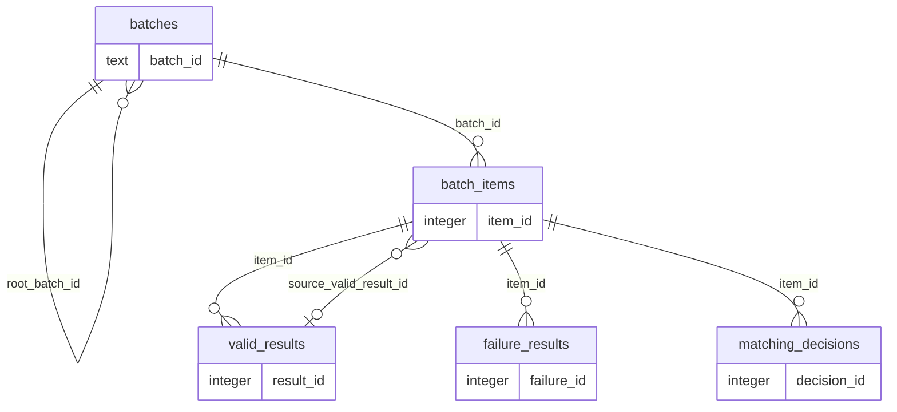

# Orchestrator storage reference

The orchestrator owns `orchestrator.db` (override with `ORCHESTRATOR_DB_PATH`). It stores New Input and Rerun lineage, per-item progress, append-only qualified ProductData snapshots, terminal failures, and Matching decision history. SQLite foreign keys, JSON validity checks, terminal-outcome guards, and WAL mode are enabled for every writable connection.

## Lifecycle

`batches` owns `batch_items`; each item reaches exactly one terminal record in either `valid_results` or `failure_results`. Reruns preserve a stable `logical_item_id`, point directly to the qualified source snapshot through `source_valid_result_id`, and keep intermediate stored-URL failures in `stage_trace` rather than creating a terminal failure beside a later success. Result tables keep only their own payload; batch, logical-item, input, URL, and execution metadata are joined through `item_id`.

## Tables

<!-- BEGIN GENERATED: orchestrator-tables -->

### `batches`

Top-level New Input and Rerun executions with lineage and lifecycle status.

| Column | Type | Nullable | Default | Key / constraints | Meaning |
|---|---|---|---|---|---|
| `batch_id` | `TEXT` | No | — | PK | Human-readable identifier for one top-level execution |
| `root_batch_id` | `TEXT` | No | — | FK → batches.batch_id | Initial New Input batch shared by the whole rerun lineage |
| `parent_batch_id` | `TEXT` | Yes | — | FK → batches.batch_id | Immediately requested parent batch for a rerun |
| `rerun_no` | `INTEGER` | No | `0` | — | Zero for New Input; monotonic rerun suffix within a root lineage |
| `operation` | `TEXT` | No | — | CHECK(operation IN ('new_input', 'rerun')) | User operation that created the batch |
| `status` | `TEXT` | No | — | CHECK(status IN ('running', 'completed', 'completed_with_failures', 'failed', 'interrupted')) | Batch lifecycle state |
| `vision_enabled` | `INTEGER` | No | `0` | — | Boolean integer controlling optional image comparison |
| `source_file` | `TEXT` | Yes | — | — | Original xlsx/csv/json path when New Input came from a file |
| `job_config` | `TEXT` | No | `'{}'` | CHECK(json_valid(job_config)) | JSON snapshot of invocation settings not represented by typed columns |
| `created_at` | `TEXT` | No | — | — | UTC ISO timestamp when the batch was allocated |
| `finished_at` | `TEXT` | Yes | — | — | UTC ISO timestamp when the batch reached a terminal state |
| `error_message` | `TEXT` | Yes | — | — | Batch-level fatal error, when present |

Indexes:

| Name | Columns | Unique | Purpose |
|---|---|---|---|
| `idx_orch_batches_root` | `root_batch_id`, `rerun_no` | No | Supports allocating and querying reruns for one root batch. |

Declared foreign keys:

| Column | References | On delete |
|---|---|---|
| `parent_batch_id` | `batches.batch_id` | `NO ACTION` |
| `root_batch_id` | `batches.batch_id` | `NO ACTION` |

### `batch_items`

One logical product execution inside a batch, including stage progress and fallback trace.

| Column | Type | Nullable | Default | Key / constraints | Meaning |
|---|---|---|---|---|---|
| `item_id` | `INTEGER` | No | — | PK; AUTOINCREMENT | Surrogate item execution identifier |
| `batch_id` | `TEXT` | No | — | UNIQUE(batch_id, row_index); FK → batches.batch_id ON DELETE CASCADE | Owning batch |
| `logical_item_id` | `TEXT` | No | — | — | Stable product identity copied through rerun descendants |
| `source_valid_result_id` | `INTEGER` | Yes | — | FK → valid_results.result_id | Prior qualified snapshot that supplied this rerun input |
| `row_index` | `INTEGER` | No | — | UNIQUE(batch_id, row_index) | Zero-based source-row position retained across reruns |
| `input_title` | `TEXT` | No | — | — | Original user title, possibly blank for an invalid row |
| `country` | `TEXT` | Yes | — | — | Normalized country code or NULL for invalid input |
| `site_name` | `TEXT` | Yes | — | — | Normalized marketplace key or NULL for invalid input |
| `input_gtin` | `TEXT` | Yes | — | — | Optional user-provided GTIN preserved as text |
| `input_image_urls` | `TEXT` | No | `'[]'` | CHECK(json_valid(input_image_urls)) | JSON array of original image URLs |
| `status` | `TEXT` | No | — | CHECK(status IN ('pending', 'running', 'valid', 'failed')) | Per-item lifecycle state |
| `execution_path` | `TEXT` | No | — | CHECK(execution_path IN ('new_input', 'stored_url', 'identity_revalidation', 'fallback')) | Current or terminal pipeline path |
| `search_title` | `TEXT` | Yes | — | — | Search-selected title; NULL unless Search succeeded |
| `matched_url` | `TEXT` | Yes | — | — | Search-selected or stored URL used for the latest stage |
| `stage_trace` | `TEXT` | No | `'[]'` | CHECK(json_valid(stage_trace)) | JSON array of ordered stage outcomes including non-terminal failures |
| `created_at` | `TEXT` | No | — | — | UTC ISO timestamp when this item execution was created |
| `updated_at` | `TEXT` | No | — | — | UTC ISO timestamp of the latest state transition |

Indexes:

| Name | Columns | Unique | Purpose |
|---|---|---|---|
| `idx_orch_items_logical` | `logical_item_id`, `item_id` | No | Supports locating one logical product throughout a rerun lineage. |
| `sqlite_autoindex_batch_items_1` | `batch_id`, `row_index` | Yes | SQLite auto-index for a declared UNIQUE constraint. |

Declared foreign keys:

| Column | References | On delete |
|---|---|---|
| `source_valid_result_id` | `valid_results.result_id` | `NO ACTION` |
| `batch_id` | `batches.batch_id` | `CASCADE` |

### `valid_results`

Append-only terminal qualified product snapshots available to future reruns.

| Column | Type | Nullable | Default | Key / constraints | Meaning |
|---|---|---|---|---|---|
| `result_id` | `INTEGER` | No | — | PK; AUTOINCREMENT | Surrogate qualified-result identifier |
| `item_id` | `INTEGER` | No | — | UNIQUE; FK → batch_items.item_id ON DELETE CASCADE | Exactly one Valid terminal for the item |
| `product_data` | `TEXT` | No | — | CHECK(json_valid(product_data)) | Complete qualified ProductData serialized as JSON |
| `created_at` | `TEXT` | No | — | — | UTC ISO timestamp when the snapshot was committed |

Indexes:

| Name | Columns | Unique | Purpose |
|---|---|---|---|
| `sqlite_autoindex_valid_results_1` | `item_id` | Yes | SQLite auto-index for a declared UNIQUE constraint. |

Declared foreign keys:

| Column | References | On delete |
|---|---|---|
| `item_id` | `batch_items.item_id` | `CASCADE` |

### `failure_results`

Append-only terminal row failures and business no-match outcomes.

| Column | Type | Nullable | Default | Key / constraints | Meaning |
|---|---|---|---|---|---|
| `failure_id` | `INTEGER` | No | — | PK; AUTOINCREMENT | Surrogate terminal-failure identifier |
| `item_id` | `INTEGER` | No | — | UNIQUE; FK → batch_items.item_id ON DELETE CASCADE | Exactly one Failure terminal for the item |
| `fail_node` | `TEXT` | No | — | CHECK(fail_node IN ('input', 'search', 'scraping', 'match', 'rerun')) | Actual terminal workflow stage |
| `failure_kind` | `TEXT` | No | — | — | Structured business or technical failure category |
| `reasoning` | `TEXT` | No | — | — | Human-readable rule, model, validation, or exception explanation |
| `detail` | `TEXT` | No | `'{}'` | CHECK(json_valid(detail)) | JSON diagnostics without changing the stable column contract |
| `created_at` | `TEXT` | No | — | — | UTC ISO timestamp when the terminal failure was committed |

Indexes:

| Name | Columns | Unique | Purpose |
|---|---|---|---|
| `idx_orch_failure_node` | `fail_node`, `failure_kind` | No | Supports failure breakdowns by terminal stage and category. |
| `sqlite_autoindex_failure_results_1` | `item_id` | Yes | SQLite auto-index for a declared UNIQUE constraint. |

Declared foreign keys:

| Column | References | On delete |
|---|---|---|
| `item_id` | `batch_items.item_id` | `CASCADE` |

### `matching_decisions`

Append-only record of every Matching invocation, including rule short-circuits and skipped decisions.

| Column | Type | Nullable | Default | Key / constraints | Meaning |
|---|---|---|---|---|---|
| `decision_id` | `INTEGER` | No | — | PK; AUTOINCREMENT | Surrogate matching-decision identifier |
| `item_id` | `INTEGER` | No | — | UNIQUE(item_id, attempt_no); FK → batch_items.item_id ON DELETE CASCADE | Item execution the decision belongs to |
| `attempt_no` | `INTEGER` | No | — | UNIQUE(item_id, attempt_no) | One-based Matching invocation counter within one item execution |
| `execution_path` | `TEXT` | No | — | CHECK(execution_path IN ('new_input', 'stored_url', 'identity_revalidation', 'fallback')) | Pipeline path that requested the decision |
| `url` | `TEXT` | Yes | — | — | Scraped product URL the decision was made against |
| `verdict` | `TEXT` | No | — | CHECK(verdict IN ('match', 'no_match', 'error')) | Business outcome, or error when Matching failed technically |
| `decision_source` | `TEXT` | No | — | CHECK(decision_source IN ('gtin', 'variant_rule', 'llm', 'identity_guard', 'technical_error')) | Node that settled the verdict |
| `gtin_status` | `TEXT` | Yes | — | CHECK(gtin_status IS NULL OR gtin_status IN ('pass', 'conflict', 'unknown')) | EvidenceStatus of the GTIN node, or NULL when that node did not run |
| `variant_status` | `TEXT` | Yes | — | CHECK(variant_status IS NULL OR variant_status IN ('pass', 'conflict', 'unknown')) | EvidenceStatus of the brand/numeric/multipack node, or NULL when that node did not run |
| `vision_status` | `TEXT` | Yes | — | CHECK(vision_status IS NULL OR vision_status IN ('not_requested', 'not_available', 'success', 'failed')) | VisionStatus of the image-comparison node, or NULL when that node did not run |
| `reasoning` | `TEXT` | Yes | — | — | Rule sentence or LLM one-sentence reasoning explaining the verdict |
| `decision_process` | `TEXT` | No | `'{}'` | CHECK(json_valid(decision_process)) | JSON ordered node trace with per-node status and detail |
| `created_at` | `TEXT` | No | — | — | UTC ISO timestamp when the decision was recorded |

Indexes:

| Name | Columns | Unique | Purpose |
|---|---|---|---|
| `sqlite_autoindex_matching_decisions_1` | `item_id`, `attempt_no` | Yes | SQLite auto-index for a declared UNIQUE constraint. |

Declared foreign keys:

| Column | References | On delete |
|---|---|---|
| `item_id` | `batch_items.item_id` | `CASCADE` |

## Views

View columns are derived from their query and therefore do not require per-column DDL comments.

| View | Columns | Purpose |
|---|---|---|
| `batch_summary` | `batch_id`, `root_batch_id`, `parent_batch_id`, `rerun_no`, `operation`, `status`, `vision_enabled`, `source_file`, `job_config`, `created_at`, `finished_at`, `error_message`, `total_items`, `valid_count`, `failure_count` | Batch lifecycle with terminal counts derived from item state instead of cached columns. |
| `item_outcomes` | `item_id`, `batch_id`, `logical_item_id`, `source_valid_result_id`, `row_index`, `input_title`, `country`, `site_name`, `input_gtin`, `input_image_urls`, `status`, `execution_path`, `search_title`, `matched_url`, `stage_trace`, `created_at`, `updated_at`, `result_id`, `product_data`, `failure_id`, `fail_node`, `failure_kind`, `failure_reasoning`, `failure_detail`, `terminal_at` | One row per item with its mutually exclusive Valid or Failure terminal payload. |
| `latest_valid_results` | `result_id`, `item_id`, `batch_id`, `root_batch_id`, `operation`, `rerun_no`, `logical_item_id`, `input_title`, `country`, `site_name`, `input_gtin`, `input_image_urls`, `search_title`, `url`, `execution_path`, `product_data`, `created_at` | Latest qualified snapshot for every stable logical product identity. |

<!-- END GENERATED: orchestrator-tables -->

## Relationships

<!-- BEGIN GENERATED: orchestrator-er -->

<!-- END GENERATED: orchestrator-er -->

## Schema compatibility

<!-- BEGIN GENERATED: orchestrator-migrations -->

Current `SCHEMA_VERSION`: `3`.

Version 3 transactionally rebuilds v1/v2 databases into the normalized five-table schema, removes denormalized terminal/result columns and duplicate indexes, moves the Rerun source reference to `batch_items.source_valid_result_id`, and derives summaries through views. Recoverable legacy `matching_result` / No Match JSON is backfilled into `matching_decisions`; stored-URL identity reuse is synthesized when its old Valid snapshot had no Matching payload. `vision_enabled` remains a typed batch column and is removed from `job_config` during migration.

<!-- END GENERATED: orchestrator-migrations -->

## Operational queries

Use `batch_summary` for lifecycle counts, `item_outcomes` for one-row-per-item inspection, and `latest_valid_results` for the current qualified snapshot of every logical product. Replay one item's Matching history by selecting `matching_decisions` in `attempt_no` order; join through `batch_items` for batch or lineage filters. `json_extract(decision_process, '$.terminated_at')` identifies the terminal node, while node absence shows a short-circuited stage. Failure reporting joins `failure_results` through the item and groups by both batch `operation` and `fail_node`.

Terminal guards reject a second Valid/Failure outcome, reject terminal status without its matching outcome row, and prevent later item mutation. These triggers complement the application transaction boundaries; `PRAGMA foreign_key_check` remains the migration and maintenance integrity check.
