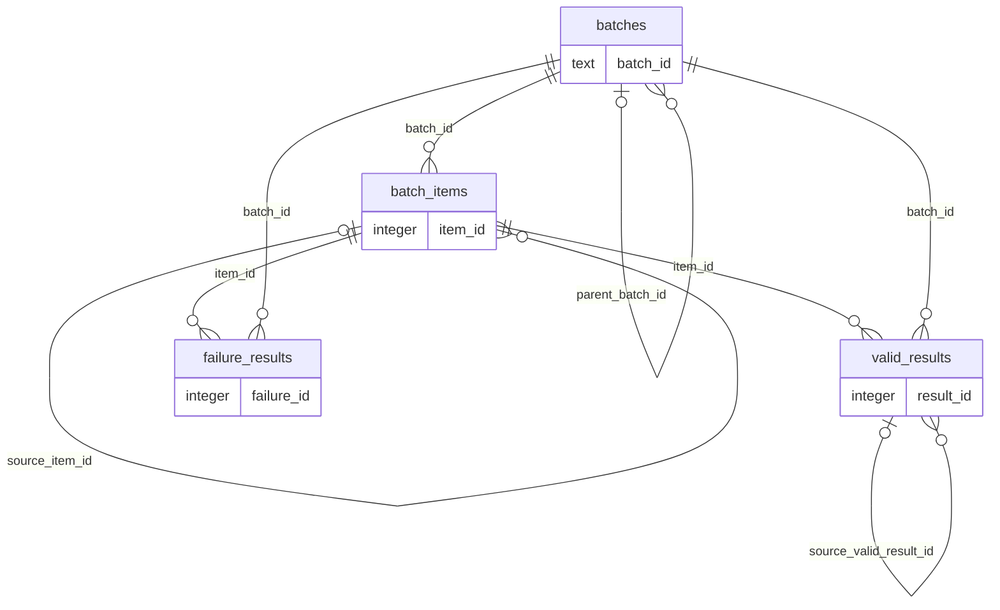

# Orchestrator storage reference

The orchestrator owns `orchestrator.db` (override with `ORCHESTRATOR_DB_PATH`). It stores New Input and Rerun lineage, per-item progress, append-only qualified ProductData snapshots, and terminal failures. SQLite foreign keys and WAL mode are enabled for every connection.

## Lifecycle

`batches` owns `batch_items`; each item reaches exactly one terminal record in either `valid_results` or `failure_results`. Reruns preserve a stable `logical_item_id`, point to their immediate source item/result, and keep intermediate stored-URL failures in `stage_trace` rather than creating a terminal failure beside a later success.

## Tables

<!-- BEGIN GENERATED: orchestrator-tables -->

### `batches`

Top-level New Input and Rerun executions with lineage and aggregate status.

| Column | Type | Nullable | Default | Key / constraints | Meaning |
|---|---|---|---|---|---|
| `batch_id` | `TEXT` | No | — | PK | Human-readable identifier for one top-level execution |
| `root_batch_id` | `TEXT` | No | — | — | Initial New Input batch shared by the whole rerun lineage |
| `parent_batch_id` | `TEXT` | Yes | — | FK → batches.batch_id | Immediately requested parent batch for a rerun |
| `rerun_no` | `INTEGER` | No | `0` | — | Zero for New Input; monotonic rerun suffix within a root lineage |
| `operation` | `TEXT` | No | — | CHECK(operation IN ('new_input', 'rerun')) | User operation that created the batch |
| `status` | `TEXT` | No | — | CHECK(status IN ('running', 'completed', 'completed_with_failures', 'failed', 'interrupted')) | Batch lifecycle state |
| `vision_enabled` | `INTEGER` | No | `0` | — | Boolean integer controlling optional image comparison |
| `source_file` | `TEXT` | Yes | — | — | Original xlsx/csv/json path when New Input came from a file |
| `job_config` | `TEXT` | No | `'{}'` | — | JSON snapshot of invocation settings |
| `total_items` | `INTEGER` | No | `0` | — | Number of rows/items registered in this batch |
| `valid_count` | `INTEGER` | No | `0` | — | Terminal Valid item count |
| `failure_count` | `INTEGER` | No | `0` | — | Terminal Failure item count |
| `created_at` | `TEXT` | No | — | — | UTC ISO timestamp when the batch was allocated |
| `finished_at` | `TEXT` | Yes | — | — | UTC ISO timestamp when the batch reached a terminal state |
| `error_message` | `TEXT` | Yes | — | — | Batch-level fatal error, when present |

Indexes:

| Name | Columns | Unique | Purpose |
|---|---|---|---|
| `idx_orch_batches_root` | `root_batch_id`, `rerun_no` | No | Supports allocating and querying reruns for one root batch. |

Declared foreign keys:

| Column | References | On delete |
|---|---|---|
| `parent_batch_id` | `batches.batch_id` | `NO ACTION` |

### `batch_items`

One logical product execution inside a batch, including stage progress and fallback trace.

| Column | Type | Nullable | Default | Key / constraints | Meaning |
|---|---|---|---|---|---|
| `item_id` | `INTEGER` | No | — | PK; AUTOINCREMENT | Surrogate item execution identifier |
| `batch_id` | `TEXT` | No | — | UNIQUE(batch_id, row_index); FK → batches.batch_id ON DELETE CASCADE | Owning batch |
| `logical_item_id` | `TEXT` | No | — | — | Stable product identity copied through rerun descendants |
| `source_item_id` | `INTEGER` | Yes | — | FK → batch_items.item_id | Prior item execution that supplied this rerun input |
| `row_index` | `INTEGER` | No | — | UNIQUE(batch_id, row_index) | Zero-based source-row position retained across reruns |
| `input_title` | `TEXT` | No | — | — | Original user title, possibly blank for an invalid row |
| `country` | `TEXT` | Yes | — | — | Normalized country code or NULL for invalid input |
| `site_name` | `TEXT` | Yes | — | — | Normalized marketplace key or NULL for invalid input |
| `input_gtin` | `TEXT` | Yes | — | — | Optional user-provided GTIN preserved as text |
| `input_image_urls` | `TEXT` | No | `'[]'` | — | JSON array of original image URLs |
| `status` | `TEXT` | No | — | CHECK(status IN ('pending', 'running', 'valid', 'failed')) | Per-item lifecycle state |
| `execution_path` | `TEXT` | No | — | — | new_input, stored_url, identity_revalidation, or fallback |
| `search_title` | `TEXT` | Yes | — | — | Search-selected title; NULL unless Search succeeded |
| `matched_url` | `TEXT` | Yes | — | — | Search-selected or stored URL used for the latest stage |
| `stage_trace` | `TEXT` | No | `'[]'` | — | JSON array of ordered stage outcomes including non-terminal failures |
| `created_at` | `TEXT` | No | — | — | UTC ISO timestamp when this item execution was created |
| `updated_at` | `TEXT` | No | — | — | UTC ISO timestamp of the latest state transition |

Indexes:

| Name | Columns | Unique | Purpose |
|---|---|---|---|
| `idx_orch_items_logical` | `logical_item_id`, `item_id` | No | Supports locating one logical product throughout a rerun lineage. |
| `idx_orch_items_batch` | `batch_id`, `row_index` | No | Supports loading all item executions for a batch in source order. |
| `sqlite_autoindex_batch_items_1` | `batch_id`, `row_index` | Yes | SQLite auto-index for a declared UNIQUE constraint. |

Declared foreign keys:

| Column | References | On delete |
|---|---|---|
| `source_item_id` | `batch_items.item_id` | `NO ACTION` |
| `batch_id` | `batches.batch_id` | `CASCADE` |

### `valid_results`

Append-only terminal qualified product snapshots available to future reruns.

| Column | Type | Nullable | Default | Key / constraints | Meaning |
|---|---|---|---|---|---|
| `result_id` | `INTEGER` | No | — | PK; AUTOINCREMENT | Surrogate qualified-result identifier |
| `batch_id` | `TEXT` | No | — | FK → batches.batch_id ON DELETE CASCADE | Denormalized owning batch for direct queries |
| `item_id` | `INTEGER` | No | — | UNIQUE; FK → batch_items.item_id ON DELETE CASCADE | Exactly one Valid terminal for the item |
| `logical_item_id` | `TEXT` | No | — | — | Stable product identity used for latest-result lineage lookup |
| `source_valid_result_id` | `INTEGER` | Yes | — | FK → valid_results.result_id | Prior Valid snapshot used by a rerun |
| `input_title` | `TEXT` | No | — | — | Original user title copied for self-contained result queries |
| `search_title` | `TEXT` | Yes | — | — | Search-selected title, or inherited title when no new Search ran |
| `url` | `TEXT` | No | — | — | Validated product URL stored for future reruns |
| `product_data` | `TEXT` | No | — | — | Complete qualified ProductData serialized as JSON |
| `matching_result` | `TEXT` | Yes | — | — | ProductMatchResult JSON; NULL when unchanged identity safely reused prior validation |
| `execution_path` | `TEXT` | No | — | — | Path that produced the result: new_input, stored_url, revalidated, or fallback |
| `created_at` | `TEXT` | No | — | — | UTC ISO timestamp when the snapshot was committed |

Indexes:

| Name | Columns | Unique | Purpose |
|---|---|---|---|
| `idx_orch_valid_batch` | `batch_id`, `result_id` | No | Supports batch result retrieval without joining through items. |
| `idx_orch_valid_logical` | `logical_item_id`, `result_id` | No | Supports latest Valid snapshot lookup for a logical product. |
| `sqlite_autoindex_valid_results_1` | `item_id` | Yes | SQLite auto-index for a declared UNIQUE constraint. |

Declared foreign keys:

| Column | References | On delete |
|---|---|---|
| `source_valid_result_id` | `valid_results.result_id` | `NO ACTION` |
| `item_id` | `batch_items.item_id` | `CASCADE` |
| `batch_id` | `batches.batch_id` | `CASCADE` |

### `failure_results`

Append-only terminal row failures and business no-match outcomes.

| Column | Type | Nullable | Default | Key / constraints | Meaning |
|---|---|---|---|---|---|
| `failure_id` | `INTEGER` | No | — | PK; AUTOINCREMENT | Surrogate terminal-failure identifier |
| `batch_id` | `TEXT` | No | — | FK → batches.batch_id ON DELETE CASCADE | Denormalized owning batch for direct queries |
| `item_id` | `INTEGER` | No | — | UNIQUE; FK → batch_items.item_id ON DELETE CASCADE | Exactly one Failure terminal for the item |
| `logical_item_id` | `TEXT` | No | — | — | Stable product identity retained for audit |
| `operation` | `TEXT` | No | — | CHECK(operation IN ('new_input', 'rerun')) | User operation active when the terminal failure occurred |
| `fail_node` | `TEXT` | No | — | CHECK(fail_node IN ('input', 'search', 'scraping', 'match', 'rerun')) | Actual terminal workflow stage |
| `failure_kind` | `TEXT` | No | — | — | Structured business or technical failure category |
| `input_title` | `TEXT` | No | — | — | Original user title copied for self-contained failure queries |
| `search_title` | `TEXT` | Yes | — | — | Search-selected title when Search succeeded before the failure |
| `url` | `TEXT` | Yes | — | — | Candidate or stored URL involved in the terminal failure |
| `reasoning` | `TEXT` | No | — | — | Human-readable rule, model, validation, or exception explanation |
| `detail` | `TEXT` | No | `'{}'` | — | JSON diagnostics without changing the stable column contract |
| `created_at` | `TEXT` | No | — | — | UTC ISO timestamp when the terminal failure was committed |

Indexes:

| Name | Columns | Unique | Purpose |
|---|---|---|---|
| `idx_orch_failure_node` | `batch_id`, `fail_node` | No | Supports failure reporting by operation stage. |
| `sqlite_autoindex_failure_results_1` | `item_id` | Yes | SQLite auto-index for a declared UNIQUE constraint. |

Declared foreign keys:

| Column | References | On delete |
|---|---|---|
| `item_id` | `batch_items.item_id` | `CASCADE` |
| `batch_id` | `batches.batch_id` | `CASCADE` |

<!-- END GENERATED: orchestrator-tables -->

## Relationships

<!-- BEGIN GENERATED: orchestrator-er -->

<!-- END GENERATED: orchestrator-er -->

## Schema compatibility

<!-- BEGIN GENERATED: orchestrator-migrations -->

Current `SCHEMA_VERSION`: `1`.

This is the initial orchestrator schema. Initialization uses idempotent CREATE statements and sets SQLite `user_version`; there are no legacy orchestrator databases to migrate.

<!-- END GENERATED: orchestrator-migrations -->

## Operational queries

Latest qualified snapshots for one root lineage can be found by joining `valid_results` through `batch_items` and `batches`, partitioning by `logical_item_id`, and selecting the greatest `result_id`. Failure reporting should group by both `operation` and `fail_node`: a Rerun fallback failure keeps `operation='rerun'` while exposing the actual terminal stage.
