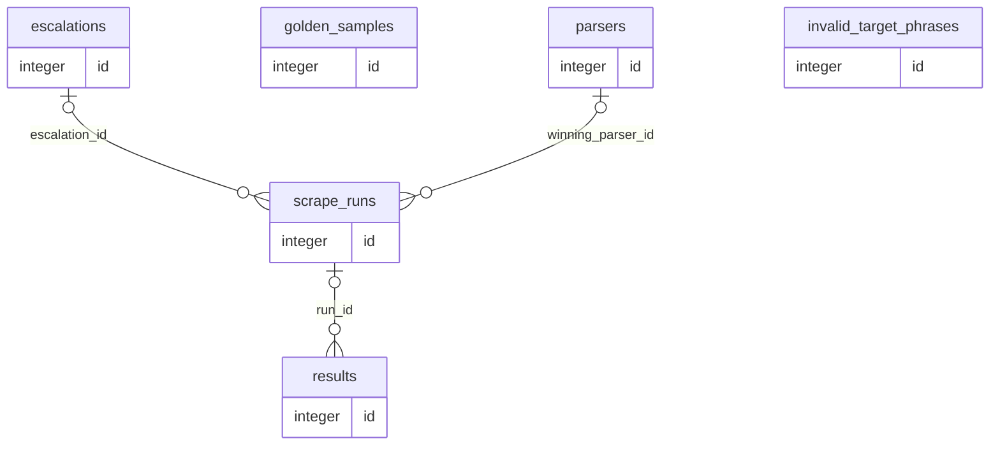

# Scraping storage reference

This document describes the SQLite schema owned by `src.scraping`. The generated regions come from the module-level DDL in `src/scraping/storage/database.py`, executed against an in-memory SQLite database and inspected with PRAGMA. Hand-written sections explain runtime conventions that SQLite cannot enforce.

The default file is `scraping.db`; `SCRAPING_DB_PATH` can override it. SQLite foreign-key enforcement is enabled on every `ScrapeDB` connection.

## Ownership and partitioning

`site` is the undeclared partition key across `parsers`, `golden_samples`, `scrape_runs`, `results`, and `invalid_target_phrases`. `ScrapeDB.clear_site()` uses it for selective clearing. `escalations` has no `site` column: its site is the first pipe-delimited segment of `signature`, and the clearing logic parses that segment. Any new signature format must preserve this convention.

`results.site` is copied from `ProductData.website`. Parser hit rate is not stored; `ParserStore.get_active_ordered_by_hits()` derives it from successful `scrape_runs.winning_parser_id` references.

Known reserved or currently unwritten fields:

- `parsers.page_type_scope` is accepted by the store API but current runtime flows do not populate it.
- `scrape_runs.attempts` remains at its default value of `1` in current writers.
- `scrape_runs.path='retried'` is allowed by the schema but current writers do not emit it.

## Tables

<!-- BEGIN GENERATED: scraping-tables -->

### `parsers`

Versioned parser implementations generated or seeded for each retailer.

| Column | Type | Nullable | Default | Key / constraints | Meaning |
|---|---|---|---|---|---|
| `id` | `INTEGER` | No | — | PK; AUTOINCREMENT | Surrogate parser identifier; referenced by scrape_runs.winning_parser_id |
| `site` | `TEXT` | No | — | — | Retailer key such as tesco, argos, or amazon |
| `version` | `TEXT` | No | — | — | Parser version label supplied when the parser is created |
| `code` | `TEXT` | No | — | — | Executable Python parser source stored as text |
| `page_type_scope` | `TEXT` | Yes | — | — | Optional page-type specialization; currently not populated by runtime flows |
| `status` | `TEXT` | No | `'active'` | CHECK(status IN ('active', 'retired')) | Lifecycle state: active or retired |
| `created_at` | `TEXT` | No | `strftime('%Y-%m-%dT%H:%M:%fZ', 'now')` | — | UTC creation timestamp generated by SQLite |
| `created_by` | `TEXT` | No | `'initial'` | CHECK(created_by IN ('initial', 'agent')) | Provenance: initial seed or repair agent |

Indexes:

| Name | Columns | Unique | Purpose |
|---|---|---|---|
| `idx_parsers_site_status` | `site`, `status` | No | Supports active parser selection within a site. |

### `golden_samples`

Golden HTML captures and expected outputs used to qualify parser promotion.

| Column | Type | Nullable | Default | Key / constraints | Meaning |
|---|---|---|---|---|---|
| `id` | `INTEGER` | No | — | PK; AUTOINCREMENT | Surrogate golden-sample identifier |
| `site` | `TEXT` | No | — | — | Retailer partition key |
| `page_type` | `TEXT` | No | — | CHECK(page_type IN ('standard', 'out_of_stock', 'discounted', 'multipack', 'membership')) | Declared scenario bucket covered by this sample. |
| `html_snapshot` | `TEXT` | No | — | — | Captured product-page HTML used by parser tests |
| `expected_output` | `TEXT` | No | — | — | JSON object containing the expected ProductData fields |
| `captured_at` | `TEXT` | No | `strftime('%Y-%m-%dT%H:%M:%fZ', 'now')` | — | UTC capture timestamp generated by SQLite |
| `is_stale` | `INTEGER` | No | `0` | — | Boolean integer; 1 excludes the sample from active golden tests |
| `created_by` | `TEXT` | No | `'auto'` | CHECK(created_by IN ('coldstart', 'auto')) | Provenance: reviewed cold start or automatic runtime seed |

Indexes:

| Name | Columns | Unique | Purpose |
|---|---|---|---|
| `idx_golden_site_page` | `site`, `page_type`, `is_stale` | No | Supports active golden coverage lookup by site and page type. |

### `escalations`

Signature-deduplicated terminal-failure tickets requiring human attention.

| Column | Type | Nullable | Default | Key / constraints | Meaning |
|---|---|---|---|---|---|
| `id` | `INTEGER` | No | — | PK; AUTOINCREMENT | Surrogate escalation identifier; referenced by scrape_runs.escalation_id |
| `signature` | `TEXT` | No | — | UNIQUE | Deduplication key whose first pipe-delimited segment must be the site |
| `reason` | `TEXT` | No | — | CHECK(reason IN ('parser_broken', 'infra_failure', 'api_malformed', 'mass_invalid_target')) | Closed failure category |
| `affected_count` | `INTEGER` | No | `1` | — | Number of executions merged into this ticket |
| `snapshot` | `TEXT` | Yes | — | — | Optional JSON diagnostic snapshot captured at escalation time |
| `status` | `TEXT` | No | `'open'` | CHECK(status IN ('open', 'resolved')) | Human-resolution state: open or resolved |
| `created_at` | `TEXT` | No | `strftime('%Y-%m-%dT%H:%M:%fZ', 'now')` | — | UTC ticket creation timestamp generated by SQLite |

Indexes:

| Name | Columns | Unique | Purpose |
|---|---|---|---|
| `sqlite_autoindex_escalations_1` | `signature` | Yes | SQLite auto-index for a declared UNIQUE constraint. |

### `scrape_runs`

One execution record for every terminal scraping outcome.

| Column | Type | Nullable | Default | Key / constraints | Meaning |
|---|---|---|---|---|---|
| `id` | `INTEGER` | No | — | PK; AUTOINCREMENT | Surrogate execution identifier; referenced by results.run_id |
| `url` | `TEXT` | No | — | — | Requested product URL |
| `host` | `TEXT` | No | — | — | Normalized URL host used for routing |
| `site` | `TEXT` | No | — | — | Retailer partition key resolved from the host |
| `scraper` | `TEXT` | No | — | — | Concrete scraper class or route used for this execution |
| `scraped_at` | `TEXT` | No | `strftime('%Y-%m-%dT%H:%M:%fZ', 'now')` | — | UTC execution timestamp generated by SQLite |
| `outcome` | `TEXT` | No | — | CHECK(outcome IN ('success', 'escalated', 'invalid_target')) | Terminal outcome: success, escalated, or invalid_target |
| `path` | `TEXT` | No | — | CHECK(path IN ('fast', 'retried', 'agent_repaired', 'backup_1', 'backup_2', 'escalated', 'invalid_target')) | Winning execution route; retried remains reserved but is not currently written. |
| `winning_parser_id` | `INTEGER` | Yes | — | FK → parsers.id | Parser that produced a successful HTML extraction, when applicable |
| `attempts` | `INTEGER` | No | `1` | — | Reserved attempt counter; current writers leave the default value |
| `repair_model` | `TEXT` | Yes | — | — | Model identifier used when an agent-repaired parser won |
| `latency_ms` | `INTEGER` | Yes | — | — | End-to-end execution latency in milliseconds |
| `signature` | `TEXT` | Yes | — | — | Failure signature copied onto terminal failed executions |
| `error` | `TEXT` | Yes | — | — | Terminal diagnostic message for failed executions |
| `escalation_id` | `INTEGER` | Yes | — | FK → escalations.id ON DELETE SET NULL | Aggregate failure ticket linked to this execution |

Indexes:

| Name | Columns | Unique | Purpose |
|---|---|---|---|
| `idx_scrape_runs_escalation` | `escalation_id` | No | Supports aggregate-ticket to execution correlation. |
| `idx_scrape_runs_site_outcome` | `site`, `outcome`, `scraped_at` | No | Supports per-site outcome analysis over time. |
| `idx_scrape_runs_site` | `site` | No | Supports per-site execution filtering and clearing. |
| `idx_scrape_runs_url_scraped` | `url`, `scraped_at` | No | Speeds URL history lookup in reverse chronological order. |

Declared foreign keys:

| Column | References | On delete |
|---|---|---|
| `escalation_id` | `escalations.id` | `SET NULL` |
| `winning_parser_id` | `parsers.id` | `NO ACTION` |

### `results`

Append-only qualified ProductData results produced by successful executions.

| Column | Type | Nullable | Default | Key / constraints | Meaning |
|---|---|---|---|---|---|
| `id` | `INTEGER` | No | — | PK; AUTOINCREMENT | Surrogate result identifier |
| `url` | `TEXT` | No | — | — | Product URL represented by the stored result |
| `site` | `TEXT` | No | — | — | Retailer key copied from ProductData.website |
| `scraped_at` | `TEXT` | No | — | — | UTC timestamp supplied with the qualified result |
| `product_data` | `TEXT` | No | — | — | Complete qualified ProductData serialized as JSON |
| `run_id` | `INTEGER` | Yes | — | FK → scrape_runs.id ON DELETE SET NULL | Exact producing execution when correlation is available |

Indexes:

| Name | Columns | Unique | Purpose |
|---|---|---|---|
| `idx_results_run` | `run_id` | No | Supports execution to qualified-result correlation. |
| `idx_results_site_scraped` | `site`, `scraped_at` | No | Supports per-site result history in timestamp order. |
| `idx_results_url` | `url` | No | Speeds product result history lookup by URL. |

Declared foreign keys:

| Column | References | On delete |
|---|---|---|
| `run_id` | `scrape_runs.id` | `SET NULL` |

### `invalid_target_phrases`

Site-specific phrases learned for cheap invalid-target pre-detection.

| Column | Type | Nullable | Default | Key / constraints | Meaning |
|---|---|---|---|---|---|
| `id` | `INTEGER` | No | — | PK; AUTOINCREMENT | Surrogate learned-phrase identifier |
| `site` | `TEXT` | No | — | — | Retailer partition key |
| `phrase` | `TEXT` | No | — | — | Lower-level page phrase indicating a non-product target |
| `source` | `TEXT` | No | `'agent_backfill'` | — | Provenance label for the learned phrase |
| `added_at` | `TEXT` | No | `strftime('%Y-%m-%dT%H:%M:%fZ', 'now')` | — | UTC insertion timestamp generated by SQLite |

Indexes:

| Name | Columns | Unique | Purpose |
|---|---|---|---|
| `idx_phrases_site` | `site` | No | Supports phrase matching and clearing within a site. |

<!-- END GENERATED: scraping-tables -->

## Relationships

Only declared SQLite foreign keys appear here. The shared `site` values and signature convention are application-level relationships.

<!-- BEGIN GENERATED: scraping-er -->



<!-- END GENERATED: scraping-er -->

## Closed value sets

- `parsers.status`: `active`, `retired`; `parsers.created_by`: `initial`, `agent`.
- `golden_samples.page_type`: `standard`, `out_of_stock`, `discounted`, `multipack`, `membership`; `created_by`: `coldstart`, `auto`.
- `escalations.reason`: `parser_broken`, `infra_failure`, `api_malformed`, `mass_invalid_target`; `status`: `open`, `resolved`.
- `scrape_runs.outcome`: `success`, `escalated`, `invalid_target`; `path`: `fast`, `retried`, `agent_repaired`, `backup_1`, `backup_2`, `escalated`, `invalid_target`.

Boolean integers use `0` / `1`, notably `golden_samples.is_stale`.

## Automatic compatibility migrations

<!-- BEGIN GENERATED: scraping-migrations -->

`ScrapeDB.init_db()` creates the current schema, then `_ensure_columns()` applies these idempotent compatibility migrations inside `BEGIN IMMEDIATE`:

| Operation | Table | Column(s) | Definition / result |
|---|---|---|---|
| Add if missing | `golden_samples` | `created_by` | `TEXT NOT NULL DEFAULT 'auto' CHECK(created_by IN ('coldstart', 'auto'))` |
| Add if missing | `scrape_runs` | `signature` | `TEXT` |
| Add if missing | `scrape_runs` | `error` | `TEXT` |
| Add if missing | `scrape_runs` | `repair_model` | `TEXT` |
| Add if missing | `scrape_runs` | `escalation_id` | `INTEGER REFERENCES escalations(id) ON DELETE SET NULL` |
| Add if missing | `results` | `run_id` | `INTEGER REFERENCES scrape_runs(id) ON DELETE SET NULL` |
| Rename / merge | `scrape_runs` | `model_used` → `repair_model` | Preserve the new value, otherwise copy the old value |
| Drop if present | `scrape_runs` | `cost` | Removed from the current schema |

Existing rows are not backfilled for nullable correlation fields (`results.run_id`, `scrape_runs.escalation_id`, `signature`, or `error`) because their exact historical relationships cannot be reconstructed safely.

<!-- END GENERATED: scraping-migrations -->

## Common queries

```sql
-- Price history for a URL
SELECT scraped_at, product_data
FROM results
WHERE url = ?
ORDER BY scraped_at DESC;

-- Qualified result to exact producing run and parser
SELECT r.id, r.scraped_at, s.path, s.scraper, s.winning_parser_id, p.version
FROM results r
LEFT JOIN scrape_runs s ON s.id = r.run_id
LEFT JOIN parsers p ON p.id = s.winning_parser_id
WHERE r.url = ?
ORDER BY r.id DESC;

-- Parser hit rates for a site
SELECT winning_parser_id, COUNT(*) AS hits
FROM scrape_runs
WHERE site = ? AND outcome = 'success'
GROUP BY winning_parser_id
ORDER BY hits DESC;

-- Open escalations needing human attention
SELECT *
FROM escalations
WHERE status = 'open'
ORDER BY affected_count DESC;

-- Aggregate ticket to every affected execution
SELECT id, url, scraper, outcome, path, signature, error
FROM scrape_runs
WHERE escalation_id = ?
ORDER BY id DESC;
```

## Adding or changing a column

1. Edit `_DDL` so a fresh database has the final column and add a `--` meaning comment on the column line or immediately above it.
2. If existing databases need an additive, rename, or removal migration, update `_ADDED_COLUMNS`, `_RENAMED_COLUMNS`, or `_REMOVED_COLUMNS`. An added column must also exist in `_DDL`.
3. Update all relevant store reads and writes, then run `uv run python scripts/gen_storage_docs.py`.
4. Run `uv run python scripts/gen_storage_docs.py --check`, the storage-generator unit tests, and the schema-touching scraping tests.

Do not hand-edit generated regions; the pre-commit hook rewrites and stages them.
