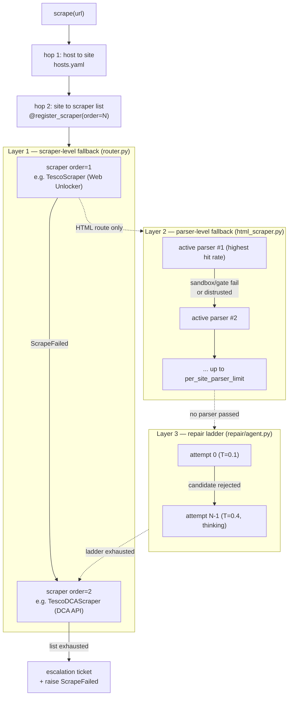
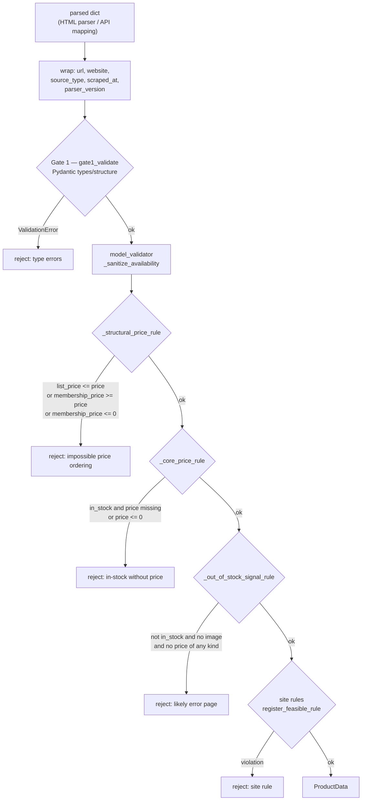
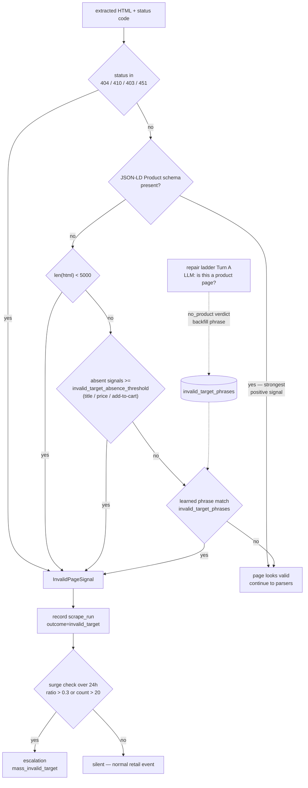
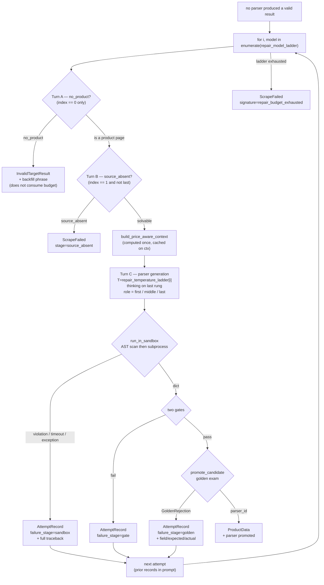
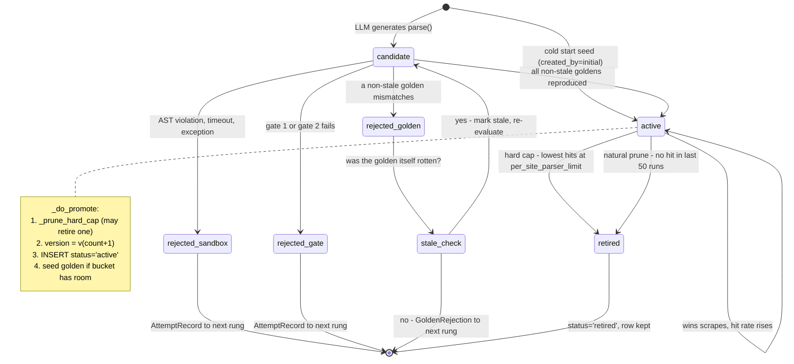
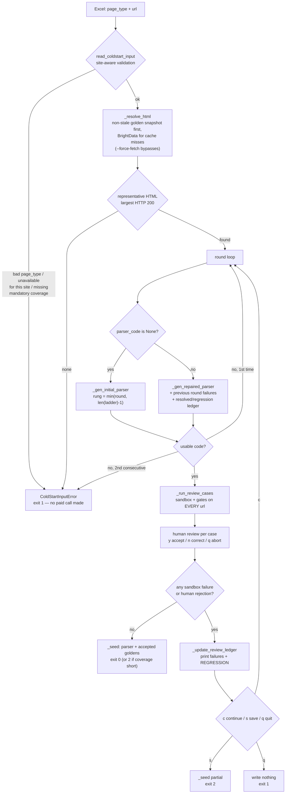
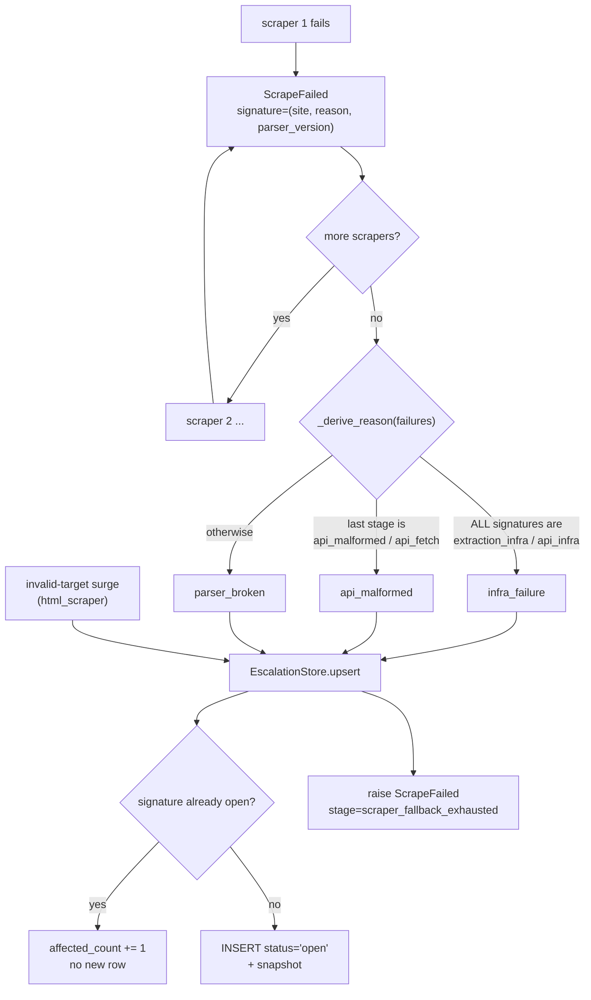

# Scraping Module — Design Reference

How `src/scraping` actually works, mechanism by mechanism: what each mechanism does, what
state it owns, why it is shaped that way, and where its known seams are.

## 0. How to read this document

Five documents cover the scraping module. They do different jobs — pick the right one:

| Document | Job | Read it when |
|---|---|---|
| [`src/scraping/README.md`](../src/scraping/README.md) | Operator manual — install, run, add a site, config table, exit codes | You are *using* the module |
| [`src/scraping/CLAUDE.md`](../src/scraping/CLAUDE.md) (= `AGENTS.md`) | Milestone log M1–M23, newest behavior first | You need to know *what changed and when* |
| [`src/scraping/scraping_module_spec_v1_2.md`](../src/scraping/scraping_module_spec_v1_2.md) | The original Phase-0 spec (Chinese) with decisions **D1–D29** and their rationale | You are about to overturn a decision and need the original reasoning |
| [`docs/scraping_storage.md`](scraping_storage.md) | Generated SQLite tables, columns, constraints, relationships, migrations, and queries | You need the exact persisted schema |
| **This document** | Mechanism-level design reference, written from the code as it stands | You are *analyzing or evolving* the design |

Two rules for this document: it describes the code as it is today (M23), and it does not
repeat what the README already explains operationally. `D<n>` references point at the
spec's decision table.

### Where spec v1.2 is now out of date

The spec is frozen at v1.2 and predates M13–M23. Do not act on these parts of it:

| Spec says | Code does | Since |
|---|---|---|
| repair budget is a fixed 3 attempts | budget is `len(repair_model_ladder)`, default 2 | M12 |
| 4 page types (standard / out_of_stock / discounted / multipack) | 5 — `membership` added | M14 |
| repair ladder is `flash → flash+errors → pro+all errors` | ladder is a config list of model ids; escalation is temperature + thinking + role strategy | M12 |
| no per-site page-type declarations | [`sites.yaml`](../src/scraping/sites.yaml) declares availability, cold-start requirements, and membership hints | M23 |
| price fields are `price` / `list_price` (+ unit price) | canonical three-price contract, unit-price fields removed | M20, M22 |

Everything else in the spec — especially the D1–D29 rationale — still holds.

---

## 1. Contract and overall data flow

The module's public surface is one async function and three result types
([`src/scraping/__init__.py`](../src/scraping/__init__.py)):

```python
result = await scrape(url)      # ProductData | InvalidTargetResult
                                # raises ScrapeFailed on terminal failure
```

Three outcomes, not two. `InvalidTargetResult` is a *result*, not a failure: the URL was
reachable and parseable but does not correspond to a live product (delisted, 404-with-200,
wrong link). Conflating it with failure would trigger repair, fallback, and escalation for
what is a completely normal event on any retail site (D27, D29). See §3.

### The three nested fallback layers

This is the single most confusable thing in the module. Three different "try the next one"
loops are nested inside each other, and they are not interchangeable:



- **Layer 1 — scraper-level fallback** ([`router.py`](../src/scraping/router.py)). Different
  *acquisition channels* for the same site: Tesco has a Web Unlocker HTML scraper at
  `order=1` and a DCA API scraper at `order=2`. Rationale (D23): when one BrightData channel
  is stuck, another often gets through, and a vendor-maintained API may already have adapted
  to a site redesign.
- **Layer 2 — parser-level fallback** ([`html_scraper.py:_run_parsers`](../src/scraping/scrapers/html_scraper.py)).
  Different *ways of reading the same HTML*, inside one scraper. Rationale (D2): a site
  runs several page templates (A/B tests, category variants), so replacing the parser
  wholesale would kill pages the old one still served; an ordered list of small independent
  parsers gives replacement's cleanliness with union's safety, and each unit stays
  independently prunable.
- **Layer 3 — repair ladder** ([`repair/agent.py`](../src/scraping/repair/agent.py)). When
  no existing parser works, an LLM writes a new one. Only the HTML route has this — the API
  route has no selectors to fix (D10).

Only layer 1 is visible to the caller. Layers 2 and 3 are internal to a single
`scraper.scrape(url)` call.

### Who writes which table

Six SQLite tables ([`storage/database.py`](../src/scraping/storage/database.py)), one
database at `db_path`. Knowing the writer of each explains most of the module's coupling:

| Table | Written by | On |
|---|---|---|
| `parsers` | `golden.py:_do_promote`, `coldstart.py:_seed` | Candidate promoted / cold start succeeded |
| `golden_samples` | `golden.py:maybe_seed_golden` + `_maybe_seed_golden_inline`, `coldstart.py:_seed` | Successful scrape with bucket room / human acceptance |
| `scrape_runs` | `html_scraper._record_run`, `api_scraper._record_run` | Every scrape attempt — the sole source of hit rates (D17) |
| `results` | `ResultStore.append` | Every result that passed both gates, append-only (D24) |
| `escalations` | `router._write_escalation`, `html_scraper._check_mass_invalid_target` | Scraper list exhausted / invalid-target surge |
| `invalid_target_phrases` | `agent._backfill_phrase` | Ladder Turn A judged a page "not a product" |

`scrape_runs` is high-frequency and deliberately stores no HTML (D16 — a single Argos page
reaches 1.6 MB). Large text lives only in `golden_samples` and `escalations`.

---

## 2. The two gates (shared checkpoint)

Every produced dict — from a stored parser, from a fresh LLM candidate, from an API field
mapping — passes through the same two gates
([`validation/__init__.py:validate`](../src/scraping/validation/__init__.py)).



**Gate 1** is pure Pydantic: types and structure, single fields only. `price` is
deliberately optional here — a type system can only judge unconditionally, so making price
required would kill legitimate out-of-stock products, and making it optional would miss the
real fault of an in-stock product with no price (D13).

**Gate 2** (`feasible_check`) is where the conditional, cross-field rules live
([`validation/gate2.py`](../src/scraping/validation/gate2.py)). Three route-agnostic rules:

1. `_structural_price_rule` — enforces `list_price > price > membership_price` for whichever
   fields are present, and rejects a non-positive `membership_price`. This catches the
   most common LLM parser error: mapping the same amount into two price fields, or
   inverting the member/regular relationship.
2. `_core_price_rule` — an in-stock product must have a positive ordinary `price`. This
   guarantees every in-stock result has exactly one stable comparable number, which is what
   the downstream matching module consumes.
3. `_out_of_stock_signal_rule` — an out-of-stock product with no images *and* no price of any
   kind is almost certainly an error/soft-block page, not a real product. It catches
   title-only extractions where a generated parser matched a generic `<h1>` on an error page.

### The canonical price contract

Gate 2's rules only make sense against the field semantics fixed in M20, which the whole
module leans on — parser prompts, promotion detection, golden classification, and cold-start
review all restate it:

| Field | Meaning | Page-type combination |
|---|---|---|
| `price` | The ordinary, non-member, current customer price | standard: `price` alone |
| `list_price` | A separately displayed **higher** Was/RRP reference | discounted: `price + list_price` |
| `membership_price` | A visibly **gated lower** loyalty/member price | membership: `price + membership_price` (+ optional `list_price`) |

A `Was £X Now £Y` markdown is a discount, never a membership price — even when JSON-LD tags
the offer with a member tier. That distinction is the difference between a correct price
series and a silently wrong one.

### Why the gates are route-agnostic

They are the single choke point where a bad mapping can be stopped before it becomes
permanent. A gate failure blocks three separate persistence paths at once: writing to
`results`, promoting a candidate parser, and seeding a golden sample. If gate 2 were per-route
or per-site, a semantic error could be promoted into the golden set and then defended by the
promotion exam forever.

A second, narrower choke point sits inside the model itself:
`ProductData._sanitize_availability` ([`models/product_data.py`](../src/scraping/models/product_data.py))
recovers a schema.org availability token from anywhere in a blob and otherwise derives the
label from `in_stock` — so no parser, on either route, can ever surface a raw JSON-LD script
as `availability_raw`.

`register_feasible_rule(site, rule)` exists as a per-site escape hatch. It is intentionally
unused: see §12.

---

## 3. Invalid-target detection (not a failure — a third result class)



Detection lives in one small tool ([`detection.py`](../src/scraping/detection.py)) reused at
two call sites, which is the point of D20: soft-wall, captcha, and delisted-page detection
are the same judgment ("this page has no valid product content"), and writing it three times
guarantees that one copy is forgotten when a site changes its error page.

**Structural first, keywords auxiliary (D26).** Out-of-stock wording differs per site and
changes without notice ("sorry this product is out" / "Oops, that didn't go to plan" / …), so
a keyword dictionary needs endless per-site maintenance and never converges. JSON-LD Product
schema is machine-readable data that retailers maintain for search engines — it does not
move with front-end copy or language.

**The phrase list grows itself.** When the repair ladder's Turn A judges an unfamiliar page
to be a non-product, it stores the page's characteristic phrase
(`agent._backfill_phrase` → `invalid_target_phrases`), and the next page of the same kind is
caught by cheap pre-detection instead of burning an LLM call. This is the module's only
self-growing lookup table, and it is deliberately *auxiliary*: a wrong phrase degrades cost,
not correctness, because it only fires after all structural signals have already been checked.

**One is silent, a surge is not (D29).** A single delisted product among 100 URLs is normal;
generating a human ticket for it would be pure noise. But an abnormal share of
`invalid_target` for one site within 24 hours usually means a site-wide URL structure change
— that is worth waking someone for. Thresholds: `mass_invalid_target_ratio` (0.3) or
`mass_invalid_target_absolute` (20), with a minimum of 5 runs to avoid small-sample noise
([`html_scraper.py:_check_mass_invalid_target`](../src/scraping/scrapers/html_scraper.py)).

---

## 4. HTML route: the ordered parser list and the fast path

`_run_parsers` reads the site's active parsers ordered by hit rate DESC, then id DESC
([`storage/parser_store.py:get_active_ordered_by_hits`](../src/scraping/storage/parser_store.py))
and tries each in a sandbox until one produces a dict that clears both gates.

**Hit rates are never stored** (D17). They are aggregated live with a `GROUP BY
winning_parser_id` over `scrape_runs`. A stored counter drifts from the run history the
first time anything is backfilled, retried, or deleted; a computed one cannot. The `id DESC`
tiebreak means a freshly promoted parser (0 hits) sorts ahead of older 0-hit parsers, which
reconciles the spec's two orderings: "by hit rate" and "put a promotion at the front".

### The fast-path distrust guard

A parser that passes both gates can still be quietly wrong, so there is one more layer
([`html_scraper.py:_fast_path_sane`](../src/scraping/scrapers/html_scraper.py)). It runs two
structural checks against the page and rejects an otherwise-valid result:

1. **`availability_raw` is a JSON blob** — the parser grabbed the whole JSON-LD script
   instead of navigating to the availability token.
2. **The page carries a visible promotion signal the parser missed** —
   `detect_promotion` finds a struck reference price or gated member price, but the result
   has neither `list_price` nor `membership_price`.

The design insight: **gates can only see what the parser returned, never what the page showed
and the parser omitted.** A parser learned on a single-price product page passes every gate on
a discounted page while silently dropping the discount. Distrust falls the request through to
the repair ladder, which generates a better parser and promotes it — the failure is corrected
rather than merely detected.

The guard is intentionally lopsided: a false distrust costs one repair cycle, a false trust
writes a wrong price into an append-only history. It also degrades safely — if promotion
detection itself raises, the parser is trusted and the exception is logged at debug level.

---

## 5. The repair ladder (runtime self-healing)



### Budget is a list, not a number

Attempt count is `len(cfg.repair_model_ladder)`; the temperature list must match in length
and is asserted at runtime. Adding or removing a rung is a config edit, and the ladder's
behavior adapts through **semantic positions** rather than hardcoded indices: `first`
(index 0), `middle`, `last` (index n-1). This is why Turn B is skipped on the default 2-node
ladder — `source_absence` only runs on a non-last attempt, and on a 2-node ladder index 1
*is* last, so there is nothing left to skip toward.

The three turns, and why each is where it is:

- **Turn A — `no_product`** (attempt 0 only). Before spending a parser-generation call, ask
  whether the page is a product page at all. It runs at temperature 0.1 like all judgment
  prompts, and a `no_product` verdict does **not** consume budget — it is a different
  outcome class, not a failure (D27).
- **Turn B — `source_absence`** (non-last attempt only). Distinguishes "hard to parse"
  (solvable, keep spending) from "the data simply is not in this HTML" (soft-wall, captcha,
  structurally missing fields — unsolvable, stop). Escalating the model against absent data
  is pure spend (D19). Running it on the last attempt would be pointless, since there is no
  further budget to protect.
- **Turn C — parser generation** (every attempt). Produces `def parse(html, url) -> dict`.

Parse exceptions and gate failures share one budget (D8). Counting them separately produces a
ping-pong loop: parse succeeds → feasible fails → repair → parse succeeds → feasible fails
again, with neither counter ever exhausting.

### How the ladder converges

Escalating the model is only one of several levers, and on the default ladder
(`["deepseek-v4-flash", "deepseek-v4-flash"]`) it is not used at all. What actually varies
between attempts:

- **`AttemptRecord`** ([`repair/agent.py`](../src/scraping/repair/agent.py)) — every attempt
  records its index, model, generated code, sandbox output, a `summarize_capture()` breakdown
  (which fields were captured / missing-required / missing-optional), the failure stage, and
  its errors. Because code, capture, and errors live in one indexed record, the prompt builder
  cannot misalign an error with the wrong candidate — the failure mode of the earlier
  parallel-list design.
- **Full sandbox tracebacks** are propagated, not just exception messages, so the next attempt
  sees the failing line and expression.
- **`GoldenRejection`** carries which golden, which field, expected vs. actual — a far more
  actionable signal than "golden test failed".
- **Temperature ramp** from `repair_temperature_ladder` (default `[0.1, 0.4]`). Judgment
  prompts (Turns A/B) always stay at 0.1 regardless.
- **Thinking mode** on the last rung only, via the provider's `thinking_extra_body`.
- **Role strategy** ([`repair/prompts.py:_ROLE_STRATEGY`](../src/scraping/repair/prompts.py)):
  `first` = try the simplest viable approach (JSON-LD `Product` block); `middle` = fix the
  specific missing field from the capture summary, do not rewrite from scratch; `last` =
  think step by step and inspect all prior records.

### Input quality: the price-aware pre-pass

Turn C does not receive raw HTML. `build_price_aware_context`
([`repair/prepass.py`](../src/scraping/repair/prepass.py)) builds a structured `PriceContext`
first — this is the module's largest single file (~1570 lines) and the largest lever on repair
quality:

1. **Three evidence sources** — DOM currency scan, meta-description scan, and a schema.org
   JSON-LD walk (`priceSpecification`, `validForMemberTier`), each emitted as a
   `PriceEvidence` with its label, CSS hint, struck-through flag, and surrounding snippet.
2. **Anchoring to the main product** — evidence is marked `inside_main` vs `ambiguous` using
   the URL product id, the canonical title, `<h1>` proximity, cross-source value
   corroboration (a visible price equal to the JSON-LD main-offer price *is* the main price),
   and membership of the primary price container.
3. **Cross-sell deletion** — prices belonging to recommendation carousels are hard-deleted
   before emission, so the model never sees them.
4. **Evidence-first budget allocation** — excerpts are trimmed around the evidence, so no DOM
   price subtree can be truncated away by the token budget.

The problem this solves: an LLM handed a 1.6 MB page finds *a* price, and on a discounted or
membership page that is frequently the wrong one. Prompt rules are stated as evidence rules
(struck-through or labelled → `list_price`; visibly gated → `membership_price`) and are
site-agnostic. `validForMemberTier` is only a corroborating hint — treating it as
authoritative (as M14 briefly did) misclassifies ordinary markdowns as membership prices.

`detect_promotion(soup, trusted_values, site)` classifies the main price container
structurally: it scores candidate containers on six factors (does it wrap a trusted JSON-LD
value, buy-box class hints, mid-size, contains a price amount, gating keywords, `<h1>`
proximity) rather than taking the first plausible one, then resolves gating → membership,
reference-only → discount, neither → `None`. A site profile can **veto** the membership
interpretation (§11). The same detector serves the pre-pass, the fast-path distrust guard,
and cold start — one implementation, no drift.

### The sandbox is a safety boundary, not a correctness check

[`repair/sandbox.py`](../src/scraping/repair/sandbox.py) runs candidate code through:

1. **AST scan before execution** — import whitelist (`bs4`, `lxml`, `re`, `json`), forbidden
   builtins (`open`, `eval`, `exec`, `compile`, `__import__`, …), forbidden attribute roots
   (`os`, `sys`, `socket`, `subprocess`, …), and forbidden dunders (`__globals__`,
   `__subclasses__`, `__mro__`, …). A violation never spawns a process.
2. **Subprocess isolation** with a JSON payload over stdin/stdout.
3. **Timeout** (`sandbox_timeout`, 10 s) with a kill.
4. **`setrlimit`** on POSIX: 5 s CPU, 256 MB address space.

Stdlib only, by design (D14): the executed code is pure HTML parsing whose legitimate
privilege set is approximately zero, and the realistic risks are infinite loops, exceptions,
memory blowups, and dangerous imports — all of which the standard library covers.

The division of labor matters: the sandbox answers *"can this code run safely and return a
dict?"*. Whether the dict is *right* is the golden set's job (§6). Keeping the two apart is
what allows a candidate to be rejected for being wrong without any suggestion that it was
unsafe, and vice versa.

### Terminal exits

- `source_absent` — Turn B judged the data genuinely absent. Terminal for this scraper; the
  router still tries the next one.
- `repair_budget_exhausted` — every rung failed. The snapshot carries an HTML preview, the
  last capture summary, and the last failure stage.

---

## 6. The golden set (the promotion exam)

A golden sample is an HTML snapshot **plus its expected `ProductData`** (D15). Storing the
answer alongside the page upgrades the exam from "can you parse this?" to "do you get the
same answer?", which is what stops a candidate from passing by grabbing a plausible-looking
wrong node. It also makes rot detectable automatically, removing the need for periodic manual
review.

### Five buckets and their precedence

`classify_page_type` ([`repair/golden.py`](../src/scraping/repair/golden.py)) assigns a bucket
by inspecting the result, in strict precedence order:

```
out_of_stock  >  membership  >  discounted  >  multipack  >  standard
```

Precedence resolves overlap deterministically — an out-of-stock discounted multipack is
filed under `out_of_stock`, because that is the property that most changes what a parser must
handle. Classification reads only `ProductData` fields (`in_stock`, `membership_price`,
`list_price` vs `price`, `variant["pack_qty"]`), so it is site-agnostic by construction.

### Seeding

Two provenances, tracked in `golden_samples.created_by`:

| Provenance | Source | Trust |
|---|---|---|
| `coldstart` | Human confirmed the extraction during cold start | Highest — evicted last |
| `auto` | A successful runtime scrape filled a bucket with room | Ordinary |

`maybe_seed_golden` runs on every successful HTML scrape and seeds only when
`_bucket_accepts_product` allows: the bucket is below `golden_max_samples_per_page_type` (3)
**and** the product URL is not already represented. The distinct-URL rule matters — three
snapshots of the same product would look like coverage while testing a single DOM shape.
When a bucket is found over cap (after the cap was lowered), a warning points at
`prune_goldens`; nothing is deleted implicitly.

### Comparison semantics

`_matches_expected` compares a fixed field list — `title`, `brand`, `gtin`, `image_urls`,
`variant`, `price`, `currency`, `list_price`, `membership_price`, `in_stock`,
`availability_raw` — and returns the *first* mismatch as `(field, expected, actual)` so the
rejection is actionable. `_normalize` compares numerics as `Decimal`, so `"19.50"`, `19.5`,
and `Decimal("19.50")` are equal while non-numeric strings compare literally. Tracing fields
(`url`, `scraped_at`, `parser_version`, …) are excluded — they differ by construction.

### Staleness: the control experiment

The subtle problem: **a candidate failing a golden cannot, by itself, distinguish a bad
candidate from a rotten golden.** The product may have been delisted, repriced, or the page
redesigned since the snapshot was taken. Rejecting the candidate would be wrong; accepting it
would defeat the exam.

`_no_active_parser_passes` supplies the missing control: re-run **every currently active
parser** against that same snapshot. If some active parser still reproduces the expected
output, the golden is fine and the candidate is genuinely wrong. If none can — including the
case where no active parser exists at all (an orphan golden, stale by definition) — the golden
is marked `is_stale=1` and skipped, and the candidate is not blamed for it. Results are cached
per sample within one promotion run, so the extra sandbox runs are paid once.

Stale goldens are flagged, never deleted; `get_by_site_and_type(..., exclude_stale=True)` is
the default read path, so they simply stop participating.

### Shrinking the set

Lowering the cap never deletes anything automatically — deletion of human-confirmed evidence
should be an explicit act. [`scripts/prune_goldens.py`](../src/scraping/scripts/prune_goldens.py)
is a dry run by default and evicts in provenance order:

```
stale  →  oldest auto-seeded  →  oldest human-confirmed cold-start
```

and never takes a bucket below the mandatory minimum for that site/page type.

---

## 7. Parser lifecycle: promotion and retirement

**Terminology check.** Promotion and retirement apply to **parsers** — rows in the `parsers`
table holding generated Python code. *Scrapers* are classes registered in code with
`@register_scraper(site, order=N)`; they are never promoted or retired at runtime, only
ordered. Conflating the two makes the whole lifecycle unreadable.



### Birth

| Origin | `created_by` | `version` |
|---|---|---|
| Cold start | `initial` | `cs_<YYYYmmdd_HHMMSS>` |
| Ladder promotion | `agent` | `v<N>` where N counts all rows ever created for the site |

### The promotion gate

`promote_candidate` ([`repair/golden.py`](../src/scraping/repair/golden.py)) runs the
candidate against every non-stale golden in every bucket. **All must reproduce exactly**;
the first mismatch returns a `GoldenRejection` with golden id, page type, field, expected,
and actual, which the ladder feeds into the next attempt. When there are no goldens at all
(a genuinely fresh site), the current `(html, product)` pair is seeded as the first golden and
the candidate is promoted — the exam bootstraps itself from the first result that already
cleared both gates.

Promotion is not just an insert. `_do_promote` also enforces the hard cap first and then
seeds a golden from the current page if that bucket still has room, so a successful repair
simultaneously grows the evidence base that will judge the next repair.

### Two retirement paths

1. **Hard cap** — `_prune_hard_cap` runs *before* every promotion. If the site already has
   `per_site_parser_limit` (4) active parsers, the one with the fewest hits retires, oldest id
   breaking ties. This keeps the fast path's cost bounded: each stored parser is a potential
   sandbox run on every scrape.
2. **Natural prune** — `prune_stale` runs on every successful scrape (`_on_success`). Any
   active parser that did not win a single run within the last `prune_sliding_window` (50)
   runs for that site retires. A freshly promoted parser is exempt via the `total_ever == 0`
   check — otherwise a parser could be retired before it ever got a chance to compete.

Retirement sets `status='retired'` and never deletes the row. The code stays inspectable, and
`scrape_runs.winning_parser_id` keeps pointing at something real.

### Known leak: promoted parsers that never get reused

From the M12 live run (16 URLs, Tesco + Argos), every Argos HTML success went through
`agent_repaired` — a stored Argos parser was never reused, while Tesco reused parsers
routinely. Two distinct causes, neither a plumbing bug:

1. **Cold-start herd (timing).** `_run_parsers` reads the parser list at the very start of a
   scrape. Argos repairs are slow (249–660 s), so a parser promoted by the first concurrent
   scrape appears long after its siblings have already read an empty list. Deferred fix: a
   per-site single-flight repair gate — the first scrape repairs, concurrent siblings wait and
   reuse.
2. **Poor generality.** Log item [09] started *after* item [11] had promoted a parser, and
   still re-repaired — the stored parser was tried and rejected on a different product. An LLM
   parser tuned to one product's DOM often fails gate 2 or the distrust guard on the next.
   Deferred fix: a JSON-LD-first generality prompt, plus surfacing "a stored parser was tried
   and rejected" as an explicit signal instead of letting it hide inside a silent re-repair.

Both are revisit-if-cost-matters items, not correctness bugs: the wasted work is money and
latency, and the output is still right.

---

## 8. Cold start (onboarding a new site)



### Why a human is in the loop at all (D22)

A brand-new site has no ground truth. The first parser cannot be validated automatically, and
that same first parser is the source of every golden that will validate all later parsers. So
the human confirmation is not a convenience — it is the seed of the entire self-healing
system. What the human must supply is *raw material* (URLs, because the module has no
"product name → URL" capability) and *judgment* ("this extraction is correct"). They never
write expected values from scratch: an accepted output becomes the golden.

### Fail before spending

`read_coldstart_input` validates the workbook against **site-aware** policy before any network
call: legal page types, page types declared `available: false` for this site (rejected
outright), and mandatory coverage. Every rejection here costs nothing; the same rejection
after fetching costs BrightData calls and LLM tokens.

Then `_resolve_html` prefers a non-stale golden HTML snapshot for the same URL over a fresh
fetch (`--force-fetch` bypasses it), so iterating on a site's parser does not re-pay for pages
already captured.

### Round-based review, and why every URL reruns

Each round runs the current parser against **every** resolved URL, not only the failures. This
is what makes a repair unable to silently regress a previously accepted case: a fixed
membership price that breaks a standard page shows up in the same round, and the ledger
prints it as `[REGRESSION]`. Previously accepted results whose fields are unchanged
(`_products_match`, reusing `_matches_expected`) are auto-accepted without re-prompting the
human — thoroughness without re-asking.

### The ladder is a warm-up schedule (M21)

Cold start has its own ladder (`cold_start_model_ladder` / `cold_start_temperature_ladder`),
independent of the runtime one. Its length does **not** bound the round count:
`rung = min(round_index, len(ladder) - 1)`, so the last model and temperature repeat, with
thinking enabled from that rung onward, for as long as needed. Termination is the human's
call (`c` / `s` / `q`); `cold_start_max_repair_rounds` (10) is a runaway guard that offers
save-or-quit, not a budget.

An unusable LLM reply (truncated mid-JSON, unparsable) falls through: with no parser yet the
next round generates from scratch, and with a usable current parser that parser is retained.
Two consecutive unusable replies abort — that pattern means the provider or the output cap is
wrong, not the parser.

### Feedback design: current round only, plus a bounded ledger

A repair prompt carries the **immediately preceding round's** failures — structured field
corrections plus a free-text hint per rejected case, and sandbox/gate failures — plus a
compact URL→field ledger of what has already been resolved and what regressed
(`_update_review_ledger`). Everything else is dropped.

The reason is signal dilution, not just prompt size: an accumulating transcript of every past
mistake makes the current, actual defect one item among dozens, and models start "fixing"
issues that were fixed three rounds ago. The bounded ledger preserves the one long-range fact
that matters — "you already got this right, do not break it again".

A human correction value of `-`, `none`, `null`, or `n/a` is normalized to
`"None (clear or omit this field)"` before it reaches the prompt, so a rejected field is
never taught as a literal hyphen.

### Persistence is atomic at workflow level

Nothing is written until the whole round passes. A parser crash, a gate failure, or a single
human rejection blocks **both** the parser and every golden. Half a cold start is worse than
none: a stored parser that fails on membership pages will be tried first on every future
scrape and will keep falling through to repair.

The one exception is fetch failures. They are reported separately and never blamed on the
parser — the parser had no opportunity to prove itself on a page that never arrived. They can
still leave a coverage shortfall, which is why exit 2 exists.

### Exit contract

| Action | Written | Exit |
|---|---|---|
| All cases pass, mandatory coverage complete | Parser + all accepted goldens | 0 |
| All cases pass, coverage short | Parser + accepted goldens | 2 |
| `s` — save partial | Current parser + this round's accepted goldens (`partial=True`) | 2 |
| `q`, review abort, bad input, no seed | Nothing | 1 |

---

## 9. API route and restricted JSON self-healing

`DirectAPIScraper` ([`scrapers/api_scraper.py`](../src/scraping/scrapers/api_scraper.py))
is deliberately **outside** the HTML self-healing system — no parser list, no sandbox, no
golden set, no repair ladder (D10). BrightData returns structured JSON; there are no
selectors to repair. What does break is key naming and nesting, and that class of problem is
an order of magnitude easier to fix automatically than DOM parsing.

### The D25 red line

JSON healing may **only remap fields that already exist in the payload**. It may never
fabricate a missing one. The failure mode this prevents is specific and nasty: the JSON has no
price, the model "helpfully" sources a number from another key, and the result is a
plausible-looking wrong price that passes both gates and lands in an append-only price
history — strictly worse than a clean failure.

Three enforcement layers ([`repair/json_healer.py`](../src/scraping/repair/json_healer.py)):

1. **Prompt** — a precheck turn decides `source_present` vs `source_absent`; `source_absent`
   ends the heal immediately.
2. **Response schema** — the model must answer with *dotted source paths*, not values. It
   cannot express "invent 19.99"; it can only say "take `data.0.final_price`".
3. **Post-response validation** — every proposed path is resolved with `_lookup_path`. If any
   path does not resolve to a non-`None` value, the **entire mapping is rejected**, not just
   that field. Partial acceptance would let one hallucinated path in alongside three good ones.

M22 added a fourth constraint for price targets specifically: `_is_unit_price_source` rejects
source keys matching `unit_price` / `price_per_unit` / `ppu` and values shaped like
`£1.50/100g`, for `price`, `list_price`, and `membership_price`. It runs on both fresh
mappings and cached replays (`_apply_heal_cache`), because a per-kilo rate mapped into `price`
is exactly the sort of plausible-looking wrong number D25 exists to prevent.

Budget is `json_heal_budget = 1` — single shot. A heal that needs several attempts is a schema
change, which is a human's problem.

### Trigger/poll split (M13)

The Datasets (Amazon) and DCA (Tesco/Argos backup) APIs are asynchronous: POST to trigger a
snapshot, then poll for it. The original code wrapped the whole trigger-then-poll cycle in
`with_extraction_retry`, so a poll timeout re-POSTed and created a *fresh* snapshot while
abandoning the original — which kept running on BrightData's side, succeeded, and was never
collected. One URL could burn three snapshots.

The fix separates the two by their retry semantics: `_trigger()` is retryable because a failed
POST creates nothing, while `_poll()` runs **outside** the retry wrapper and owns the whole
wall-clock budget (`bd_async_poll_max_seconds` = 300 s, `bd_async_poll_interval_seconds` =
4 s), never re-triggering. One URL, at most one snapshot. This is the general principle worth
remembering: **retry wraps the idempotent half, never the half that allocates a resource.**

---

## 10. Failure taxonomy and escalation



### Four classes, and the pairs that get confused

| Class | Meaning | Consequence |
|---|---|---|
| `invalid_target` | The URL does not correspond to a live product | **Not a failure.** Silent, unless it surges |
| Terminal failure | A scraper exhausted its own means (retries, repair budget, API error) | Falls through to the next scraper; escalates if the list runs out |
| `source_absent` | The data genuinely is not present in this input | Terminal without spending the rest of the budget |
| Infra (`BrightDataInfraError`) | BrightData quota / proxy / account failure | No retry, immediate alert (D21) |

Two distinctions to keep straight:

- **Terminal failure vs. `invalid_target`** — "our capability fell short" vs. "the target was
  never a product". The first deserves repair and escalation; the second deserves neither.
- **`source_absent` vs. `invalid_target`** — "a real product page that we cannot read the
  data from" vs. "this is not a product page at all".

### Independent channels, and the infra promotion rule

Both scrapers convert `BrightDataInfraError` into a scraper-scoped `ScrapeFailed` with an
`extraction_infra` / `api_infra` signature rather than letting it propagate. Rationale: each
scraper uses a *different* BrightData channel (Web Unlocker ≠ DCA ≠ Datasets), so one
channel's outage should not stop the router from trying another.

The router then restores the correct global signal: `_derive_reason` returns `infra_failure`
only when **every** attempted channel failed with an `*_infra` signature — that is a genuine
BrightData-ecosystem event rather than one flaky channel. This preserves D21's intent
(infra failures are an ops event, not a data ticket) without letting it block a fallback that
might have worked.

Note the tension: the router still re-raises `BrightDataInfraError` immediately if one is
raised at its own level, which is the pure D21 path. In practice the scrapers catch it first,
so the promotion rule is the live path.

### Signature dedup

Escalations are keyed on `{site}|{field_or_rule}|{parser_version}`
([`storage/escalation_store.py`](../src/scraping/storage/escalation_store.py)). A repeat of
the same signature increments `affected_count` instead of creating a row, so 200 URLs broken
by one Tesco redesign produce one ticket with `affected_count=200`, not 200 tickets. The
invalid-target surge reuses the same mechanism under `{site}|invalid_target_surge|`.

---

## 11. Configuration and site declarations

Site knowledge lives in three places, deliberately separated by who owns it and how often it
changes:

| Layer | File | Owns | Why here |
|---|---|---|---|
| host → site | [`hosts.yaml`](../src/scraping/hosts.yaml) | Which domains belong to which retailer | Pure data; Amazon's per-country domains all map to `amazon`, so parsers/goldens/signatures organize by site, not host (D6) |
| site → scrapers | `@register_scraper` in `scrapers/sites/` | Which acquisition channels exist and in what order | Code, not YAML (D3): type-safe, IDE-navigable, and the registry cannot drift from the implementation. YAML's benefits (non-engineer edits, hot updates across hundreds of sites) do not exist at 3 sites |
| site → page-type facts | [`sites.yaml`](../src/scraping/sites.yaml) | Which page types can exist, which are mandatory for cold start, membership program words | Declarative *constraints* consumed by detection and cold start |

### `available: false` is a veto, not a detector

The distinction that keeps `sites.yaml` from becoming a rules engine: detection logic lives in
`repair/prepass.py` and is site-agnostic; the profile only says which interpretations are
*impossible* for a site.

The motivating case is Argos: "Collect N Nectar points" accrues rewards, it is not a gated
member price. Without the veto, the structural promotion detector reasonably reads the loyalty
badge as membership gating and assigns a `membership_price`, poisoning both the result and any
golden seeded from it. With `membership: {available: false}`, three things follow at once:
promotion detection skips the membership interpretation (but still detects a genuine Was/RRP
discount in the same container), the type can never be mandatory for cold start, and
cold-start rows declaring it are rejected during input validation.

[`site_profile.py`](../src/scraping/site_profile.py) is fail-open at every level — undeclared
site, undeclared page type, or missing key all fall back to `config.py`. A missing profile
degrades to the previous global behavior rather than crashing, which is why adding a site
without a profile works, and also why a *wrong* assumption fails silently: hence the
conspicuous reverse-validation warning when cold start accepts a result classified into a
declared-unavailable bucket.

### Providers

[`providers.py`](../src/scraping/providers.py) is the only place a model or vendor is defined:
base URL, key name, model ids, thinking toggle, JSON-mode support, and output caps. Switching
a ladder to another vendor is a model-name change in config plus that vendor's key in `.env`.

One trap is worth carrying forward. The output cap is injected into `extra_body` as a
body-level `max_tokens`, **not** passed as `ChatOpenAI(max_tokens=...)` — langchain rewrites
that field to `max_completion_tokens`, which DeepSeek accepts and silently ignores. Anything
that raises a cap must keep the body-level name. The failure it prevents: parser generation
emits a whole `parse()` body as a JSON-escaped string, so a low cap truncates the reply
mid-JSON; because `response_format={"type": "json_object"}` routes through the SDK's `.parse()`
path, the SDK raises `LengthFinishReasonError` and **discards the partial content**, leaving
nothing to salvage. DeepSeek therefore registers 32768, and 65536 for thinking nodes where
reasoning and visible content share one budget.

### Config reference

`ScrapingConfig` ([`config.py`](../src/scraping/config.py)) holds every knob; the README's
[configuration table](../src/scraping/README.md#configuration) lists defaults and env-var
overrides. The values most load-bearing for design discussions:

| Knob | Default | Governs |
|---|---|---|
| `repair_model_ladder` / `repair_temperature_ladder` | `["deepseek-v4-flash"] × 2` / `[0.1, 0.4]` | Runtime repair budget (§5) |
| `cold_start_model_ladder` / `cold_start_temperature_ladder` | same | Cold-start warm-up schedule (§8) |
| `per_site_parser_limit` | 4 | Hard-cap retirement (§7) |
| `prune_sliding_window` | 50 | Natural retirement (§7) |
| `golden_max_samples_per_page_type` | 3 | Golden bucket cap (§6) |
| `cold_start_page_require_mandatory` | standard/discounted/out_of_stock/membership | Global fallback, overridden per site by `sites.yaml` |
| `sandbox_timeout` / `sandbox_import_whitelist` | 10 s / `bs4, lxml, re, json` | Sandbox boundary (§5) |
| `mass_invalid_target_ratio` / `_absolute` | 0.3 / 20 | Surge escalation (§3) |

---

## 12. Design tensions and evolution directions

Each item states the tension, the current choice, and what would change it.

**1. Generated-parser generality vs. single-page fit.**
An LLM writing a parser from one page's evidence naturally overfits that page's DOM. Current
choice: accept it, and let the golden set catch the damage — a parser that fails another
bucket's golden never gets promoted. The cost is the M12 leak (§7): a stored parser is tried,
rejected on a different product, and silently re-repaired at 250–660 s per Argos URL.
Would change it: a JSON-LD-first generality prompt, plus surfacing "a stored parser was tried
and rejected" as an explicit signal so overfitting is measurable rather than invisible.

**2. Concurrent cold-start herd.**
Parsers are read once at the start of a scrape, so N concurrent scrapes on a fresh site all
repair independently. Current choice: accept the duplicate spend for simplicity — no
cross-request coordination state. Would change it: a per-site single-flight repair gate (first
scrape repairs, siblings await and reuse). Worth doing when a site's repair latency × its
concurrency becomes the dominant cost.

**3. Golden set as regression suite vs. as burden.**
Every golden makes promotion stricter and slower — a promotion sandboxes the candidate against
every non-stale golden, and a staleness check sandboxes every active parser on top. Current
choice: cap at 3 per bucket per site with distinct URLs, and detect rot automatically via the
control experiment rather than by manual review. The residual burden is human: cold-start
review time scales with URLs × rounds. Would change it: cheaper approximate pre-filters before
the full exam, or scoping goldens to page types a parser actually claims
(`parsers.page_type_scope` exists in the schema and is currently unused).

**4. Sandbox strength vs. dependency weight.**
`setrlimit` is POSIX-only, so on Windows the subprocess timeout is the only isolation — an
AST-passing parser can still exhaust memory. Current choice: stdlib only (D14), because the
executed code is HTML parsing and the AST scan already blocks I/O, imports, and introspection
escapes. Would change it: Phase 2 Docker execution, at the cost of a hard container dependency
in every environment that runs a repair.

**5. Cheap operational hooks that are still stubs.**
The JSON heal cache is an in-memory class-level dict lost on restart (`_cache_heal` is an
explicit no-op hook), and `INFRA ALERT` is a `logger.error` with no email/IM delivery. Both
are known Phase-0 compromises with clear Phase-1 homes; neither affects correctness, and both
would be small to close.

**6. Cold-start human cost vs. automation.**
Rerunning every URL every round is what makes regressions impossible to miss (§8), but it is
O(URLs) of human attention per round in the worst case. Auto-acceptance of unchanged results
already removes most of it. Would change it further: auto-accepting results that match a
*prior round's* golden-compared fields even when the human never saw them, at the cost of the
guarantee that every seeded golden was directly confirmed by a person.

**7. Gate-2 site-agnosticism vs. site exceptions.**
`register_feasible_rule(site, rule)` exists and is deliberately unused. Every rule currently in
gate 2 is a statement about retail pricing in general, which is why they can be trusted to
block promotions and golden seeds for any site. The moment a site-specific rule is registered,
gate 2 stops being a universal contract and a promotion that is valid for one site becomes
invalid for another. Use it only when a site genuinely violates a universal invariant — and
prefer a `sites.yaml` constraint (§11) when the fact is about *what page types exist* rather
than *what a valid product looks like*.

---

## Related documents

- [`src/scraping/README.md`](../src/scraping/README.md) — operator manual, config table, adding a site
- [`src/scraping/CLAUDE.md`](../src/scraping/CLAUDE.md) — milestone log M1–M23
- [`src/scraping/scraping_module_spec_v1_2.md`](../src/scraping/scraping_module_spec_v1_2.md) — original spec, decisions D1–D29
- [`docs/scraping_storage.md`](scraping_storage.md) — generated SQLite schema and migration reference
- [`src/scraping/tests/README.md`](../src/scraping/tests/README.md) — verification inventory
- [`docs/architecture.md`](architecture.md) — project-level module map
