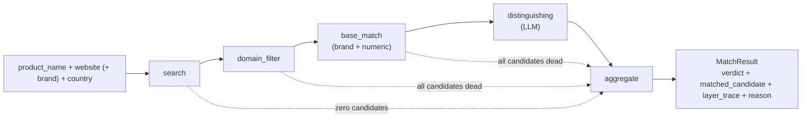

# Search Module — Design Reference

How `src/search` decides whether a product exists on a target marketplace and, if so,
which URL is it: the 5-layer pipeline, the short-circuit rule, and the business-logic
rationale behind each layer's three-state / two-state semantics.

## 0. How to read this document

Four documents cover the search module. They do different jobs — pick the right one:

| Document | Job | Read it when |
|---|---|---|
| [`src/search/README.md`](../../src/search/README.md) | Operator manual — install, run, CLI flags, config table, maintenance recipes | You are *using* the module |
| [`src/search/CLAUDE.md`](../../src/search/CLAUDE.md) (= `AGENTS.md`) | Architecture map and key files, for an agent working in the code | You need to know *where things live and how to change them safely* |
| [`src/search/search_link_algorithm_spec.md`](../../src/search/search_link_algorithm_spec.md) | The original design spec (Chinese), frozen | You want the historical design intent behind the pipeline |
| **This document** | Mechanism-level design reference, written from the code as it stands | You are *analyzing or evolving* the pipeline logic |

This document describes the code as it currently stands and does not repeat what the
README already explains operationally.

### Where the original spec is now stale

The spec predates several code-level refinements. Do not act on these parts of it without
checking the code first:

| Spec says | Code does |
|---|---|
| Enumerated `website` values are `amazon` / `tesco` / `argos` | `website` is looked up in `domain_map` in `maintain/search_config.yaml` — any key added there is accepted, no code change |
| No URL-shape / single-product-page validation is described (only host filtering, §2) | `layers/url_rules.py` also validates `url_rules.product_path` per website, killing gallery/category/browse pages that pass host filtering |
| No tracking-parameter stripping is described | `url_rules.strip_query_params` strips a configured denylist from every candidate URL before dedup |
| SQLite cache is described as base-attribute extraction cache keyed on `md5(title)` (§3) | Base-attribute caching is not implemented; what exists instead is the run/task trace database (`search.db`, see `docs/search/storage.md`) — a different concern (observability, not memoization) |
| Provider list is Serper + a `ddgs`-backed DuckDuckGo provider, described generically | Both providers additionally carry internal `_COUNTRY_TO_*` mappings (`_COUNTRY_TO_GL`, `_COUNTRY_TO_REGION`) so a single `country` argument translates per-provider; this is now a hard requirement for any new provider (see CLAUDE.md "Adding things") |
| LLM vendor names given as examples `qwen` / `deepseek` | Vendor routing now lives in the shared `src/common/llm_router_config.yaml` (also used by Matching and Scraping), not a search-local file |

Everything else in the spec — physically decoupling base from distinguishing, three-state
semantics, per-layer trace, and the short-circuit rule — still holds and is the basis for
the sections below.

---

## 1. Pipeline shape and data flow

Five LangGraph nodes, strictly sequential, each consuming and returning the shared
orchestrator state:

1. **search** — builds provider-specific `keyword` / `sitename` / `both` query variants
   from `product_name + website (+ brand)`, fires them concurrently (`asyncio.gather`)
   against the first provider in the configured chain, and dedups the combined results by
   URL. Also extracts query-side `BaseAttributes` (brand + numeric tokens from the input
   itself) for later comparison.
2. **domain_filter** — two checks per candidate, in order: (a) does the URL host match the
   target website's `domain_map` entry, and (b) if the website has a `url_rules.product_path`
   entry, does the URL path look like a single-product page (vs. a search-results, category,
   browse, or brand-store page)? Either failure kills the candidate (`domain=fail`,
   `alive=False`). Before this layer runs, every candidate URL is first stripped of tracking
   query parameters (`url_rules.strip_query_params`) and deduped again on the cleaned URL.
3. **base_match** — per surviving candidate, in parallel (`asyncio.to_thread`, since
   extraction is CPU-bound regex/quantulum3/rapidfuzz work): compare **brand** and
   **numeric attributes** between the query side and the candidate side. Either sub-check can
   kill the candidate; neither can single-handedly confirm a match — see §2.
4. **distinguishing** — one batched LLM call over every candidate still alive after
   base_match, deciding which one (if any) is the same SKU — catching variant differences the
   rules can't see (flavour, colour, version, pack size). See §3.
5. **aggregate** — pure logic, no I/O. Picks the final verdict and the representative
   `LayerTrace`. See §4.

`base_match` and `distinguishing` are **physically decoupled**: they live in separate
modules (`layers/base_match.py`, `layers/brand.py`, `layers/numeric.py` vs.
`layers/distinguishing.py`) and neither imports the other. All communication is through the
shared state dict that `graph.py` threads between nodes. This means the rule-based layer can
be tuned, tested, or replaced without touching the LLM call, and vice versa.

---

## 2. base_match: three-state brand + numeric comparison

**The governing principle**: a candidate is only killed when the pipeline has *confirmed*
it's a different product. Missing or unreadable information is never treated as evidence of
a mismatch — it passes through as `unknown` and the decision is deferred to distinguishing
(or, if both brand and numeric are `unknown`, all the way to the LLM).

This is why every sub-comparison here is three-valued (`pass` / `fail` / `unknown`), not
two-valued. A binary pass/fail would force a decision — accept or reject — in exactly the
cases where the pipeline has no basis for either, and a brand table or numeric extractor can
never be complete enough to avoid that case being common.

### Brand

Extraction, in priority order:
1. Brand explicitly supplied by the caller (used directly on the query side, skipping
   extraction).
2. Literal word-boundary matches against `maintain/brand.xlsx` — `extract_brands()` returns
   *every* literal hit in order of first appearance, not just the longest or first. This
   matters because titles routinely contain more than one brand-list token (a real brand plus
   an unrelated word that happens to also be in the list, e.g. "Tetley ... **Tropical** Tea").
3. If no literal hit: a single rapidfuzz fuzzy match against the brand list.
4. If still nothing: the title's first token, if it's capitalized and non-numeric — a rough
   heuristic, used only as a last resort.

Comparison (`compare_brands(list, list)`) is **any-pair-pass, all-pairs-differ-fail**: if any
brand token from one side fuzzy-matches (score ≥ `fuzzy_same_threshold`, default 88) any token
from the other side, the candidate passes. Only if *every* pairing scores at or below
`fuzzy_differ_threshold` (default 40) does it fail. Anything in between, or a missing token on
either side, is `unknown`. The any-pair rule is what makes multi-brand extraction safe: a
noise token like "Tropical" surviving alongside the real brand can't drown out a genuine match
elsewhere in the pair-set.

A `BRANDS_FUZZY_SAFE` guard restricts fuzzy matching to brands with `len >= 4 AND has a
letter`. Short or pure-numeric brand names ("7Up" is fine because it has a letter; a
hypothetical brand "55" would not be) only match via the literal regex path — fuzzy matching
on very short strings produces false positives against almost anything.

### Numeric

Extraction combines a regex pre-pass (owns `abv_percent` and `count`, which quantulum3 either
misses entirely — ABV — or misparses — it reads the leading `4` in "4 X 330ml" as a bare
dimensionless number) with quantulum3 for everything quantulum3 handles natively: volume,
weight, digital storage, length, power, voltage, charge. Ambiguous quantulum3 entities
(`digital_storage`, `length`) are disambiguated using keyword context within
`numeric.ambiguity_window_chars` characters of the matched span (e.g. "RAM" nearby routes a
storage-shaped number to `ram_gb` instead of `storage_gb`).

Comparison only considers attribute keys present on **both** sides:
- No shared key → `unknown`.
- Shared key in `numeric.discrete_attrs` (storage, RAM, screen size, voltage, ABV, power,
  pack count) → exact equality required; any mismatch is `fail`.
- Shared key not in that set (weight, volume, length) → compared with
  `numeric.continuous_tolerance` (default ±10%), absorbing rounding differences like "500g" vs
  "0.5kg"; outside tolerance is `fail`.
- No conflicting key → `pass` (even if some other, non-shared key is present on only one
  side — that's not evidence of anything, by the same "confirmed different only" rule).

A `fail` on either brand or numeric kills the candidate immediately (`alive=False`) — the
other sub-check is not even computed once brand has already failed. `unknown` on both leaves
`alive=True` and hands the decision to distinguishing.

---

## 3. distinguishing: the single LLM call

By the time distinguishing runs, the candidate set has already been narrowed by two free,
deterministic layers — domain and base_match — so what's left is small (often 0–3
candidates) and genuinely ambiguous: same brand, same numeric attributes, but possibly a
different flavour, colour, version, or pack configuration that neither rule-based layer can
read.

One batched call handles the whole surviving set: the prompt carries the query's title +
brand + numeric attributes plus every surviving candidate's equivalent fields, and the model
returns a single JSON object — the index of the best-matching candidate (or `null`) plus a
short free-text reason. Batching the candidates into one call (rather than one call per
candidate) is a direct token-cost saving, and is viable specifically because base_match has
already thinned the field down.

The pipeline deliberately never asks the LLM to self-report a confidence score — only the
binary same/not-same judgment is used. A model's own confidence estimate is not a reliable
signal (models are frequently overconfident or underconfident in ways uncorrelated with
actual accuracy), so nothing downstream is built on top of it.

If exactly one candidate is picked, it is marked `distinguishing=pass`; if the model returns
`null`, or the whole node was skipped because there was nothing left to send it (see §4's
short-circuit), no candidate gets `pass` and the trace records why.

---

## 4. aggregate and the short-circuit rule

**aggregate** is the only layer with no I/O — pure selection logic over already-computed
per-candidate traces:

- If any surviving candidate has `distinguishing=pass` → `verdict=MATCH`; `layer_trace` is
  that candidate's trace.
- Otherwise → `verdict=NO_MATCH`; `layer_trace` is the **representative candidate** — the one
  that reached the deepest layer before dying. This is chosen for diagnostic value: a
  candidate that died at `numeric=fail` is a more informative trace than one that died at
  `domain=fail`, even though both produce `NO_MATCH`.

**Short-circuiting**: whenever a layer's output leaves zero candidates alive, the graph's
conditional edges (in `graph.py`) skip directly to `aggregate`, bypassing every layer in
between — most importantly `distinguishing`, which is the only layer that costs an LLM call.
Concretely:

| After this node | Skip to `aggregate` when |
|---|---|
| `search` | zero raw candidates returned |
| `domain_filter` | every candidate's `domain` came back `fail` |
| `base_match` | every candidate died on brand or numeric |

There is no short-circuit after `distinguishing` — it always flows into `aggregate`, since
that's the layer that actually decides `MATCH` vs `NO_MATCH` from its output.

The result: the LLM is **never** called when the cheap, deterministic layers have already
settled the question either way (killed everything, or — this doesn't arise since a domain
pass alone can't confirm a match — established a match without ambiguity). Every dollar spent
on an LLM call corresponds to a genuinely ambiguous case that rule-based logic could not
resolve on its own.

### Trace shape reference

Each candidate's `LayerTrace` has four fields (`domain`, `brand`, `numeric`,
`distinguishing`), each `pass` / `fail` / `unknown` / `None` (layer never reached). Some
representative shapes:

| Scenario | `layer_trace` |
|---|---|
| Match | `{domain: pass, brand: pass, numeric: pass, distinguishing: pass}` |
| Reached LLM, rejected | `{domain: pass, brand: pass, numeric: unknown, distinguishing: fail}` |
| Died on numeric conflict | `{domain: pass, brand: pass, numeric: fail, distinguishing: None}` |
| All candidates wrong domain | `{domain: fail, brand: None, numeric: None, distinguishing: None}` |
| Zero search results | `{domain: None, brand: None, numeric: None, distinguishing: None}` |

---

## 5. Caching and concurrency notes

- **Brand list is process-lifetime cached** (`lru_cache` over `maintain/brand.xlsx`). This is
  a maintenance-relevant fact covered in the README; the design-relevant consequence is that
  a long-running process (not the CLI batch entry point, which starts fresh each invocation)
  needs an explicit restart to pick up brand-list edits.
- **Two independent concurrency knobs** operate at different layers: the batch-level
  `asyncio.Semaphore` (default 16, see README) bounds how many *products* run their full
  pipeline concurrently; within a single product's `search` layer, all query variants for the
  active provider fire concurrently via `asyncio.gather` regardless of the batch semaphore.
  These are not the same budget and tuning one does not directly trade off against the other.
- **`asyncio.to_thread` in base_match** exists because brand/numeric extraction is CPU-bound
  (regex, quantulum3, rapidfuzz) rather than I/O-bound; running it directly on the event loop
  would block every other concurrent task in the batch for the duration of the computation.

---

## Related documents

- [`src/search/README.md`](../../src/search/README.md) — operator manual, CLI usage, config table, maintenance recipes
- [`src/search/CLAUDE.md`](../../src/search/CLAUDE.md) — architecture map and key files
- [`src/search/search_link_algorithm_spec.md`](../../src/search/search_link_algorithm_spec.md) — original design spec (Chinese, frozen)
- [`docs/search/storage.md`](storage.md) — generated SQLite schema and migration reference
- [`docs/architecture.md`](../architecture.md) — project-level module map
