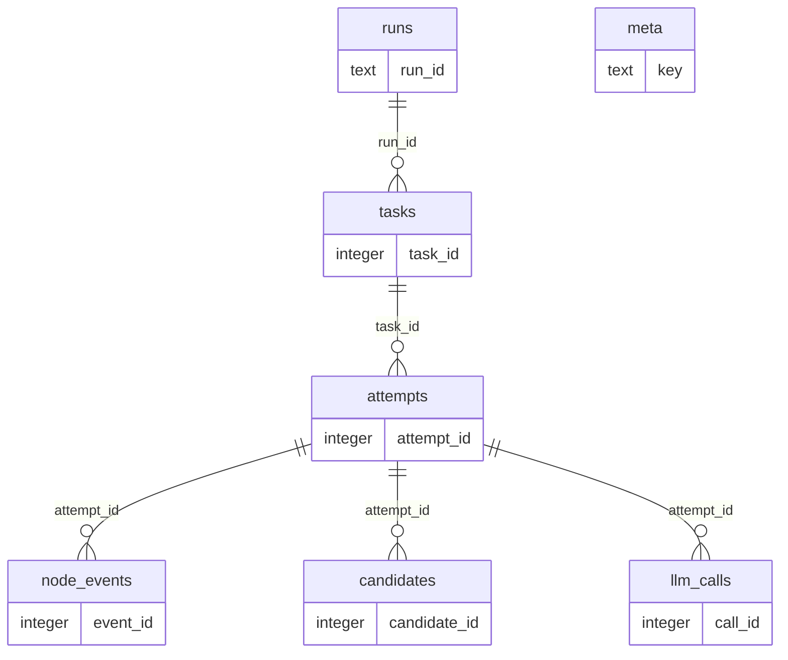

# Search storage reference

This document describes the SQLite tracing schema owned by `src.search`. The generated regions come from the module-level DDL in `src/search/db.py`, executed against an in-memory SQLite database and inspected with PRAGMA. Hand-written sections explain runtime conventions that SQLite cannot enforce.

The default file is `search.db`; `db.sqlite_path` in `src/search/maintain/search_config.yaml` can override it. SQLite foreign-key enforcement is enabled on every `SearchDB` connection.

## Lifecycle and retention

The declared ownership chain is `runs → tasks → attempts → {node_events, candidates, llm_calls}` with `ON DELETE CASCADE`. `attempts.run_id`, and the `task_id` / `run_id` fields on the three leaf tables, are deliberately denormalized for direct filtering and have no declared foreign keys; writers populate them from the owning records in the same transaction.

`runs.matched_count`, `no_match_count`, and `error_count` are aggregated from `tasks` by `finish_run()` rather than incremented during execution. If `db.store_candidates` is false, no `candidates` rows are written. If `db.store_llm_payload` is false, `llm_calls.prompt` and `raw_response` are stored as NULL while call metadata remains available.

## Tables

<!-- BEGIN GENERATED: search-tables -->

### `runs`

Batch or standalone search executions and their reproducibility metadata.

| Column | Type | Nullable | Default | Key / constraints | Meaning |
|---|---|---|---|---|---|
| `run_id` | `TEXT` | No | — | PK | UUID identifying one top-level search execution |
| `started_at` | `TEXT` | No | — | — | UTC ISO timestamp when the run started |
| `finished_at` | `TEXT` | Yes | — | — | UTC ISO timestamp when the run reached a terminal state |
| `status` | `TEXT` | No | — | — | Run state: running, completed, failed, or interrupted |
| `mode` | `TEXT` | Yes | — | — | Invocation mode: batch or single |
| `input_file` | `TEXT` | Yes | — | — | Batch input workbook path; NULL for standalone runs |
| `input_sku_col` | `TEXT` | Yes | — | — | Batch column containing product names |
| `output_file` | `TEXT` | Yes | — | — | Requested batch output workbook path |
| `country` | `TEXT` | Yes | — | — | Run-level country when one value applies to all tasks |
| `website` | `TEXT` | Yes | — | — | Run-level retailer when one value applies to all tasks |
| `provider_chain` | `TEXT` | Yes | — | — | Comma-separated search-provider names in fallback order |
| `llm_model` | `TEXT` | Yes | — | — | Configured distinguishing-layer model identifier |
| `concurrency` | `INTEGER` | Yes | — | — | Maximum concurrent batch tasks |
| `serper_max_calls` | `INTEGER` | Yes | — | — | Optional Serper call budget for the run |
| `total_tasks` | `INTEGER` | Yes | — | — | Expected task count declared when the run starts |
| `matched_count` | `INTEGER` | Yes | — | — | Match task count aggregated when the run finishes |
| `no_match_count` | `INTEGER` | Yes | — | — | No-match task count aggregated when the run finishes |
| `error_count` | `INTEGER` | Yes | — | — | Error task count aggregated when the run finishes |
| `provider_calls` | `TEXT` | Yes | — | — | JSON object mapping provider name to call count |
| `job_config` | `TEXT` | Yes | — | — | JSON snapshot of invocation-specific arguments |
| `pipeline_config` | `TEXT` | Yes | — | — | JSON snapshot of the search pipeline configuration |
| `git_commit` | `TEXT` | Yes | — | — | Git commit hash captured for reproducibility |
| `error_message` | `TEXT` | Yes | — | — | Run-level terminal error message, when any |

### `tasks`

One product-matching task within a run, including its final outcome.

| Column | Type | Nullable | Default | Key / constraints | Meaning |
|---|---|---|---|---|---|
| `task_id` | `INTEGER` | No | — | PK; AUTOINCREMENT | Surrogate task identifier; parent of attempts |
| `run_id` | `TEXT` | No | — | UNIQUE(run_id, row_index); FK → runs.run_id ON DELETE CASCADE | Owning run |
| `row_index` | `INTEGER` | No | — | UNIQUE(run_id, row_index) | Zero-based input-row identity within the run |
| `product_name` | `TEXT` | No | — | — | Source SKU or product name searched for |
| `product_key` | `TEXT` | No | — | — | MD5 of the normalized product name for cross-run lookup |
| `brand_input` | `TEXT` | Yes | — | — | Optional caller-supplied brand hint |
| `website` | `TEXT` | Yes | — | — | Retailer key used by this task |
| `country` | `TEXT` | Yes | — | — | Country code used by search providers for this task |
| `status` | `TEXT` | No | — | — | Recorder status: ok or error |
| `verdict` | `TEXT` | No | — | — | Final task verdict: match, no_match, or error |
| `failure_kind` | `TEXT` | No | — | — | Derived closed outcome category documented below |
| `matched_url` | `TEXT` | Yes | — | — | Selected product URL for match verdicts |
| `matched_title` | `TEXT` | Yes | — | — | Selected candidate title for match verdicts |
| `reason` | `TEXT` | Yes | — | — | Human-readable final decision or error rationale |
| `layer_trace` | `TEXT` | Yes | — | — | JSON object with domain, brand, numeric, and distinguishing verdicts |
| `candidates_considered` | `INTEGER` | Yes | — | — | Candidate count reported by the final aggregation |
| `final_provider` | `TEXT` | Yes | — | — | Provider whose attempt supplied the final result |
| `attempt_count` | `INTEGER` | Yes | — | — | Number of provider attempts recorded for the task |
| `error_type` | `TEXT` | Yes | — | — | Python exception class for task-level failures |
| `error_message` | `TEXT` | Yes | — | — | Exception message for task-level failures |
| `traceback` | `TEXT` | Yes | — | — | Full task-level Python traceback |
| `started_at` | `TEXT` | Yes | — | — | UTC ISO timestamp when task recording began |
| `finished_at` | `TEXT` | Yes | — | — | UTC ISO timestamp when task recording ended |
| `duration_ms` | `INTEGER` | Yes | — | — | End-to-end task duration in milliseconds |

Indexes:

| Name | Columns | Unique | Purpose |
|---|---|---|---|
| `idx_tasks_key` | `product_key` | No | Supports finding the same normalized product across runs. |
| `idx_tasks_failure` | `run_id`, `failure_kind` | No | Supports per-run failure-category analysis. |
| `idx_tasks_verdict` | `run_id`, `verdict` | No | Supports per-run verdict aggregation. |
| `idx_tasks_run` | `run_id` | No | Supports loading all tasks for a run. |
| `sqlite_autoindex_tasks_1` | `run_id`, `row_index` | Yes | SQLite auto-index for a declared UNIQUE constraint. |

Declared foreign keys:

| Column | References | On delete |
|---|---|---|
| `run_id` | `runs.run_id` | `CASCADE` |

### `attempts`

One provider attempt within a task's ordered fallback chain.

| Column | Type | Nullable | Default | Key / constraints | Meaning |
|---|---|---|---|---|---|
| `attempt_id` | `INTEGER` | No | — | PK; AUTOINCREMENT | Surrogate attempt identifier; parent of trace leaves |
| `task_id` | `INTEGER` | No | — | UNIQUE(task_id, attempt_no); FK → tasks.task_id ON DELETE CASCADE | Owning task |
| `run_id` | `TEXT` | No | — | — | Denormalized run identifier for direct filtering; no declared FK |
| `attempt_no` | `INTEGER` | No | — | UNIQUE(task_id, attempt_no) | One-based provider-attempt sequence within the task |
| `provider` | `TEXT` | No | — | — | Search provider name used by this attempt |
| `verdict` | `TEXT` | Yes | — | — | Attempt result: match, no_match, or error |
| `reason` | `TEXT` | Yes | — | — | Attempt-level decision or failure rationale |
| `candidates_found` | `INTEGER` | Yes | — | — | Candidate count returned across query variants |
| `alive_after_domain` | `INTEGER` | Yes | — | — | Candidates passing the domain layer |
| `alive_after_base` | `INTEGER` | Yes | — | — | Candidates surviving brand and numeric rules |
| `budget_exhausted` | `INTEGER` | Yes | — | — | Boolean integer indicating provider budget exhaustion |
| `query_variants` | `TEXT` | Yes | — | — | JSON array of query strings issued by this attempt |
| `started_at` | `TEXT` | Yes | — | — | UTC ISO timestamp when the attempt began |
| `finished_at` | `TEXT` | Yes | — | — | UTC ISO timestamp when the attempt ended |
| `duration_ms` | `INTEGER` | Yes | — | — | Attempt duration in milliseconds |

Indexes:

| Name | Columns | Unique | Purpose |
|---|---|---|---|
| `idx_attempts_task` | `task_id` | No | Supports loading provider attempts for a task. |
| `sqlite_autoindex_attempts_1` | `task_id`, `attempt_no` | Yes | SQLite auto-index for a declared UNIQUE constraint. |

Declared foreign keys:

| Column | References | On delete |
|---|---|---|
| `task_id` | `tasks.task_id` | `CASCADE` |

### `node_events`

Ordered node-level events emitted while a provider attempt traverses the graph.

| Column | Type | Nullable | Default | Key / constraints | Meaning |
|---|---|---|---|---|---|
| `event_id` | `INTEGER` | No | — | PK; AUTOINCREMENT | Surrogate node-event identifier |
| `attempt_id` | `INTEGER` | No | — | FK → attempts.attempt_id ON DELETE CASCADE | Owning provider attempt |
| `task_id` | `INTEGER` | No | — | — | Denormalized task identifier for direct filtering; no declared FK |
| `run_id` | `TEXT` | No | — | — | Denormalized run identifier for direct filtering; no declared FK |
| `seq` | `INTEGER` | No | — | — | One-based event sequence within the attempt |
| `node` | `TEXT` | No | — | — | Graph node name such as search, domain_filter, or aggregate |
| `status` | `TEXT` | No | — | — | Event state: ok, warning, error, or skipped |
| `error_kind` | `TEXT` | Yes | — | — | Open-ended structured error category emitted by the node |
| `error_message` | `TEXT` | Yes | — | — | Node-level warning or error message |
| `traceback` | `TEXT` | Yes | — | — | Full traceback for node exceptions when captured |
| `detail` | `TEXT` | Yes | — | — | JSON object containing node-specific diagnostic context |
| `candidates_in` | `INTEGER` | Yes | — | — | Candidate count entering the node |
| `candidates_out` | `INTEGER` | Yes | — | — | Candidate count leaving the node |
| `started_at` | `TEXT` | Yes | — | — | UTC ISO timestamp when node execution began |
| `duration_ms` | `INTEGER` | Yes | — | — | Node duration in milliseconds |

Indexes:

| Name | Columns | Unique | Purpose |
|---|---|---|---|
| `idx_events_err` | `run_id`, `status`, `node` | No | Supports per-run warning and error analysis by node. |
| `idx_events_attempt` | `attempt_id` | No | Supports loading ordered node events for an attempt. |

Declared foreign keys:

| Column | References | On delete |
|---|---|---|
| `attempt_id` | `attempts.attempt_id` | `CASCADE` |

### `candidates`

Optional per-candidate snapshots from each provider attempt.

| Column | Type | Nullable | Default | Key / constraints | Meaning |
|---|---|---|---|---|---|
| `candidate_id` | `INTEGER` | No | — | PK; AUTOINCREMENT | Surrogate candidate snapshot identifier |
| `attempt_id` | `INTEGER` | No | — | FK → attempts.attempt_id ON DELETE CASCADE | Owning provider attempt |
| `task_id` | `INTEGER` | No | — | — | Denormalized task identifier for direct filtering; no declared FK |
| `run_id` | `TEXT` | No | — | — | Denormalized run identifier for direct filtering; no declared FK |
| `rank` | `INTEGER` | No | — | — | Zero-based candidate order after search-result deduplication |
| `url` | `TEXT` | Yes | — | — | Normalized candidate URL |
| `title` | `TEXT` | Yes | — | — | Search-result candidate title |
| `snippet` | `TEXT` | Yes | — | — | Search-result candidate snippet |
| `host` | `TEXT` | Yes | — | — | Lower-cased host parsed from the candidate URL |
| `brands` | `TEXT` | Yes | — | — | JSON array of brand tokens extracted from the candidate |
| `numerics` | `TEXT` | Yes | — | — | JSON object of normalized numeric attributes |
| `v_domain` | `TEXT` | Yes | — | — | Domain-layer verdict: pass, fail, unknown, or NULL if unreached |
| `v_brand` | `TEXT` | Yes | — | — | Brand-layer verdict: pass, fail, unknown, or NULL if unreached |
| `v_numeric` | `TEXT` | Yes | — | — | Numeric-layer verdict: pass, fail, unknown, or NULL if unreached |
| `v_distinguishing` | `TEXT` | Yes | — | — | LLM-layer verdict: pass, fail, unknown, or NULL if unreached |
| `alive` | `INTEGER` | Yes | — | — | Boolean integer indicating survival after the latest reached layer |
| `trace_depth` | `INTEGER` | Yes | — | — | Number of layers reached by this candidate |
| `is_matched` | `INTEGER` | Yes | — | — | Boolean integer indicating the selected final candidate |
| `llm_index` | `INTEGER` | Yes | — | — | Candidate index used in the batched LLM prompt, when included |

Indexes:

| Name | Columns | Unique | Purpose |
|---|---|---|---|
| `idx_cand_url` | `run_id`, `url` | No | Supports finding repeated candidate URLs within a run. |
| `idx_cand_attempt` | `attempt_id` | No | Supports loading candidate snapshots for an attempt. |

Declared foreign keys:

| Column | References | On delete |
|---|---|---|
| `attempt_id` | `attempts.attempt_id` | `CASCADE` |

### `llm_calls`

Optional distinguishing-layer LLM request, response, parse, and usage telemetry.

| Column | Type | Nullable | Default | Key / constraints | Meaning |
|---|---|---|---|---|---|
| `call_id` | `INTEGER` | No | — | PK; AUTOINCREMENT | Surrogate LLM-call identifier |
| `attempt_id` | `INTEGER` | No | — | FK → attempts.attempt_id ON DELETE CASCADE | Owning provider attempt |
| `task_id` | `INTEGER` | No | — | — | Denormalized task identifier for direct filtering; no declared FK |
| `run_id` | `TEXT` | No | — | — | Denormalized run identifier for direct filtering; no declared FK |
| `node` | `TEXT` | Yes | — | — | Graph node that made the call, normally distinguishing |
| `model` | `TEXT` | Yes | — | — | Routed model identifier |
| `base_url` | `TEXT` | Yes | — | — | OpenAI-compatible provider base URL |
| `temperature` | `REAL` | Yes | — | — | Sampling temperature supplied to the model |
| `timeout_s` | `REAL` | Yes | — | — | Request timeout in seconds |
| `prompt` | `TEXT` | Yes | — | — | Full prompt; NULL when store_llm_payload is disabled |
| `raw_response` | `TEXT` | Yes | — | — | Raw model response; NULL when store_llm_payload is disabled |
| `parsed_match_idx` | `INTEGER` | Yes | — | — | Parsed candidate index selected by the model |
| `parsed_reason` | `TEXT` | Yes | — | — | Parsed model rationale |
| `status` | `TEXT` | Yes | — | — | Call outcome: ok, error, or parse_error |
| `error_message` | `TEXT` | Yes | — | — | Request or response-parse error message |
| `prompt_tokens` | `INTEGER` | Yes | — | — | Provider-reported input token count |
| `completion_tokens` | `INTEGER` | Yes | — | — | Provider-reported output token count |
| `total_tokens` | `INTEGER` | Yes | — | — | Provider-reported total token count |
| `duration_ms` | `INTEGER` | Yes | — | — | LLM call duration in milliseconds |

Indexes:

| Name | Columns | Unique | Purpose |
|---|---|---|---|
| `idx_llm_attempt` | `attempt_id` | No | Supports loading LLM calls for an attempt. |

Declared foreign keys:

| Column | References | On delete |
|---|---|---|
| `attempt_id` | `attempts.attempt_id` | `CASCADE` |

### `meta`

Small key/value store for database-level metadata.

| Column | Type | Nullable | Default | Key / constraints | Meaning |
|---|---|---|---|---|---|
| `key` | `TEXT` | No | — | PK | Metadata key, currently schema_version |
| `value` | `TEXT` | No | — | — | Metadata value stored as text |

## Views

View columns are derived from their query and therefore do not require per-column DDL comments.

| View | Columns | Purpose |
|---|---|---|
| `v_errors` | `event_id`, `attempt_id`, `task_id`, `run_id`, `seq`, `node`, `status`, `error_kind`, `error_message`, `traceback`, `detail`, `candidates_in`, `candidates_out`, `started_at`, `duration_ms`, `row_index`, `product_name`, `provider` | Warning and error events enriched with task identity and provider. |
| `v_task_result` | `task_id`, `run_id`, `row_index`, `product_name`, `product_key`, `brand_input`, `website`, `country`, `status`, `verdict`, `failure_kind`, `matched_url`, `matched_title`, `reason`, `layer_trace`, `candidates_considered`, `final_provider`, `attempt_count`, `error_type`, `error_message`, `traceback`, `started_at`, `finished_at`, `duration_ms`, `run_started_at`, `run_finished_at`, `run_status`, `input_file`, `output_file`, `provider_chain`, `llm_model` | Task outcomes enriched with the most useful owning-run fields. |
| `v_funnel` | `run_id`, `node`, `event_count`, `candidates_in`, `candidates_out`, `avg_duration_ms` | Per-run, per-node candidate funnel counts and average duration. |
| `v_run_summary` | `run_id`, `started_at`, `finished_at`, `status`, `mode`, `input_file`, `input_sku_col`, `output_file`, `country`, `website`, `provider_chain`, `llm_model`, `concurrency`, `serper_max_calls`, `total_tasks`, `matched_count`, `no_match_count`, `error_count`, `provider_calls`, `job_config`, `pipeline_config`, `git_commit`, `error_message`, `duration_ms`, `failure_distribution` | One-row-per-run summary with computed duration and failure distribution. |

<!-- END GENERATED: search-tables -->

## Relationships

Only declared SQLite foreign keys appear here; denormalized identifiers are described above.

<!-- BEGIN GENERATED: search-er -->



<!-- END GENERATED: search-er -->

## Closed and open value sets

- `runs.status`: `running`, `completed`, `failed`, `interrupted`; `runs.mode`: `batch`, `single`.
- `tasks.status`: `ok`, `error`; `tasks.verdict` and `attempts.verdict`: `match`, `no_match`, `error`.
- `tasks.failure_kind`: `matched`, `no_search_results`, `domain_map_missing`, `all_domain_filtered`, `brand_mismatch`, `numeric_mismatch`, `llm_no_match`, `llm_error`, `llm_parse_error`, `budget_exhausted`, `provider_error`, `unknown_error`.
- Candidate layer verdicts: `pass`, `fail`, `unknown`, or NULL when the layer was not reached.
- `node_events.status`: `ok`, `warning`, `error`, `skipped`. `node_events.error_kind` is intentionally open-ended; current producers include `DomainMapMissing`, `BudgetExhausted`, `LLMError`, and `LLMParseError`, plus exception class names.
- `llm_calls.status`: `ok`, `error`, `parse_error`.

Boolean integers use `0` / `1`, notably `attempts.budget_exhausted` and `candidates.alive` / `is_matched`.

## JSON text fields

SQLite stores these values as JSON text:

| Field | Shape |
|---|---|
| `runs.provider_chain` | comma-separated provider names in fallback order |
| `runs.provider_calls` | object mapping provider name to integer call count |
| `runs.job_config` | object of invocation arguments; batch and standalone runs use different keys |
| `runs.pipeline_config` | full object returned by `search.config.load_config()` |
| `tasks.layer_trace` | object with `domain`, `brand`, `numeric`, and `distinguishing` verdicts |
| `attempts.query_variants` | array of the exact query strings issued |
| `node_events.detail` | open-ended object owned by the emitting node; skipped events use `{"reason":"short_circuit"}` |
| `candidates.brands` | array of extracted brand strings |
| `candidates.numerics` | object mapping normalized attribute names to extracted values |

## Schema compatibility

<!-- BEGIN GENERATED: search-migrations -->

Current `SCHEMA_VERSION`: `2`.

Each initialization probes `PRAGMA table_info(runs)` and adds `runs.mode TEXT` when opening a pre-v2 database. It then upserts `meta['schema_version']` to the current version. All other objects use idempotent `CREATE ... IF NOT EXISTS`; there is no general search migration framework yet.

<!-- END GENERATED: search-migrations -->

## Example queries

```sql
-- Latest run summaries
SELECT run_id, status, mode, total_tasks, matched_count, no_match_count, error_count,
       duration_ms, failure_distribution
FROM v_run_summary
ORDER BY started_at DESC
LIMIT 20;

-- Failure categories and representative tasks for one run
SELECT failure_kind, COUNT(*) AS tasks
FROM tasks
WHERE run_id = ?
GROUP BY failure_kind
ORDER BY tasks DESC;

-- Node warnings and errors with product and provider context
SELECT row_index, product_name, provider, node, status, error_kind, error_message
FROM v_errors
WHERE run_id = ?
ORDER BY task_id, attempt_id, seq;

-- Candidate funnel by node
SELECT * FROM v_funnel WHERE run_id = ? ORDER BY node;
```

## Adding or changing a column

1. Edit `_DDL` so a fresh database has the final column and add a `--` meaning comment on the column line or immediately above it.
2. Add an explicit compatibility probe/migration in `_init_schema()` when existing databases require it; bump `SCHEMA_VERSION` when the stored schema contract changes.
3. Update every relevant writer, reader, view, and index, then run `uv run python scripts/gen_storage_docs.py`.
4. Run `uv run python scripts/gen_storage_docs.py --check`, the storage-generator unit tests, and `tests/unit/search`.

Do not hand-edit generated regions; the pre-commit hook rewrites and stages them.
