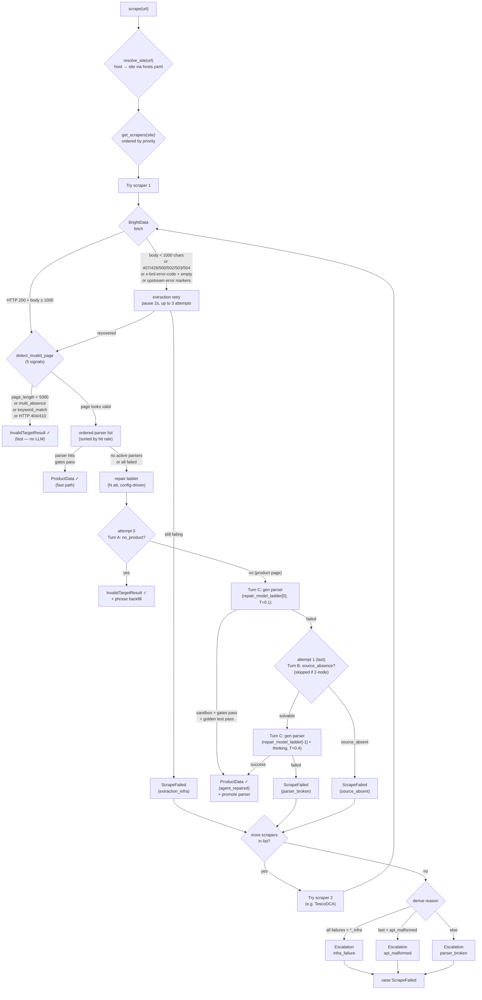

# PriceScope — Scraping Module

Extracts structured product data from marketplace pages. Given a `(url, site)` pair, it returns a validated `ProductData` object with title, price, list_price, membership_price, stock, images, brand, etc. — or explains cleanly why it couldn't.

> **Status**: Phase 0 complete. M1–M28 implemented. M28 adds exact result/run/escalation correlation and records the promoted parser on repaired successes. See [tests/](tests/).

## What it does

```
URL in  ─→  Router (host→site→scraper list)
             ├─ HTMLScraper (Tesco/Argos): BrightData Web Unlocker → HTML → parser → ProductData
             └─ DirectAPIScraper (Amazon): BrightData Datasets API → _trigger (retried) → _poll (300s budget, no re-trigger) → JSON → ProductData
                (Tesco has DCA API as backup — same trigger/poll split)
     out ─→  ProductData | InvalidTargetResult | ScrapeFailed
```

### Pipeline Flow

> Rendered by Mermaid (GitHub + VS Code native). Click to zoom.



Under the hood:

- **Invalid-target detection** — before parsing, checks JSON-LD, HTTP status, structural absence, page length, and a learned phrase list. Delisted / error pages are caught before wasting a parse.
- **Ordered parser list** — each site has multiple parsers ranked by real-time hit rate. First to pass both gates wins.
- **Two gates** — Gate 1 = Pydantic types. Gate 2 = `feasible_check`: every in-stock product needs a positive ordinary `price`; `list_price > price` and `membership_price < price` when those fields are present; out-of-stock items still need a product signal.
- **Trigger/poll split (M13)** — for async BD APIs (Datasets/DCA): `_trigger()` is wrapped in retry (safe — failed POST → no snapshot), `_poll()` owns the full budget and **never re-triggers**. One URL → at most one BD snapshot. Configurable poll budget via `bd_async_poll_max_seconds` (300s default). The old blind-re-trigger-on-timeout bug for Amazon is fixed.
- **Self-healing** — when all parsers fail, a provider-configured LLM generates a candidate, sandboxes it, tests against golden samples, and promotes it if it passes. API routes use JSON remapping only (D25 red line — never fabricates).
- **Fallback ladder** — a site can register multiple scrapers (e.g. Tesco = HTML primary + DCA backup). Terminal failure → next scraper; all exhausted → escalation ticket (`parser_broken / api_malformed / infra_failure / mass_invalid_target`).
- **API price normalization (M24)** — hand-written API mappings pass through one canonical choke point before validation. Equal/lower `list_price` and equal/higher or non-positive `membership_price` values are omitted; HTML parsers remain gate-driven so bad generated mappings still trigger repair.
- **Execution observability (M24/M28)** — every scraper execution, including Direct API routes such as Amazon, writes one `scrape_runs` row; successes are no longer collapsed by a time window. Qualified `results` point to their producing run, failed runs point to their aggregate escalation ticket, repaired HTML successes record the promoted parser in `winning_parser_id`, and repair paths record the actual LLM in `repair_model`.
- **Golden set** — successful scrapes grow each page-type bucket to the config-driven cap (3 by default), with duplicate-URL protection. Five buckets (precedence order): `out_of_stock` > `membership` > `discounted` > `multipack` > `standard`. Future promotions must reproduce all goldens exactly.
- **Site profiles (M23)** — [sites.yaml](sites.yaml) declares, per site, which page types can exist at all and which are mandatory for cold start. These are *constraints*, not detectors: a site that has no gated member pricing (Argos — Nectar points accrue rewards, they are not a member price) vetoes `membership` classification outright, and an unavailable type can never become mandatory. Undeclared sites and undeclared types fail open to the global `config.py` defaults. See [Site profiles](#site-profiles-sitesyaml).
- **Cold start** — a validated Excel sheet declares each URL's page type; required coverage is checked before paid work. The dedicated cold-start model ladder generates and repairs one parser from sandbox failures plus structured human corrections. The parser and confirmed goldens are written only when every fetched, in-scope case passes; fetch failures remain non-blocking and are reported separately.

## Quick start

### 1. Install

From the repo root:

```bash
py -3.12 -m venv .venv
.\.venv\Scripts\Activate.ps1     # or source .venv/bin/activate on POSIX
pip install -r requirements.txt
```

### 2. Set API keys

Copy `.env.sample` to `.env` and fill in:

```
BRIGHT_DATA_KEY = your Bright Data API key
QWEN_KEY        = your Qwen API key (runtime repair + JSON healing by default)
DEEPSEEK_KEY    = your DeepSeek API key (cold start by default)
```

BrightData is used for extraction (Web Unlocker for HTML, Datasets API for Amazon). Both the runtime repair ladder and the (independent) cold-start ladder currently default to `deepseek-v4-flash` — see the [configuration table](#configuration) for the exact defaults and how to switch back to Qwen. Keep whichever provider key the configured ladders resolve to; `providers.py` maps a model id to its vendor, endpoint, and key name.

### 3. Scrape a URL

```python
import asyncio
from src.scraping import scrape

async def main():
    result = await scrape("https://www.amazon.co.uk/dp/B0C62DWSDL")
    print(result.title, result.price, result.currency)

asyncio.run(main())
```

Returns:
- `ProductData` — validated product data
- `InvalidTargetResult` — URL reachable but not a valid product (delisted, 404, etc.)
- raises `ScrapeFailed` — all scrapers exhausted (see escalation ticket in DB)

### 4. Cold-start a new site

If you want to add a site that isn't yet in the parser table:

```bash
# 1. Add the site's hostnames to hosts.yaml
# 2. Register an HTMLScraper subclass in scrapers/sites/
# 3. Run cold start with a representative Excel input
python -m src.scraping.coldstart --site newsite --input newsite.xlsx
# Ignore reusable non-stale golden snapshots when a fresh fetch is required:
python -m src.scraping.coldstart --site newsite --input newsite.xlsx --force-fetch
```

The first row must contain `page_type` and `url` (case-insensitive; extra columns are ignored). Legal page types are `standard`, `discounted`, `out_of_stock`, `membership`, and `multipack`. Multiple rows per type are useful as spares: once a bucket reaches its cap, remaining rows are skipped without another prompt.

Which types are *required* is site-aware. The global fallback in `config.py` makes the first four mandatory and `multipack` optional, but a site declared in [sites.yaml](sites.yaml) overrides it per page type — and a row whose type is declared `available: false` for that site is **rejected during input validation**, before any paid call. If cold start complains about a missing or unavailable page type, fix the site's profile in `sites.yaml` (or the global fallback in `config.py`), not the spreadsheet. See [Site profiles](#site-profiles-sitesyaml).

The CLI validates coverage before paid calls, reuses matching non-stale golden HTML snapshots when possible, and then prompts interactively (`y` / `n` / `q`) for each usable extraction. The review panel derives its fields from `ProductData`, summarizes lists/long strings, and warns when a declared bucket's critical field is empty.

- `y` — accept this case for the current round
- `n` — reject it, optionally identify incorrect fields, enter correct values, and add a free-text hint
- `q` — abort the whole run without writing the parser or any goldens

After a failing review round, `c` (or legacy alias `y`) repairs again, `s` saves the current parser plus that round's accepted goldens as a partial result, and `q` abandons without writes. The model ladder is a warm-up schedule: its final model/temperature repeats with thinking enabled until review succeeds, the human stops, or the safety cap is reached. Every round reruns every URL so a repair cannot silently regress an accepted case; unchanged accepted outputs are reused without prompting. Repair prompts contain only the preceding round's failures plus a compact resolved/regression ledger. Fetch failures do not block persistence because the parser had no opportunity to prove itself, but can leave a coverage shortfall. A declared/extracted type disagreement is shown as `MISMATCH`; accepting still stores the declared type. Exit codes are `0` for complete coverage, `1` for input/abort/no seed, and `2` for incomplete coverage or a partial save.

### Re-cold-starting an existing site

Before re-cold-starting, open `scripts/check_database.ipynb`, set `SITE` and `TABLES`, and run the preview cell. The default table selection clears only `parsers` and `golden_samples`; add `results`, `escalations`, and `invalid_target_phrases` for a fully clean parser/data reset. Add `scrape_runs` only when the site's execution history should also be permanently deleted. Clearing `scrape_runs` detaches retained `results.run_id` values; clearing `escalations` detaches retained `scrape_runs.escalation_id` values. After reviewing the counts, set `CONFIRM = True` and run the clear cell, then run the cold-start command again.

## Module structure

```
src/scraping/
├── __init__.py                     Public API: scrape(), ProductData, ScrapeFailed
├── config.py                       ScrapingConfig (all knobs from spec §7)
├── providers.py                    LLM model/vendor registry + client factory (M18)
├── exceptions.py                   ScrapeFailed, BrightDataInfraError
├── detection.py                    Invalid-target detection (5 signal layers)
├── router.py                       Two-hop dispatch + scraper fallback + escalation
├── registry.py                     @register_scraper decorator
├── hosts.yaml                      host → site mapping (edit to add sites)
├── sites.yaml                      site → page-type availability + cold-start profile (M23)
├── site_profile.py                 fail-open sites.yaml loader + policy accessors
├── coldstart.py                    Cold-start CLI
├── models/                         ProductData, enums, InvalidTargetResult
├── validation/                     gate1 (Pydantic) + gate2 (feasible_check)
├── scrapers/
│   ├── base.py                     BaseScraper ABC
│   ├── html_scraper.py             Template Method: extract → detect → parse → gates → repair
│   ├── api_scraper.py              JSON mapping + restricted JSON self-heal
│   └── sites/                      TescoScraper, TescoDCAScraper, ArgosScraper, AmazonUKScraper
├── extraction/                     Bright Data async clients (Unlocker / Datasets / DCA)
├── repair/
│   ├── sandbox.py                  Subprocess + AST whitelist + timeout
│   ├── agent.py                    Repair ladder (driven by repair_model_ladder)
│   ├── prepass.py                  Price-aware context + promotion detector (M14/M15/M23)
│   ├── prompts.py                  Prompt builders (JSON-LD-aware HTML excerpts)
│   ├── json_healer.py              Restricted JSON remap (D25 red line)
│   └── golden.py                   page_type classifier + promote_candidate + prune
├── storage/                        6 SQLite tables (parsers, golden_samples, scrape_runs,
│                                   results, escalations, invalid_target_phrases)
├── data/                           Sample HTMLs / JSON for tests
├── scripts/check_database.ipynb    Database inspection + selective per-site clearing
├── scripts/live_batch_report.py    Paid end-to-end batch report tool
└── tests/                          Legacy verify scripts pending pytest migration;
                                    historical logs live in tests/logs/archive/
```

## Adding a new site

1. **Add its hosts** to [hosts.yaml](hosts.yaml):
   ```yaml
   waitrose.com: waitrose
   www.waitrose.com: waitrose
   ```

2. **Declare its page-type profile** in [sites.yaml](sites.yaml) — technically optional (every key fails open to `config.py`) but strongly recommended, because what it controls otherwise fails *silently*: a mis-detected `membership` bucket and a cold-start coverage requirement the site cannot satisfy.

   ```yaml
   waitrose:
     page_types:
       standard:     {available: true,  cold_start_required: true}
       discounted:   {available: true,  cold_start_required: true}
       out_of_stock: {available: true,  cold_start_required: false}
       multipack:    {available: true,  cold_start_required: false}
       # myWaitrose is a real gated member price, so keep it available.
       membership:   {available: true,  cold_start_required: true, hints: ["mywaitrose"]}
   ```

   - `available: false` **vetoes** the type. `membership: {available: false}` is the Argos case: "Collect N Nectar points" accrues rewards, it is not a gated member price, and without the veto the promotion detector classifies those pages as `membership` and mis-assigns `membership_price`. An unavailable type can also never be mandatory, and cold-start input rows declaring it are rejected up front.
   - `cold_start_required` overrides the global `cold_start_page_require_mandatory` fallback for this site only. Set it `false` for a type the site genuinely never shows.
   - `hints` lists the site's loyalty-program words (Tesco: `clubcard`) for membership detection.
   - Undeclared site, undeclared type, or omitted key → falls back to `config.py`. Verify with `python -m src.scraping.tests.verify_m23`.

3. **Register a scraper** in `scrapers/sites/waitrose.py`:
   ```python
   from ...registry import register_scraper
   from ...extraction import BrightDataUnlocker
   from ..html_scraper import HTMLScraper

   @register_scraper("waitrose", order=1)
   class WaitroseScraper(HTMLScraper):
       def _get_unlocker(self) -> BrightDataUnlocker:
           return BrightDataUnlocker(zone="web_unlocker1", country="gb")
   ```

4. **Add the module to** [scrapers/sites/\_\_init\_\_.py](scrapers/sites/__init__.py) so the decorator runs at import time:
   ```python
   from . import amazon_uk, argos, tesco, tesco_dca, waitrose
   ```

5. **Cold start** to seed the first parser + goldens:
   ```bash
   python -m src.scraping.coldstart --site waitrose --input waitrose.xlsx
   ```
   The workbook's required page types come from the profile you wrote in step 2, so do that first — otherwise coverage validation asks for types the site does not have.

For an API-route site, subclass `DirectAPIScraper` instead and implement `_fetch_json` + `_map_fields`.

### Adding a fallback scraper

If a site already has a primary scraper, add a backup with `order=2` — the router tries them in ascending order and falls through when one fails terminally. See [Tesco DCA backup](scrapers/sites/tesco_dca.py) as a model:

1. **Create the scraper** in `scrapers/sites/<site>_dca.py`:
   ```python
   from datetime import datetime, timezone
   from ...extraction import BrightDataDCA, with_extraction_retry
   from ...registry import register_scraper
   from ..api_scraper import DirectAPIScraper

   @register_scraper("argos", order=2)
   class ArgosDCAScraper(DirectAPIScraper):
       source_type = "api"
       def __init__(self):
           self._client = BrightDataDCA()

       async def _fetch_json(self, url):
           collection_id = await with_extraction_retry(self._client._trigger, url)
           return await self._client._poll(collection_id)

       def _is_not_found(self, json_data):
           return not json_data.get("product_name")

       def _map_fields(self, json_data, url):
           # Map DCA response fields to ProductData-compatible dict
           ...
   ```
   Use `_trigger`/`_poll` (not `fetch`) — the trigger is retried; poll runs with the configurable budget and never re-triggers.

2. **Register it** in [scrapers/sites/\_\_init\_\_.py](scrapers/sites/__init__.py):
   ```python
   from . import amazon_uk, argos, tesco, tesco_dca, argos_dca
   ```

3. **Done.** The router tries `order=1` first; if it escalates, `order=2` is tried next; if all exhausted, an escalation ticket is written.

## Storage

Single SQLite database at `scraping.db` (path configurable via `SCRAPING_DB_PATH` env var). Six tables:

| Table | Purpose |
|-------|---------|
| `parsers` | Parser code text + status (active/retired) |
| `golden_samples` | HTML snapshots + expected ProductData for promote gate |
| `scrape_runs` | Per-execution log for success/failure/invalid_target; repair paths set `repair_model`, failed rows carry `signature` + `error`, and `escalation_id` links to the aggregate ticket |
| `results` | Append-only history of qualified ProductData outputs; `run_id` links to the producing execution |
| `escalations` | Failure tickets with signature dedup (4 reason types) |
| `invalid_target_phrases` | Learned phrases from Agent backfill for future invalid-target detection |

Common queries:

```sql
-- Price history for a URL
SELECT scraped_at, product_data FROM results WHERE url = ? ORDER BY scraped_at DESC;

-- Qualified result → exact producing run and parser
SELECT r.id, r.scraped_at, s.path, s.scraper, s.winning_parser_id, p.version
FROM results r
LEFT JOIN scrape_runs s ON s.id = r.run_id
LEFT JOIN parsers p ON p.id = s.winning_parser_id
WHERE r.url = ? ORDER BY r.id DESC;

-- Parser hit rates for a site
SELECT winning_parser_id, COUNT(*) hits FROM scrape_runs
WHERE site = ? AND outcome = 'success' GROUP BY winning_parser_id ORDER BY hits DESC;

-- Open escalations needing human attention
SELECT * FROM escalations WHERE status = 'open' ORDER BY affected_count DESC;

-- Aggregate ticket → every affected execution/URL
SELECT s.id, s.url, s.scraper, s.outcome, s.path, s.signature, s.error
FROM scrape_runs s
WHERE s.escalation_id = ? ORDER BY s.id DESC;

-- Recent diagnosable Amazon attempts, including failures
SELECT scraped_at, site, scraper, outcome, path, signature, substr(error,1,120)
FROM scrape_runs WHERE site='amazon' ORDER BY scraped_at DESC LIMIT 10;
```

`init_db()` automatically adds the M24 `scrape_runs.signature` / `scrape_runs.error` columns and the M28 `results.run_id` / `scrape_runs.escalation_id` columns and indexes to existing databases. It also renames the former `scrape_runs.model_used` column to `repair_model` and removes the unused `cost` column. No manual migration or data rewrite is required. Historical rows keep `NULL` correlation keys because their exact relationships cannot be reconstructed safely.

## Configuration

All knobs live in [config.py](config.py) (`ScrapingConfig`). Notable defaults (spec §7):

| Setting | Default | Notes |
|---------|---------|-------|
| `repair_model_ladder` | `deepseek-v4-flash` x2 | Runtime HTML repair models, one per attempt; JSON healing uses the first model |
| `repair_temperature_ladder` | `0.1 → 0.4` | Parser-generation temperature per attempt (length must match the model ladder) |
| `cold_start_model_ladder` | `deepseek-v4-flash` x2 | Warm-up schedule; final model repeats for later repair rounds |
| `cold_start_temperature_ladder` | `0.1 → 0.4` | Must match the cold-start model ladder; final rung repeats with thinking enabled |
| `cold_start_max_repair_rounds` | 10 | Runaway guard for the otherwise human-terminated cold-start repair loop |
| `bright_data_zone` | `web_unlocker1` | Web Unlocker zone used by the HTML route |
| `per_site_concurrency` | 16 | Concurrent scrapes allowed per site |
| `extraction_retry_count` | 2 | Retries after the first BrightData attempt (3 attempts total) |
| `extraction_retry_interval` | 2.0 | Seconds paused between extraction attempts |
| `bd_async_poll_max_seconds` | 300 | Wall-clock budget for Datasets/DCA snapshot polling (M13) |
| `bd_async_poll_interval_seconds` | 4 | Sleep between Datasets/DCA poll GETs (M13) |
| `json_heal_budget` | 1 | Single-shot for API route |
| `sandbox_timeout` | 10s | Kill parser subprocess after this |
| `sandbox_max_concurrency` | 8 | Maximum live parser subprocesses per event loop |
| `sandbox_spawn_retries` | 2 | Retries after `fork`/spawn reports process or memory exhaustion |
| `sandbox_spawn_retry_interval` | 1.0s | Base interval for linearly backed-off spawn retries |
| `sandbox_import_whitelist` | `bs4, lxml, re, json` | Only these can be imported |
| `prune_sliding_window` | 50 | Runs before natural prune considers a parser |
| `per_site_parser_limit` | 4 | Hard cap on active parsers per site |
| `cold_start_page_require_mandatory` | standard/discounted/out_of_stock/membership = true; multipack = false | **Fallback only** — the per-site `cold_start_required` in [sites.yaml](sites.yaml) wins for declared sites/types. Unknown page-type keys are rejected at startup |
| `golden_max_samples_per_page_type` | 3 | Maximum non-stale goldens per site/page type |
| `invalid_target_absence_threshold` | 2 | Missing structural signals before a page counts as invalid |
| `mass_invalid_target_ratio` | 0.3 | Alert if >30% of a site's 24h runs are invalid_target |
| `mass_invalid_target_absolute` | 20 | Or if absolute count exceeds this |
| `db_path` | `scraping.db` | SQLite path; override with `SCRAPING_DB_PATH` |

Override via env vars, for example:

```bash
SCRAPING_REPAIR_MODEL_LADDER='["deepseek-v4-flash","deepseek-v4-pro"]'
SCRAPING_COLD_START_MODEL_LADDER='["qwen3.7-plus","qwen3.7-plus"]'
SCRAPING_COLD_START_TEMPERATURE_LADDER='[0.1,0.4]'
SCRAPING_COLD_START_PAGE_REQUIRE_MANDATORY='{"multipack": false, "membership": false}'
SCRAPING_GOLDEN_MAX_SAMPLES_PER_PAGE_TYPE=2
```

LLM models, endpoints, key names, JSON-mode support, output caps, and thinking toggles live only in `providers.py` — registered models are `qwen3.7-plus` / `qwen3.7-flash` (DashScope, `QWEN_KEY`) and `deepseek-v4-flash` / `deepseek-v4-pro` (`DEEPSEEK_KEY`). Switching a ladder to another vendor is a model-name change here plus that vendor's key in `.env`; no scraper or repair code changes are needed. An unregistered name falls back to the default provider (Qwen).

### Site profiles (`sites.yaml`)

`config.py` holds the **global** page-type policy; [sites.yaml](sites.yaml) holds the **per-site** truth and takes precedence. It is loaded by [site_profile.py](site_profile.py), which is fail-open at every level: an undeclared site, an undeclared page type, or a missing key falls back to `config.py`.

```yaml
argos:
  page_types:
    standard:     {available: true,  cold_start_required: true}
    out_of_stock: {available: true,  cold_start_required: false}
    # "Collect N Nectar points" accrues rewards; it is not a gated member price.
    membership:   {available: false}

tesco:
  page_types:
    membership:   {available: true,  cold_start_required: true, hints: ["clubcard"]}
```

| Key | Effect | Consumed by |
|-----|--------|-------------|
| `available: false` | The type cannot exist for this site. Promotion detection is vetoed (no `membership_price` from loyalty-point badges), the type can never be mandatory, and cold-start rows declaring it are rejected during input validation. An accepted result later classified into an unavailable bucket raises a conspicuous reverse-validation warning | `repair/prepass.py`, `coldstart.py` |
| `cold_start_required` | Per-site override of `cold_start_page_require_mandatory`; also drives the per-bucket golden minimum | `coldstart.py`, `golden_min_for()` |
| `hints` | The site's loyalty-program words used as membership evidence | `membership_hints()` |

Maintain it whenever you onboard a site (see [Adding a new site](#adding-a-new-site)) or when a site's commercial page types diverge from the global defaults. Profiles are read once at import; tests and hot-reload can call `site_profile.reload_profiles()`.

### Shrinking the golden set

Lowering the cap never deletes automatically. Preview and apply an age/provenance-aware shrink explicitly:

```bash
python -m src.scraping.scripts.prune_goldens --site tesco
python -m src.scraping.scripts.prune_goldens --site tesco --apply
```

The default is a dry run. Stale samples are evicted first, then oldest auto-seeded samples, then oldest human-confirmed cold-start samples. The configured mandatory minimum is never crossed.

## Verification

The default test command is offline and does not use paid APIs:

```bash
python -m pytest
```

API-backed tests are opt-in and require the corresponding keys:

```bash
python -m pytest -m live
```

New tests belong under `tests/unit/scraping/` and use pytest markers. The
milestone-era `src/scraping/tests/verify_mN.py` scripts remain only during the
staged migration; do not add new scripts or committed output logs. Historical
logs are immutable audit evidence under [tests/logs/archive/](tests/logs/archive/).

The former M12 live batch is now an operational, paid report command:

```bash
python -m src.scraping.scripts.live_batch_report
```

It writes `output/live_batch_report.log` and may call both BrightData and the
configured LLM.

## Design

Mechanism-level design reference (how repair, cold start, parser promotion/retirement, and the golden set actually work, with diagrams): [docs/scraping_design.md](../../docs/scraping_design.md).

Full design spec: [scraping_module_spec_v1_2.md](scraping_module_spec_v1_2.md) (in Chinese). Key decisions are numbered D1–D29 with rationale. Highlights:

- **D1**: Prices always `Decimal`, never `float`
- **D3**: Scraper registry is a code decorator (`@register_scraper`), not YAML
- **D8**: Parse + gate failures share one repair budget (avoids ping-pong)
- **D14**: Sandbox uses only Python stdlib (subprocess + AST + setrlimit)
- **D17**: Hit rates aggregated in real time from `scrape_runs`, not stored
- **D21**: BrightData infra failure = immediate alert, no retry, no fallback
- **D24**: `results` table is append-only (price history is a core asset)
- **D25**: JSON self-heal never fabricates missing fields (three-layer enforcement)
- **D26**: Invalid-target detection is structural-signal-first (JSON-LD), keyword-auxiliary
- **D29**: Single `invalid_target` is silent; only site-wide surges escalate

## Phase 0 known compromises

- **Sandbox on Windows** — `resource.setrlimit` is POSIX-only. On Windows only the subprocess timeout provides isolation. Phase 2 will use Docker.
- **JSON heal cache** — in-memory only (lost on restart). Next scrape re-heals in ~1 LLM call.
- **INFRA ALERT** — currently logged only. Phase 1 will hook email/IM.
- **LLM output variance** — the Agent's parser code differs between runs even on identical HTML. Verify scripts test *machinery*, not exact parser code.

## External dependencies

- **BrightData** — [Web Unlocker](https://docs.brightdata.com/scraping-automation/web-unlocker/introduction) for HTML, Datasets API for Amazon, DCA collectors for Tesco backup
- **LLM providers** — DeepSeek through its official OpenAI-compatible endpoint (current ladder default) and Qwen via DashScope; registry in `providers.py`
- **Python 3.12** — some upstream deps lack 3.14 wheels
- Key libraries: `pydantic`, `httpx`, `lxml`, `beautifulsoup4`, `openpyxl`, `langchain-openai`, `pydantic-settings`, `pyyaml`

## Contributing

- Add a new site → see "Adding a new site" above; `hosts.yaml`, `sites.yaml`, and `scrapers/sites/__init__.py` all need an entry.
- Change page-type availability or cold-start requirements → per site in [sites.yaml](sites.yaml), globally in [config.py](config.py). Never encode a site's page types in detector code.
- Modify a D-numbered decision → read its rationale in the spec first.
- Add or change behavior → add topic-based pytest coverage under `tests/unit/scraping/`; mark paid API tests `live` and long subprocess/I/O tests `slow`.
