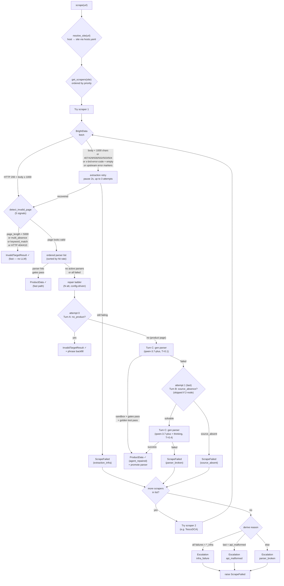

# PriceScope — Scraping Module

Extracts structured product data from marketplace pages. Given a `(url, site)` pair, it returns a validated `ProductData` object with title, price, list_price, membership_price, stock, images, brand, etc. — or explains cleanly why it couldn't.

> **Status**: Phase 0 complete. M1–M21 implemented. M21 extends cold-start repair until human termination with a repeating final model rung, bounded feedback context, regression tracking, and partial save. See [tests/](tests/).

## What it does

```
URL in  ─→  Router (host→site→scraper list)
             ├─ HTMLScraper (Tesco/Argos): BrightData Web Unlocker → HTML → parser → ProductData
             └─ DirectAPIScraper (Amazon): BrightData Datasets API → _trigger (retried) → _poll (300s budget, no re-trigger) → JSON → ProductData
                (Tesco has DCA API as backup — same trigger/poll split)
     out ─→  ProductData | InvalidTargetResult | ScrapeFailed
```

### Pipeline Flow

> Rendered by Mermaid (GitHub + VS Code native). Click to zoom.



Under the hood:

- **Invalid-target detection** — before parsing, checks JSON-LD, HTTP status, structural absence, page length, and a learned phrase list. Delisted / error pages are caught before wasting a parse.
- **Ordered parser list** — each site has multiple parsers ranked by real-time hit rate. First to pass both gates wins.
- **Two gates** — Gate 1 = Pydantic types. Gate 2 = `feasible_check`: every in-stock product needs a positive ordinary `price`; `list_price > price` and `membership_price < price` when those fields are present; out-of-stock items still need a product signal.
- **Trigger/poll split (M13)** — for async BD APIs (Datasets/DCA): `_trigger()` is wrapped in retry (safe — failed POST → no snapshot), `_poll()` owns the full budget and **never re-triggers**. One URL → at most one BD snapshot. Configurable poll budget via `bd_async_poll_max_seconds` (300s default). The old blind-re-trigger-on-timeout bug for Amazon is fixed.
- **Self-healing** — when all parsers fail, a provider-configured LLM generates a candidate, sandboxes it, tests against golden samples, and promotes it if it passes. API routes use JSON remapping only (D25 red line — never fabricates).
- **Fallback ladder** — a site can register multiple scrapers (e.g. Tesco = HTML primary + DCA backup). Terminal failure → next scraper; all exhausted → escalation ticket (`parser_broken / api_malformed / infra_failure / mass_invalid_target`).
- **Golden set** — successful scrapes grow each page-type bucket to the config-driven cap (3 by default), with duplicate-URL protection. Five buckets (precedence order): `out_of_stock` > `membership` > `discounted` > `multipack` > `standard`. Future promotions must reproduce all goldens exactly.
- **Cold start** — a validated Excel sheet declares each URL's page type; required coverage is checked before paid work. The dedicated cold-start model ladder generates and repairs one parser from sandbox failures plus structured human corrections. The parser and confirmed goldens are written only when every fetched, in-scope case passes; fetch failures remain non-blocking and are reported separately.

## Quick start

### 1. Install

From the repo root:

```bash
py -3.12 -m venv .venv
.\.venv\Scripts\Activate.ps1     # or source .venv/bin/activate on POSIX
pip install -r requirements.txt
```

### 2. Set API keys

Copy `.env.sample` to `.env` and fill in:

```
BRIGHT_DATA_KEY = your Bright Data API key
QWEN_KEY        = your Qwen API key (runtime repair + JSON healing by default)
DEEPSEEK_KEY    = your DeepSeek API key (cold start by default)
```

BrightData is used for extraction (Web Unlocker for HTML, Datasets API for Amazon). Runtime repair defaults to Qwen; cold start has its own ladder and defaults to DeepSeek V4 Flash → Pro.

### 3. Scrape a URL

```python
import asyncio
from src.scraping import scrape

async def main():
    result = await scrape("https://www.amazon.co.uk/dp/B0C62DWSDL")
    print(result.title, result.price, result.currency)

asyncio.run(main())
```

Returns:
- `ProductData` — validated product data
- `InvalidTargetResult` — URL reachable but not a valid product (delisted, 404, etc.)
- raises `ScrapeFailed` — all scrapers exhausted (see escalation ticket in DB)

### 4. Cold-start a new site

If you want to add a site that isn't yet in the parser table:

```bash
# 1. Add the site's hostnames to hosts.yaml
# 2. Register an HTMLScraper subclass in scrapers/sites/
# 3. Run cold start with a representative Excel input
python -m src.scraping.coldstart --site newsite --input newsite.xlsx
# Ignore reusable non-stale golden snapshots when a fresh fetch is required:
python -m src.scraping.coldstart --site newsite --input newsite.xlsx --force-fetch
```

The first row must contain `page_type` and `url` (case-insensitive; extra columns are ignored). Legal page types are `standard`, `discounted`, `out_of_stock`, `membership`, and `multipack`. By default the first four are mandatory and `multipack` is optional. Multiple rows per type are useful as spares: once a bucket reaches its cap, remaining rows are skipped without another prompt.

The CLI validates coverage before paid calls, reuses matching non-stale golden HTML snapshots when possible, and then prompts interactively (`y` / `n` / `q`) for each usable extraction. The review panel derives its fields from `ProductData`, summarizes lists/long strings, and warns when a declared bucket's critical field is empty.

- `y` — accept this case for the current round
- `n` — reject it, optionally identify incorrect fields, enter correct values, and add a free-text hint
- `q` — abort the whole run without writing the parser or any goldens

After a failing review round, `c` (or legacy alias `y`) repairs again, `s` saves the current parser plus that round's accepted goldens as a partial result, and `q` abandons without writes. The model ladder is a warm-up schedule: its final model/temperature repeats with thinking enabled until review succeeds, the human stops, or the safety cap is reached. Every round reruns every URL so a repair cannot silently regress an accepted case; unchanged accepted outputs are reused without prompting. Repair prompts contain only the preceding round's failures plus a compact resolved/regression ledger. Fetch failures do not block persistence because the parser had no opportunity to prove itself, but can leave a coverage shortfall. A declared/extracted type disagreement is shown as `MISMATCH`; accepting still stores the declared type. Exit codes are `0` for complete coverage, `1` for input/abort/no seed, and `2` for incomplete coverage or a partial save.

## Module structure

```
src/scraping/
├── __init__.py                     Public API: scrape(), ProductData, ScrapeFailed
├── config.py                       ScrapingConfig (all knobs from spec §7)
├── exceptions.py                   ScrapeFailed, BrightDataInfraError
├── detection.py                    Invalid-target detection (5 signal layers)
├── router.py                       Two-hop dispatch + scraper fallback + escalation
├── registry.py                     @register_scraper decorator
├── hosts.yaml                      host → site mapping (edit to add sites)
├── coldstart.py                    Cold-start CLI
├── models/                         ProductData, enums, InvalidTargetResult
├── validation/                     gate1 (Pydantic) + gate2 (feasible_check)
├── scrapers/
│   ├── base.py                     BaseScraper ABC
│   ├── html_scraper.py             Template Method: extract → detect → parse → gates → repair
│   ├── api_scraper.py              JSON mapping + restricted JSON self-heal
│   └── sites/                      TescoScraper, TescoDCAScraper, ArgosScraper, AmazonUKScraper
├── extraction/                     Bright Data async clients (Unlocker / Datasets / DCA)
├── repair/
│   ├── sandbox.py                  Subprocess + AST whitelist + timeout
│   ├── agent.py                    Repair ladder (qwen-3.7-plus x2)
│   ├── prompts.py                  Prompt builders (JSON-LD-aware HTML excerpts)
│   ├── json_healer.py              Restricted JSON remap (D25 red line)
│   └── golden.py                   page_type classifier + promote_candidate + prune
├── storage/                        6 SQLite tables (parsers, golden_samples, scrape_runs,
│                                   results, escalations, invalid_target_phrases)
├── data/                           Sample HTMLs / JSON for tests
└── tests/                          verify_mN.py + verify_mN_output.log per milestone
```

## Adding a new site

1. **Add its hosts** to [hosts.yaml](hosts.yaml):
   ```yaml
   waitrose.com: waitrose
   www.waitrose.com: waitrose
   ```

2. **Register a scraper** in `scrapers/sites/waitrose.py`:
   ```python
   from ...registry import register_scraper
   from ...extraction import BrightDataUnlocker
   from ..html_scraper import HTMLScraper

   @register_scraper("waitrose", order=1)
   class WaitroseScraper(HTMLScraper):
       def _get_unlocker(self) -> BrightDataUnlocker:
           return BrightDataUnlocker(zone="web_unlocker1", country="gb")
   ```

3. **Add the module to** [scrapers/sites/\_\_init\_\_.py](scrapers/sites/__init__.py) so the decorator runs at import time:
   ```python
   from . import amazon_uk, argos, tesco, tesco_dca, waitrose
   ```

4. **Cold start** to seed the first parser + goldens:
   ```bash
   python -m src.scraping.coldstart --site waitrose --input waitrose.xlsx
   ```

For an API-route site, subclass `DirectAPIScraper` instead and implement `_fetch_json` + `_map_fields`.

### Adding a fallback scaper

If a site already has a primary scraper, add a backup with `order=2` — the router tries them in ascending order and falls through when one fails terminally. See [Tesco DCA backup](src/scraping/scrapers/sites/tesco_dca.py) as a model:

1. **Create the scraper** in `scrapers/sites/<site>_dca.py`:
   ```python
   from datetime import datetime, timezone
   from ...extraction import BrightDataDCA, with_extraction_retry
   from ...registry import register_scraper
   from ..api_scraper import DirectAPIScraper

   @register_scraper("argos", order=2)
   class ArgosDCAScraper(DirectAPIScraper):
       source_type = "api"
       def __init__(self):
           self._client = BrightDataDCA()

       async def _fetch_json(self, url):
           collection_id = await with_extraction_retry(self._client._trigger, url)
           return await self._client._poll(collection_id)

       def _is_not_found(self, json_data):
           return not json_data.get("product_name")

       def _map_fields(self, json_data, url):
           # Map DCA response fields to ProductData-compatible dict
           ...
   ```
   Use `_trigger`/`_poll` (not `fetch`) — the trigger is retried; poll runs with the configurable budget and never re-triggers.

2. **Register it** in [scrapers/sites/\_\_init\_\_.py](scrapers/sites/__init__.py):
   ```python
   from . import amazon_uk, argos, tesco, tesco_dca, argos_dca
   ```

3. **Done.** The router tries `order=1` first; if it escalates, `order=2` is tried next; if all exhausted, an escalation ticket is written.

## Storage

Single SQLite database at `scraping.db` (path configurable via `SCRAPING_DB_PATH` env var). Six tables:

| Table | Purpose |
|-------|---------|
| `parsers` | Parser code text + status (active/retired) |
| `golden_samples` | HTML snapshots + expected ProductData for promote gate |
| `scrape_runs` | Every scrape attempt (success/failure/invalid_target); source for hit rate |
| `results` | Append-only history of qualified ProductData outputs |
| `escalations` | Failure tickets with signature dedup (4 reason types) |
| `invalid_target_phrases` | Learned phrases from Agent backfill for future invalid-target detection |

Common queries:

```sql
-- Price history for a URL
SELECT scraped_at, product_data FROM results WHERE url = ? ORDER BY scraped_at DESC;

-- Parser hit rates for a site
SELECT winning_parser_id, COUNT(*) hits FROM scrape_runs
WHERE site = ? AND outcome = 'success' GROUP BY winning_parser_id ORDER BY hits DESC;

-- Open escalations needing human attention
SELECT * FROM escalations WHERE status = 'open' ORDER BY affected_count DESC;
```

## Configuration

All knobs live in [config.py](config.py) (`ScrapingConfig`). Notable defaults (spec §7):

| Setting | Default | Notes |
|---------|---------|-------|
| `repair_model_ladder` | `qwen3.7-plus` x2 | Runtime HTML repair models; JSON healing uses the first model |
| `repair_temperature_ladder` | `0.1 → 0.4` | Parser-generation temperature per attempt (must match model ladder) |
| `cold_start_model_ladder` | `deepseek-v4-flash` x2 | Warm-up schedule; final model repeats for later repair rounds |
| `cold_start_temperature_ladder` | `0.1 → 0.4` | Must match the cold-start model ladder; final rung repeats with thinking enabled |
| `cold_start_max_repair_rounds` | 10 | Runaway guard for the otherwise human-terminated cold-start repair loop |
| `bd_async_poll_max_seconds` | 300 | Wall-clock budget for Datasets/DCA snapshot polling (M13) |
| `bd_async_poll_interval_seconds` | 4 | Sleep between Datasets/DCA poll GETs (M13) |
| `json_heal_budget` | 1 | Single-shot for API route |
| `sandbox_timeout` | 10s | Kill parser subprocess after this |
| `sandbox_import_whitelist` | `bs4, lxml, re, json` | Only these can be imported |
| `prune_sliding_window` | 50 | Runs before natural prune considers a parser |
| `per_site_parser_limit` | 4 | Hard cap on active parsers per site |
| `cold_start_page_require_mandatory` | standard/discounted/out_of_stock/membership = true; multipack = false | Cold-start coverage and per-bucket minimum policy |
| `golden_max_samples_per_page_type` | 3 | Maximum non-stale goldens per site/page type |
| `mass_invalid_target_ratio` | 0.3 | Alert if >30% of a site's 24h runs are invalid_target |
| `mass_invalid_target_absolute` | 20 | Or if absolute count exceeds this |

Override via env vars, for example:

```bash
SCRAPING_REPAIR_MODEL_LADDER='["deepseek-v4-flash","deepseek-v4-pro"]'
SCRAPING_COLD_START_MODEL_LADDER='["qwen3.7-plus","qwen3.7-plus"]'
SCRAPING_COLD_START_TEMPERATURE_LADDER='[0.1,0.4]'
SCRAPING_COLD_START_PAGE_REQUIRE_MANDATORY='{"multipack": false, "membership": false}'
SCRAPING_GOLDEN_MAX_SAMPLES_PER_PAGE_TYPE=2
```

LLM models, endpoints, key names, JSON-mode support, and thinking toggles live only in `providers.py`. To switch the ladder to DeepSeek, set the model list above and add `DEEPSEEK_KEY` to `.env`; no scraper or repair code changes are needed.

### Shrinking the golden set

Lowering the cap never deletes automatically. Preview and apply an age/provenance-aware shrink explicitly:

```bash
python -m src.scraping.scripts.prune_goldens --site tesco
python -m src.scraping.scripts.prune_goldens --site tesco --apply
```

The default is a dry run. Stale samples are evicted first, then oldest auto-seeded samples, then oldest human-confirmed cold-start samples. The configured mandatory minimum is never crossed.

## Verification

Every milestone ships with a runnable verify script. To reproduce the relevant verification set:

```bash
PYTHONIOENCODING=utf-8 python -m src.scraping.tests.verify_m1_m3
PYTHONIOENCODING=utf-8 python -m src.scraping.tests.verify_m4_m5
PYTHONIOENCODING=utf-8 python -m src.scraping.tests.verify_m6
PYTHONIOENCODING=utf-8 python -m src.scraping.tests.verify_m7
PYTHONIOENCODING=utf-8 python -m src.scraping.tests.verify_m8    # real Qwen
PYTHONIOENCODING=utf-8 python -m src.scraping.tests.verify_m9
PYTHONIOENCODING=utf-8 python -m src.scraping.tests.verify_m17
PYTHONIOENCODING=utf-8 python -m src.scraping.tests.verify_m18
PYTHONIOENCODING=utf-8 python -m src.scraping.tests.verify_m19
PYTHONIOENCODING=utf-8 python -m src.scraping.tests.verify_m10
PYTHONIOENCODING=utf-8 python -m src.scraping.tests.verify_m11   # real Qwen
PYTHONIOENCODING=utf-8 python -m src.scraping.tests.verify_m12   # real BrightData + Qwen, per-site batch
PYTHONIOENCODING=utf-8 python -m src.scraping.tests.verify_m13   # offline — mocked BD, proves no duplicate triggers
PYTHONIOENCODING=utf-8 python -m src.scraping.tests.verify_m14   # offline tiers; Qwen tier skips without a key
PYTHONIOENCODING=utf-8 python -m src.scraping.tests.verify_m15   # offline data-quality gates
PYTHONIOENCODING=utf-8 python -m src.scraping.tests.verify_m17   # offline — Excel contract + golden caps/pruning
PYTHONIOENCODING=utf-8 python -m src.scraping.tests.verify_m18   # offline — provider registry/client factory
```

Latest results are saved to [tests/verify_m*_output.log](tests/). See [tests/README.md](tests/README.md) for the 306+ check inventory and re-run instructions.

## Design

Full design spec: [scraping_module_spec_v1_2.md](scraping_module_spec_v1_2.md) (in Chinese). Key decisions are numbered D1–D29 with rationale. Highlights:

- **D1**: Prices always `Decimal`, never `float`
- **D3**: Scraper registry is a code decorator (`@register_scraper`), not YAML
- **D8**: Parse + gate failures share one repair budget (avoids ping-pong)
- **D14**: Sandbox uses only Python stdlib (subprocess + AST + setrlimit)
- **D17**: Hit rates aggregated in real time from `scrape_runs`, not stored
- **D21**: BrightData infra failure = immediate alert, no retry, no fallback
- **D24**: `results` table is append-only (price history is a core asset)
- **D25**: JSON self-heal never fabricates missing fields (three-layer enforcement)
- **D26**: Invalid-target detection is structural-signal-first (JSON-LD), keyword-auxiliary
- **D29**: Single `invalid_target` is silent; only site-wide surges escalate

## Phase 0 known compromises

- **Sandbox on Windows** — `resource.setrlimit` is POSIX-only. On Windows only the subprocess timeout provides isolation. Phase 2 will use Docker.
- **JSON heal cache** — in-memory only (lost on restart). Next scrape re-heals in ~1 LLM call.
- **INFRA ALERT** — currently logged only. Phase 1 will hook email/IM.
- **LLM output variance** — the Agent's parser code differs between runs even on identical HTML. Verify scripts test *machinery*, not exact parser code.

## External dependencies

- **BrightData** — [Web Unlocker](https://docs.brightdata.com/scraping-automation/web-unlocker/introduction) for HTML, Datasets API for Amazon, DCA collectors for Tesco backup
- **LLM providers** — Qwen via DashScope by default; DeepSeek through its official OpenAI-compatible endpoint; registry in `providers.py`
- **Python 3.12** — some upstream deps lack 3.14 wheels
- Key libraries: `pydantic`, `httpx`, `lxml`, `beautifulsoup4`, `openpyxl`, `langchain-openai`, `pydantic-settings`, `pyyaml`

## Contributing

- Add a new site → see "Adding a new site" above.
- Modify a D-numbered decision → read its rationale in the spec first.
- Ship a new milestone → follow the Verification Discipline in [CLAUDE.md](CLAUDE.md): a runnable `verify_mN.py` + its `.log` output, and a row in [tests/README.md](tests/README.md).
