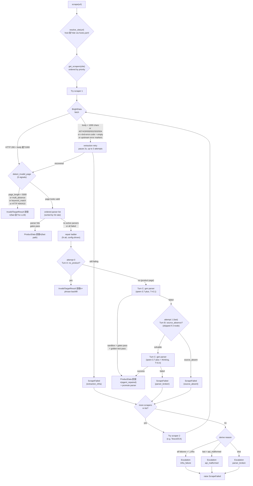

# PriceScope 鈥?Scraping Module

Extracts structured product data from marketplace pages. Given a `(url, site)` pair, it returns a validated `ProductData` object with title, price, list_price, membership_price, stock, images, brand, etc. 鈥?or explains cleanly why it couldn't.

> **Status**: Phase 0 complete. M1–M16 implemented. M1–M15 offline verification: 266 checks, 0 failures. M12: end-to-end live-scraping (Tesco+Argos). M13: DCA polling fix. M14: price-aware pre-pass. M15: data-quality gates. M16: UTF-8 mojibake resilience + anchoring hardening. See [tests/](tests/).

## What it does

```
URL in  鈹€鈫? Router (host鈫抯ite鈫抯craper list)
             鈹溾攢 HTMLScraper (Tesco/Argos): BrightData Web Unlocker 鈫?HTML 鈫?parser 鈫?ProductData
             鈹斺攢 DirectAPIScraper (Amazon): BrightData Datasets API 鈫?_trigger (retried) 鈫?_poll (300s budget, no re-trigger) 鈫?JSON 鈫?ProductData
                (Tesco has DCA API as backup 鈥?same trigger/poll split)
     out 鈹€鈫? ProductData | InvalidTargetResult | ScrapeFailed
```

### Pipeline Flow

> Rendered by Mermaid (GitHub + VS Code native). Click to zoom.



Under the hood:

- **Invalid-target detection** 鈥?before parsing, checks JSON-LD, HTTP status, structural absence, page length, and a learned phrase list. Delisted / error pages are caught before wasting a parse.
- **Ordered parser list** 鈥?each site has multiple parsers ranked by real-time hit rate. First to pass both gates wins.
- **Two gates** 鈥?Gate 1 = Pydantic types. Gate 2 = `feasible_check`: rejects `in_stock=True` with no price, hallucinated zero prices, and out-of-stock items with zero product signals.
- **Trigger/poll split (M13)** 鈥?for async BD APIs (Datasets/DCA): `_trigger()` is wrapped in retry (safe 鈥?failed POST 鈫?no snapshot), `_poll()` owns the full budget and **never re-triggers**. One URL 鈫?at most one BD snapshot. Configurable poll budget via `bd_async_poll_max_seconds` (300s default). The old blind-re-trigger-on-timeout bug for Amazon is fixed.
- **Self-healing** 鈥?when all parsers fail, an LLM (Qwen) generates a candidate, sandboxes it, tests against golden samples, promotes if it passes. API routes use JSON remapping only (D25 red line 鈥?never fabricates).
- **Fallback ladder** 鈥?a site can register multiple scrapers (e.g. Tesco = HTML primary + DCA backup). Terminal failure 鈫?next scraper; all exhausted 鈫?escalation ticket (`parser_broken / api_malformed / infra_failure / mass_invalid_target`).
- **Golden set** 鈥?every successful scrape auto-seeds a golden per page type (`standard / out_of_stock / discounted / multipack`). Future promotions must reproduce them exactly.
- **Cold start** 鈥?for a new site: fetch URLs 鈫?LLM generates first parser 鈫?confirm each result 鈫?parser + goldens seeded.

## Quick start

### 1. Install

From the repo root:

```bash
py -3.12 -m venv .venv
.\.venv\Scripts\Activate.ps1     # or source .venv/bin/activate on POSIX
pip install -r requirements.txt
```

### 2. Set API keys

Copy `.env.sample` to `.env` and fill in:

```
BRIGHT_DATA_KEY  = your Bright Data API key
QWEN_KEY        = your Qwen API key (used by both search and scraping)
```

BrightData is used for extraction (Web Unlocker for HTML, Datasets API for Amazon). Qwen is used for the repair Agent and cold start.

### 3. Scrape a URL

```python
import asyncio
from src.scraping import scrape

async def main():
    result = await scrape("https://www.amazon.co.uk/dp/B0C62DWSDL")
    print(result.title, result.price, result.currency)

asyncio.run(main())
```

Returns:
- `ProductData` 鈥?validated product data
- `InvalidTargetResult` 鈥?URL reachable but not a valid product (delisted, 404, etc.)
- raises `ScrapeFailed` 鈥?all scrapers exhausted (see escalation ticket in DB)

### 4. Cold-start a new site

If you want to add a site that isn't yet in the parser table:

```bash
# 1. Add the site's hostnames to hosts.yaml
# 2. Register an HTMLScraper subclass in scrapers/sites/
# 3. Run cold start with a batch of representative product URLs
python -m src.scraping.coldstart --site newsite --urls-file urls.txt
```

The CLI will fetch each URL, ask the LLM to generate a parser, run it against every URL, and prompt you interactively (`y` / `n` / `q`) to confirm each extracted result. Confirmed outputs become the seed golden samples.

## Module structure

```
src/scraping/
鈹溾攢鈹€ __init__.py                     Public API: scrape(), ProductData, ScrapeFailed
鈹溾攢鈹€ config.py                       ScrapingConfig (all knobs from spec 搂7)
鈹溾攢鈹€ exceptions.py                   ScrapeFailed, BrightDataInfraError
鈹溾攢鈹€ detection.py                    Invalid-target detection (5 signal layers)
鈹溾攢鈹€ router.py                       Two-hop dispatch + scraper fallback + escalation
鈹溾攢鈹€ registry.py                     @register_scraper decorator
鈹溾攢鈹€ hosts.yaml                      host 鈫?site mapping (edit to add sites)
鈹溾攢鈹€ coldstart.py                    Cold-start CLI
鈹溾攢鈹€ models/                         ProductData, enums, InvalidTargetResult
鈹溾攢鈹€ validation/                     gate1 (Pydantic) + gate2 (feasible_check)
鈹溾攢鈹€ scrapers/
鈹?  鈹溾攢鈹€ base.py                     BaseScraper ABC
鈹?  鈹溾攢鈹€ html_scraper.py             Template Method: extract 鈫?detect 鈫?parse 鈫?gates 鈫?repair
鈹?  鈹溾攢鈹€ api_scraper.py              JSON mapping + restricted JSON self-heal
鈹?  鈹斺攢鈹€ sites/                      TescoScraper, TescoDCAScraper, ArgosScraper, AmazonUKScraper
鈹溾攢鈹€ extraction/                     Bright Data async clients (Unlocker / Datasets / DCA)
鈹溾攢鈹€ repair/
鈹?  鈹溾攢鈹€ sandbox.py                  Subprocess + AST whitelist + timeout
鈹?  鈹溾攢鈹€ agent.py                    Repair ladder (qwen-3.7-plus x2)
鈹?  鈹溾攢鈹€ prompts.py                  Prompt builders (JSON-LD-aware HTML excerpts)
鈹?  鈹溾攢鈹€ json_healer.py              Restricted JSON remap (D25 red line)
鈹?  鈹斺攢鈹€ golden.py                   page_type classifier + promote_candidate + prune
鈹溾攢鈹€ storage/                        6 SQLite tables (parsers, golden_samples, scrape_runs,
鈹?                                  results, escalations, invalid_target_phrases)
鈹溾攢鈹€ data/                           Sample HTMLs / JSON for tests
鈹斺攢鈹€ tests/                          verify_mN.py + verify_mN_output.log per milestone
```

## Adding a new site

1. **Add its hosts** to [hosts.yaml](hosts.yaml):
   ```yaml
   waitrose.com: waitrose
   www.waitrose.com: waitrose
   ```

2. **Register a scraper** in `scrapers/sites/waitrose.py`:
   ```python
   from ...registry import register_scraper
   from ...extraction import BrightDataUnlocker
   from ..html_scraper import HTMLScraper

   @register_scraper("waitrose", order=1)
   class WaitroseScraper(HTMLScraper):
       def _get_unlocker(self) -> BrightDataUnlocker:
           return BrightDataUnlocker(zone="web_unlocker1", country="gb")
   ```

3. **Add the module to** [scrapers/sites/\_\_init\_\_.py](scrapers/sites/__init__.py) so the decorator runs at import time:
   ```python
   from . import amazon_uk, argos, tesco, tesco_dca, waitrose
   ```

4. **Cold start** to seed the first parser + goldens:
   ```bash
   python -m src.scraping.coldstart --site waitrose --urls-file waitrose_urls.txt
   ```

For an API-route site, subclass `DirectAPIScraper` instead and implement `_fetch_json` + `_map_fields`.

### Adding a fallback scaper

If a site already has a primary scraper, add a backup with `order=2` — the router tries them in ascending order and falls through when one fails terminally. See [Tesco DCA backup](src/scraping/scrapers/sites/tesco_dca.py) as a model:

1. **Create the scraper** in `scrapers/sites/<site>_dca.py`:
   ```python
   from datetime import datetime, timezone
   from ...extraction import BrightDataDCA, with_extraction_retry
   from ...registry import register_scraper
   from ..api_scraper import DirectAPIScraper

   @register_scraper("argos", order=2)
   class ArgosDCAScraper(DirectAPIScraper):
       source_type = "api"
       def __init__(self):
           self._client = BrightDataDCA()

       async def _fetch_json(self, url):
           collection_id = await with_extraction_retry(self._client._trigger, url)
           return await self._client._poll(collection_id)

       def _is_not_found(self, json_data):
           return not json_data.get("product_name")

       def _map_fields(self, json_data, url):
           # Map DCA response fields to ProductData-compatible dict
           ...
   ```
   Use `_trigger`/`_poll` (not `fetch`) — the trigger is retried; poll runs with the configurable budget and never re-triggers.

2. **Register it** in [scrapers/sites/\_\_init\_\_.py](scrapers/sites/__init__.py):
   ```python
   from . import amazon_uk, argos, tesco, tesco_dca, argos_dca
   ```

3. **Done.** The router tries `order=1` first; if it escalates, `order=2` is tried next; if all exhausted, an escalation ticket is written.

## Storage

Single SQLite database at `scraping.db` (path configurable via `SCRAPING_DB_PATH` env var). Six tables:

| Table | Purpose |
|-------|---------|
| `parsers` | Parser code text + status (active/retired) |
| `golden_samples` | HTML snapshots + expected ProductData for promote gate |
| `scrape_runs` | Every scrape attempt (success/failure/invalid_target); source for hit rate |
| `results` | Append-only history of qualified ProductData outputs |
| `escalations` | Failure tickets with signature dedup (4 reason types) |
| `invalid_target_phrases` | Learned phrases from Agent backfill for future invalid-target detection |

Common queries:

```sql
-- Price history for a URL
SELECT scraped_at, product_data FROM results WHERE url = ? ORDER BY scraped_at DESC;

-- Parser hit rates for a site
SELECT winning_parser_id, COUNT(*) hits FROM scrape_runs
WHERE site = ? AND outcome = 'success' GROUP BY winning_parser_id ORDER BY hits DESC;

-- Open escalations needing human attention
SELECT * FROM escalations WHERE status = 'open' ORDER BY affected_count DESC;
```

## Configuration

All knobs live in [config.py](config.py) (`ScrapingConfig`). Notable defaults (spec 搂7):

| Setting | Default | Notes |
|---------|---------|-------|
| `repair_model_ladder` | `qwen-3.7-plus` x2 | Qwen model per attempt; length = attempt count |
| `repair_temperature_ladder` | `0.1 鈫?0.4` | Parser-generation temperature per attempt (must match model ladder) |
| `bd_async_poll_max_seconds` | 300 | Wall-clock budget for Datasets/DCA snapshot polling (M13) |
| `bd_async_poll_interval_seconds` | 4 | Sleep between Datasets/DCA poll GETs (M13) |
| `json_heal_budget` | 1 | Single-shot for API route |
| `sandbox_timeout` | 10s | Kill parser subprocess after this |
| `sandbox_import_whitelist` | `bs4, lxml, re, json` | Only these can be imported |
| `prune_sliding_window` | 50 | Runs before natural prune considers a parser |
| `per_site_parser_limit` | 4 | Hard cap on active parsers per site |
| `mass_invalid_target_ratio` | 0.3 | Alert if >30% of a site's 24h runs are invalid_target |
| `mass_invalid_target_absolute` | 20 | Or if absolute count exceeds this |

Override via env vars (`SCRAPING_REPAIR_MODEL_LADDER='["qwen-3.7-plus","qwen-3.7-plus"]'` etc.).

## Verification

Every milestone ships with a runnable verify script. To reproduce the full 172-check pass:

```bash
PYTHONIOENCODING=utf-8 python -m src.scraping.tests.verify_m1_m3
PYTHONIOENCODING=utf-8 python -m src.scraping.tests.verify_m4_m5
PYTHONIOENCODING=utf-8 python -m src.scraping.tests.verify_m6
PYTHONIOENCODING=utf-8 python -m src.scraping.tests.verify_m7
PYTHONIOENCODING=utf-8 python -m src.scraping.tests.verify_m8    # real Qwen
PYTHONIOENCODING=utf-8 python -m src.scraping.tests.verify_m9
PYTHONIOENCODING=utf-8 python -m src.scraping.tests.verify_m10
PYTHONIOENCODING=utf-8 python -m src.scraping.tests.verify_m11   # real Qwen
PYTHONIOENCODING=utf-8 python -m src.scraping.tests.verify_m12   # real BrightData + Qwen, per-site batch
PYTHONIOENCODING=utf-8 python -m src.scraping.tests.verify_m13   # offline 鈥?mocked BD, proves no duplicate triggers
```

Latest results are saved to [tests/verify_m*_output.log](tests/). See [tests/README.md](tests/README.md) for the inventory (194 checks across M1鈥揗13) and re-run instructions.

## Design

Full design spec: [scraping_module_spec_v1_2.md](scraping_module_spec_v1_2.md) (in Chinese). Key decisions are numbered D1鈥揇29 with rationale. Highlights:

- **D1**: Prices always `Decimal`, never `float`
- **D3**: Scraper registry is a code decorator (`@register_scraper`), not YAML
- **D8**: Parse + gate failures share one repair budget (avoids ping-pong)
- **D14**: Sandbox uses only Python stdlib (subprocess + AST + setrlimit)
- **D17**: Hit rates aggregated in real time from `scrape_runs`, not stored
- **D21**: BrightData infra failure = immediate alert, no retry, no fallback
- **D24**: `results` table is append-only (price history is a core asset)
- **D25**: JSON self-heal never fabricates missing fields (three-layer enforcement)
- **D26**: Invalid-target detection is structural-signal-first (JSON-LD), keyword-auxiliary
- **D29**: Single `invalid_target` is silent; only site-wide surges escalate

## Phase 0 known compromises

- **Sandbox on Windows** 鈥?`resource.setrlimit` is POSIX-only. On Windows only the subprocess timeout provides isolation. Phase 2 will use Docker.
- **JSON heal cache** 鈥?in-memory only (lost on restart). Next scrape re-heals in ~1 LLM call.
- **INFRA ALERT** 鈥?currently logged only. Phase 1 will hook email/IM.
- **LLM output variance** 鈥?the Agent's parser code differs between runs even on identical HTML. Verify scripts test *machinery*, not exact parser code.

## External dependencies

- **BrightData** 鈥?[Web Unlocker](https://docs.brightdata.com/scraping-automation/web-unlocker/introduction) for HTML, Datasets API for Amazon, DCA collectors for Tesco backup
- **Qwen** (via DashScope) 鈥?OpenAI-compatible LLM endpoint (`https://dashscope.aliyuncs.com/compatible-mode/v1`)
- **Python 3.12** 鈥?some upstream deps lack 3.14 wheels
- Key libraries: `pydantic`, `httpx`, `lxml`, `beautifulsoup4`, `langchain-openai`, `pydantic-settings`, `pyyaml`

## Contributing

- Add a new site 鈫?see "Adding a new site" above.
- Modify a D-numbered decision 鈫?read its rationale in the spec first.
- Ship a new milestone 鈫?follow the Verification Discipline in [CLAUDE.md](CLAUDE.md): a runnable `verify_mN.py` + its `.log` output, and a row in [tests/README.md](tests/README.md).
