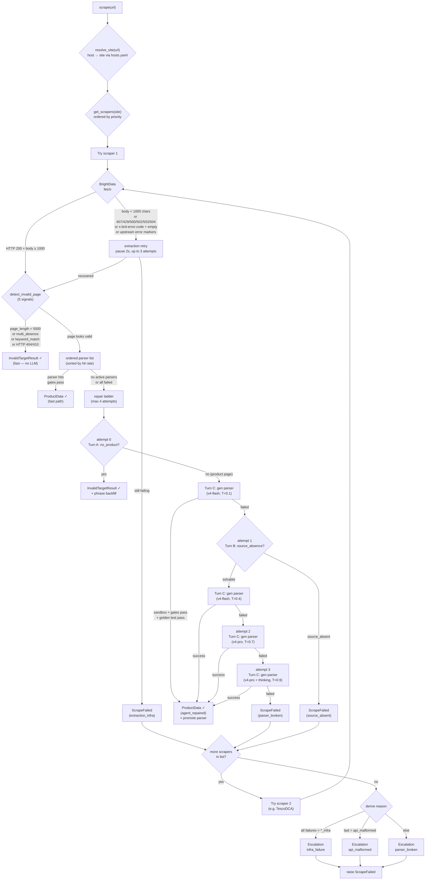

# PriceScope — Scraping Module

Extracts structured product data from marketplace pages. Given a `(url, site)` pair, it returns a validated `ProductData` object with title, price, stock, images, brand, etc. — or explains cleanly why it couldn't.

> **Status**: Phase 0 complete. M1–M12 implemented. M1–M11 offline verification: 172 checks, 0 failures. M12 end-to-end live-scraping validated on Tesco (6/6 pass) and Argos (6/8 SUCCESS, 0 escalated). See [tests/](tests/).

## What it does

```
URL in  ─→  Router (host→site→scraper list)
             ├─ HTMLScraper (Tesco/Argos): BrightData Web Unlocker → HTML → parser → ProductData
             └─ DirectAPIScraper (Amazon): BrightData Datasets API → JSON → ProductData
                (Tesco has DCA API as backup)
     out ─→  ProductData | InvalidTargetResult | ScrapeFailed
```

### Pipeline Flow

> Rendered by Mermaid (GitHub + VS Code native). Click to zoom.



Under the hood:

- **Invalid-target detection** — before parsing, checks JSON-LD, HTTP status, structural absence, page length, and a learned phrase list. Delisted / error / soft-wall pages are caught before wasting a parse.
- **Ordered parser list** — each site has multiple parsers ranked by real-time hit rate. First one that passes both validation gates wins.
- **Two gates** — Gate 1 is Pydantic type validation. Gate 2 is `feasible_check`: rejects `in_stock=True + price=None`, `in_stock=True + price<=0` (hallucinated zero), and `in_stock=False + no images + no price + no list_price` (likely an error page, not a real product).
- **Self-healing** — when all parsers fail on an HTML page, an LLM (DeepSeek) generates a candidate parser, sandboxes it, tests it against golden samples, and if it passes, promotes it to the parser list. For API routes, the LLM does field remapping only (never fabricates missing data — the D25 red line).
- **Fallback ladder** — a site can register multiple scrapers (e.g. Tesco = HTML primary + DCA backup). If one fails terminally, the router tries the next. All exhausted → escalation ticket with reason `{parser_broken, api_malformed, infra_failure, mass_invalid_target}`.
- **Golden set** — every successful scrape auto-seeds a golden sample per page type (`standard`, `out_of_stock`, `discounted`, `multipack`). Future parser promotions must reproduce these exactly.
- **Cold start** — for a brand-new site, the CLI fetches URLs → LLM generates first parser → you confirm each result → parser + goldens seeded.

## Quick start

### 1. Install

From the repo root:

```bash
py -3.12 -m venv .venv
.\.venv\Scripts\Activate.ps1     # or source .venv/bin/activate on POSIX
pip install -r requirements.txt
```

### 2. Set API keys

Copy `.env.sample` to `.env` and fill in:

```
BRIGHT_DATA_KEY  = your Bright Data API key
DEEPSEEK_KEY     = your DeepSeek API key
```

BrightData is used for extraction (Web Unlocker for HTML, Datasets API for Amazon). DeepSeek is used for the repair Agent and cold start.

### 3. Scrape a URL

```python
import asyncio
from src.scraping import scrape

async def main():
    result = await scrape("https://www.amazon.co.uk/dp/B0C62DWSDL")
    print(result.title, result.price, result.currency)

asyncio.run(main())
```

Returns:
- `ProductData` — validated product data
- `InvalidTargetResult` — URL reachable but not a valid product (delisted, 404, etc.)
- raises `ScrapeFailed` — all scrapers exhausted (see escalation ticket in DB)

### 4. Cold-start a new site

If you want to add a site that isn't yet in the parser table:

```bash
# 1. Add the site's hostnames to hosts.yaml
# 2. Register an HTMLScraper subclass in scrapers/sites/
# 3. Run cold start with a batch of representative product URLs
python -m src.scraping.coldstart --site newsite --urls-file urls.txt
```

The CLI will fetch each URL, ask the LLM to generate a parser, run it against every URL, and prompt you interactively (`y` / `n` / `q`) to confirm each extracted result. Confirmed outputs become the seed golden samples.

## Module structure

```
src/scraping/
├── __init__.py                     Public API: scrape(), ProductData, ScrapeFailed
├── config.py                       ScrapingConfig (all knobs from spec §7)
├── exceptions.py                   ScrapeFailed, BrightDataInfraError
├── detection.py                    Invalid-target detection (5 signal layers)
├── router.py                       Two-hop dispatch + scraper fallback + escalation
├── registry.py                     @register_scraper decorator
├── hosts.yaml                      host → site mapping (edit to add sites)
├── coldstart.py                    Cold-start CLI
├── models/                         ProductData, enums, InvalidTargetResult
├── validation/                     gate1 (Pydantic) + gate2 (feasible_check)
├── scrapers/
│   ├── base.py                     BaseScraper ABC
│   ├── html_scraper.py             Template Method: extract → detect → parse → gates → repair
│   ├── api_scraper.py              JSON mapping + restricted JSON self-heal
│   └── sites/                      TescoScraper, TescoDCAScraper, ArgosScraper, AmazonUKScraper
├── extraction/                     Bright Data async clients (Unlocker / Datasets / DCA)
├── repair/
│   ├── sandbox.py                  Subprocess + AST whitelist + timeout
│   ├── agent.py                    Repair ladder (flash → flash → pro)
│   ├── prompts.py                  Prompt builders (JSON-LD-aware HTML excerpts)
│   ├── json_healer.py              Restricted JSON remap (D25 red line)
│   └── golden.py                   page_type classifier + promote_candidate + prune
├── storage/                        6 SQLite tables (parsers, golden_samples, scrape_runs,
│                                   results, escalations, invalid_target_phrases)
├── data/                           Sample HTMLs / JSON for tests
└── tests/                          verify_mN.py + verify_mN_output.log per milestone
```

## Adding a new site

1. **Add its hosts** to [hosts.yaml](hosts.yaml):
   ```yaml
   waitrose.com: waitrose
   www.waitrose.com: waitrose
   ```

2. **Register a scraper** in `scrapers/sites/waitrose.py`:
   ```python
   from ...registry import register_scraper
   from ...extraction import BrightDataUnlocker
   from ..html_scraper import HTMLScraper

   @register_scraper("waitrose", order=1)
   class WaitroseScraper(HTMLScraper):
       def _get_unlocker(self) -> BrightDataUnlocker:
           return BrightDataUnlocker(zone="web_unlocker1", country="gb")
   ```

3. **Add the module to** [scrapers/sites/\_\_init\_\_.py](scrapers/sites/__init__.py) so the decorator runs at import time:
   ```python
   from . import amazon_uk, argos, tesco, tesco_dca, waitrose
   ```

4. **Cold start** to seed the first parser + goldens:
   ```bash
   python -m src.scraping.coldstart --site waitrose --urls-file waitrose_urls.txt
   ```

For an API-route site, subclass `DirectAPIScraper` instead and implement `_fetch_json` + `_map_fields`.

## Storage

Single SQLite database at `scraping.db` (path configurable via `SCRAPING_DB_PATH` env var). Six tables:

| Table | Purpose |
|-------|---------|
| `parsers` | Parser code text + status (active/retired) |
| `golden_samples` | HTML snapshots + expected ProductData for promote gate |
| `scrape_runs` | Every scrape attempt (success/failure/invalid_target); source for hit rate |
| `results` | Append-only history of qualified ProductData outputs |
| `escalations` | Failure tickets with signature dedup (4 reason types) |
| `invalid_target_phrases` | Learned phrases from Agent backfill for future invalid-target detection |

Common queries:

```sql
-- Price history for a URL
SELECT scraped_at, product_data FROM results WHERE url = ? ORDER BY scraped_at DESC;

-- Parser hit rates for a site
SELECT winning_parser_id, COUNT(*) hits FROM scrape_runs
WHERE site = ? AND outcome = 'success' GROUP BY winning_parser_id ORDER BY hits DESC;

-- Open escalations needing human attention
SELECT * FROM escalations WHERE status = 'open' ORDER BY affected_count DESC;
```

## Configuration

All knobs live in [config.py](config.py) (`ScrapingConfig`). Notable defaults (spec §7):

| Setting | Default | Notes |
|---------|---------|-------|
| `repair_budget` | 3 | Shared budget for HTML repair ladder (D8) |
| `repair_model_ladder` | flash → flash → pro | DeepSeek model tiers |
| `json_heal_budget` | 1 | Single-shot for API route |
| `sandbox_timeout` | 10s | Kill parser subprocess after this |
| `sandbox_import_whitelist` | `bs4, lxml, re, json` | Only these can be imported |
| `prune_sliding_window` | 50 | Runs before natural prune considers a parser |
| `per_site_parser_limit` | 4 | Hard cap on active parsers per site |
| `mass_invalid_target_ratio` | 0.3 | Alert if >30% of a site's 24h runs are invalid_target |
| `mass_invalid_target_absolute` | 20 | Or if absolute count exceeds this |

Override via env vars (`SCRAPING_REPAIR_BUDGET=5` etc.).

## Verification

Every milestone ships with a runnable verify script. To reproduce the full 172-check pass:

```bash
PYTHONIOENCODING=utf-8 python -m src.scraping.tests.verify_m1_m3
PYTHONIOENCODING=utf-8 python -m src.scraping.tests.verify_m4_m5
PYTHONIOENCODING=utf-8 python -m src.scraping.tests.verify_m6
PYTHONIOENCODING=utf-8 python -m src.scraping.tests.verify_m7
PYTHONIOENCODING=utf-8 python -m src.scraping.tests.verify_m8    # real DeepSeek
PYTHONIOENCODING=utf-8 python -m src.scraping.tests.verify_m9
PYTHONIOENCODING=utf-8 python -m src.scraping.tests.verify_m10
PYTHONIOENCODING=utf-8 python -m src.scraping.tests.verify_m11   # real DeepSeek
PYTHONIOENCODING=utf-8 python -m src.scraping.tests.verify_m12   # real BrightData + DeepSeek, per-site batch
```

Latest results are saved to [tests/verify_m*_output.log](tests/). See [tests/README.md](tests/README.md) for the inventory and re-run instructions.

## Design

Full design spec: [scraping_module_spec_v1_2.md](scraping_module_spec_v1_2.md) (in Chinese). Key decisions are numbered D1–D29 with rationale. Highlights:

- **D1**: Prices always `Decimal`, never `float`
- **D3**: Scraper registry is a code decorator (`@register_scraper`), not YAML
- **D8**: Parse + gate failures share one repair budget (avoids ping-pong)
- **D14**: Sandbox uses only Python stdlib (subprocess + AST + setrlimit)
- **D17**: Hit rates aggregated in real time from `scrape_runs`, not stored
- **D21**: BrightData infra failure = immediate alert, no retry, no fallback
- **D24**: `results` table is append-only (price history is a core asset)
- **D25**: JSON self-heal never fabricates missing fields (three-layer enforcement)
- **D26**: Invalid-target detection is structural-signal-first (JSON-LD), keyword-auxiliary
- **D29**: Single `invalid_target` is silent; only site-wide surges escalate

## Phase 0 known compromises

- **Sandbox on Windows** — `resource.setrlimit` is POSIX-only. On Windows only the subprocess timeout provides isolation. Phase 2 will use Docker.
- **JSON heal cache** — in-memory only (lost on restart). Next scrape re-heals in ~1 LLM call.
- **INFRA ALERT** — currently logged only. Phase 1 will hook email/IM.
- **LLM output variance** — the Agent's parser code differs between runs even on identical HTML. Verify scripts test *machinery*, not exact parser code.

## External dependencies

- **BrightData** — [Web Unlocker](https://docs.brightdata.com/scraping-automation/web-unlocker/introduction) for HTML, Datasets API for Amazon, DCA collectors for Tesco backup
- **DeepSeek** — OpenAI-compatible LLM endpoint (`https://api.deepseek.com/v1`)
- **Python 3.12** — some upstream deps lack 3.14 wheels
- Key libraries: `pydantic`, `httpx`, `lxml`, `beautifulsoup4`, `langchain-openai`, `pydantic-settings`, `pyyaml`

## Contributing

- Add a new site → see "Adding a new site" above.
- Modify a D-numbered decision → read its rationale in the spec first.
- Ship a new milestone → follow the Verification Discipline in [CLAUDE.md](CLAUDE.md): a runnable `verify_mN.py` + its `.log` output, and a row in [tests/README.md](tests/README.md).
